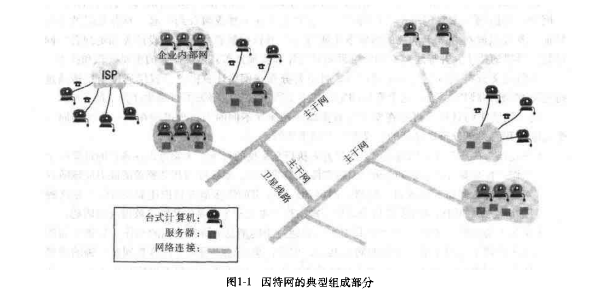

# 第一章: 分布式系统的特征 #

分布式系统是组件分布在网络计算机上且通过消息传递进行通信和动作协调的系统. 分布式系统具有下列特征:

1. 组件的并发性
2. 缺乏全局时钟
3. 组件故障的独立性

构造分布式系统的挑战点如下:

1. 组件的异构性
2. 开放性(指允许增加或替换组件)
3. 安全性
4. 可伸缩性(指用户数量增加时能正常运行的能力)
5. 故障处理以及组件的并发性和透明性

## 1.1 简介 ##

定义分布式系统为一个硬件或软件组件分布在网络计算机上, 仅仅通过消息传递进行通信和动作协调的系统. 有下列重要的结论:

1. 并发性: 如何协调并发执行的共享资源型程序也是一个重要的并经常被提及的话题
2. 缺乏全局时钟: 网络上计算机同步时钟的准确性会受到限制
3. 故障独立性: 系统的每个组件会单独地出现故障, 而其他组件还在运行

## 1.2 分布式系统实例 ##

### 1.2.1 因特网 ###

### 1.2.2 企业内部网 ###

### 1.2.3 移动计算和无处不在的计算 ###

## 1.3 资源共享和 Web ##

## 1.4 挑战 ##

### 1.4.1 异构性 ###

### 1.4.2 开放性 ###

### 1.4.3 安全性 ###

### 1.4.4 可伸缩性 ###

1. 控制物理资源的开销: 能以合理的开销扩展系统, 从而满足该要求
2. 控制性能丢失
3. 防止软件资源耗尽
4. 避免性能瓶颈

### 1.4.5 故障处理 ###

1. 检测故障
2. 故障覆盖
3. 容错
4. 故障恢复
5. 冗余

### 1.4.6 并发 ###

### 1.4.7 透明性 ###

透明性被定义成对用户和应用程序员屏蔽分布式系统的组件的分散性, 系统被认为是一个整体, 而不是独立组件的集合.
