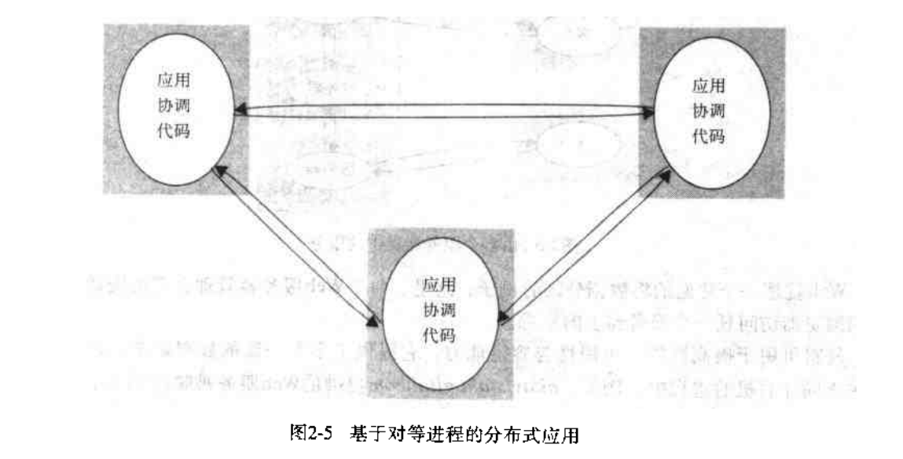

# 第二章: 系统模型 #

分布式系统的体系结构模型涉及系统各部分的位置和它们之间的关系. 客户-服务器模型和对等进程模型均为体系结构的例子, 客户-服务器模块可以有以下方面的修改:

- 在合作的服务器上进行数据分区或复制
- 由代理服务器和客户进行数据缓存
- 使用移动代码和移动代理
- 以便利的方式增加和删除移动设备

分布式系统没有全局时间, 进程间的所有通信通过消息实现. 网络上的消息通信会受到延迟的影响, 也会遇到多种故障, 并且容易受到安全性攻击. 这些问题可以由一下三个模型描述:

- 交互模型处理消息发送等的性能问题, 解决在分布式系统中设置时间限制的难题
- 故障模型试图给出进程和信道故障的一个精确的规约, 它定义了什么是可靠通信和正确的进程
- 安全模型讨论了对进程和信道的各种可能的威胁, 它引入的安全通道的概念, 可以保证在上述威胁下通信的安全

## 2.1 简介 ##

分布式系统的困难和挑战:

- 使用模式多样性: 系统的组件会承受不同的工作负载
- 系统环境的多样性: 必须适应异构的硬件, 操作系统和网络
- 内部问题: 包括非同步的时钟, 冲突的数据修改, 多种涉及系统单个组件的软硬件故障模式
- 外部问题: 包括对数据完整性，私密性的攻击以及拒绝服务

## 2.2 体系结构模型 ##

### 2.2.1 软件层 ###

### 2.2.2 系统体系结构 ###

#### 客户-服务器模型 ####

#### 由多个服务器提供的服务 ####

#### 代理服务器和缓存 ####

#### 对等的进程 ####

### 2.2.3 客户-服务器模型的变种 ###

#### 移动代码 ####

#### 移动代理 ####

移动代理是一个运行的程序(包括代码和数据两者).

#### 网络计算机 ####

#### 瘦客户 ####

指一个软件层, 在执行远程计算机上的应用程序时, 由它在用户本地的计算机上支持基于窗口的用户界面, 与网络计算机的区别是不下载应用代码到用户的计算机执行.

#### 移动设备和自发网络 ####

### 2.2.4 接口和对象 ###

### 2.2.5 分布式体系结构的设计需求 ###

## 2.3 基础模型 ##

### 2.3.1 交互模型 ###

#### 通道的性能 ####

- 等待时间: 从一个进程发送消息到另一个进程接收消息之间的延迟称为等待时间; 包括第一个 bit 从网络传递到目的地所花的时间, 访问网络的延迟以及操作系统通信服务花在发送进程和接收进程上的时间.
- 带宽: 指给定时间内网络上能传递的信息总量
- 抖动: 传递一系列消息所用时间的变化值, 与多媒体数据有关

#### 计算机时钟和时序事件 ####

分布式系统中的每个计算机有它自己的内部时钟, 不同计算机上运行的两个进程的时钟也是有偏差的(因为计算机时钟与绝对时间有偏差).

可以使用无线电接收器从 GPS 按约 1us 的精度接收时间读数, 然后同步给网络中的其他计算机.

#### 交互模型的两个变种 ####

- 同步分布式系统
- 异步分布式系统

#### 事件排序 ####

因为在一个分布式系统中时钟不能精确同步, Lamport 提出了**逻辑时间**的模型, 用于在分布式系统中给运行在不同计算机上的进程的事件提供顺序.

### 2.3.2 故障模型 ###

### 2.3.3 安全模型 ###

