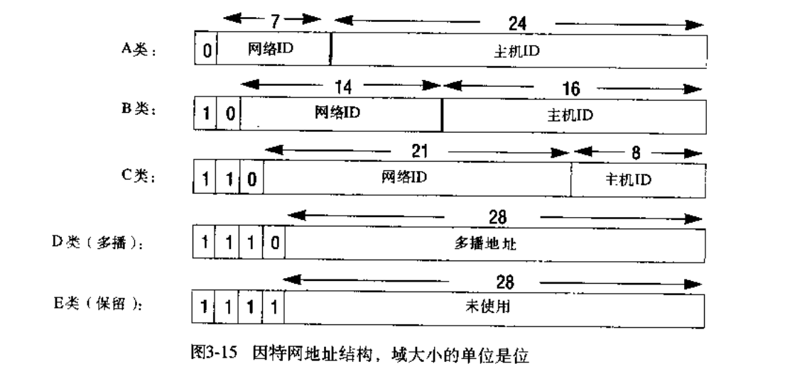

# 第三章: 网络和网络互联 #

分布式系统使用局域网, 广域网和互联网进行通信, 底层网络的性能, 可靠性, 伸缩性, 移动性以及服务质量都影响着分布式系统的行为, 从而也影响着这些系统的设计.

## 3.1 简介 ##

## 3.2 网络类型 ##

## 3.3 网络原理 ##

### 3.3.1 数据包的传输 ###

### 3.3.2 数据流 ###

### 3.3.3 交换模式 ###

### 3.3.4 协议 ###

### 3.3.5 路由 ###

路由算法包括两个部分:

1. 它必须决定每个数据包在穿梭于网络时所应经过的路径
2. 它必须能够根据监控流量和检测配置变化或故障动态的评估整个网络

每个路由器通过路由器信息协议(RIP)和每个邻接节点发送自己路由表信息的概要, 相互交换网络信息.

### 3.3.6 拥塞控制 ###

### 3.3.7 网络互联 ###

不同的网络, 链路和物理层协议形成不同的网络技术. 建立一个集成的互联网必须集成许多子网, 要实现集成需如下规定:

1. 统一的互联网寻址机制
2. 定义互联网中的网络包格式并给出相应处理规则的协议
3. 互联组件, 用于按照互联网地址将数据包路由到目的地, 可用多种网络技术通过子网传递数据包

## 3.4 因特网协议 ##

### 3.4.1 IP寻址 ###

因特网地址空间的分类如下图；

地址中主机标识为 0 用来代表本机, 主机标识全部为 1 用来表示广播地址.

### 3.4.2 IP协议 ###

IP 协议将数据包从一个主机传递到另一个主机, 主要格式如下图:

IP 提供的传输服务被描述为 **不可靠或最努力** 这样的传输语义, 数据包可能重复, 丢失, 延迟或乱序. IP  中唯一的校验和是对于头部的校验和.

### 3.4.3 IP路由 ###

#### 路由协议 ####

第一个路由算法是 RIP-1 算法(距离-向量算法的第一个版本), 它还有一个包含了其他附加需求(如无类别域间寻址) 的 RIP-2 版本.

现在趋向于使用链路-状态型算法, 即开放最短路径优先(OSPF), 该算法基于 Dijkstra 的路径寻找算法.

#### 默认路由 ####

路由表中具有默认的目的地项, 该默认项指定了所有目的地不在路由表中的 IP 数据包所使用的路线.

#### 本地子网上的路由 ####

当数据包的目的地主机与发送者在同一网络时, 利用地址的主机标识部分可获得底层网络的目的地主机地址, 只需一个跳转就能到达目的地.

#### 无类别域间路由(CIDR) ####

在 IP 的短缺中, 主要是 B 类地址的不足与 C 类地址的足够可以可用. CIDR 的解决方案是给那些需要 255 个地址以上的子网分配一批连续的 C 类地址, 同时也允许将 B 类地址分割.

### 3.4.4 IPv6 ###

- 地址空间: IPv6 地址有 128 位. IPv6 地址空间也是被分区的
- 路由速度: 基本 IPv6 头部的复杂度以及在每个节点上的处理时间都被降低. 数据包内容不使用校验, 而且一旦一个数据包开始它的路程就不能再被分片(在数据包发送前确定最小的 MTU)
- 实时以及其他特别服务: 优先级与流标号域与此相关. 优先级 0-8 用于可延迟的数据包, 8-15 保留给依赖与时间的数据包(这些数据包或者被迅速的发送, 或者被丢弃); 流标号使得资源被保留以便满足实时数据流
- 未来的演进: 即下一个头域, 定义了数据包中包含的扩展头的类型
- 安全: 在 IPv6 中使用认证和加密的安全静荷扩展头类型来实现安全性

### 3.4.5 移动 IP ###

可以通过动态主机配置协议(DHCP)在任意节点获得一个新的 IP 地址.

### 3.4.6 TCP 和 UDP ###

### 3.4.7 域名 ###

### 3.4.8 防火墙 ###

## 3.5 网络实例研究: 以太网, 无线LAN 和 ATM ##

### 3.5.1 以太网 ###

单个以太网是一个简单的或分支总线, 使用的传输介质由通过网络集线器或中继器连接的一个或多个连续的电缆段组成. 几个以太网可在以太网网络协议层次上通过以太网交换机或网桥连接.

以太网的操作方法为具有检测冲突的载波侦听多路访问(CSMA/CD), 管理介质的协议称为介质访问控制(MAC)协议.

#### CSMA/CD ####

数据包长度为 64 字节到 1518 字节, 在 IEEE 标准的 MTU 被定义为 1518 字节.

#### 以太网数据包格式 ####

#### 数据包冲突 ####

以太网有 3 中方式来处理冲突:

- 载波侦听: 当需要发送数据包时会等待介质上没有信号再开始传输
- 冲突检测: 当一个工作站通过硬件输出端口传送一个数据包时, 它也监听输入端口并比较两个信号, 如果不同则说明发生了冲突; 此时它停止传输并产生阻塞信号, 通知所有工作站产生了冲突
- 后退: 当收到阻塞信号后, 每个冲突的工作站随机等待一段时间再重新传输

### 3.5.2 IEEE 802.11 无线LAN ###

### 3.5.3 异步传输模式网络 ###

