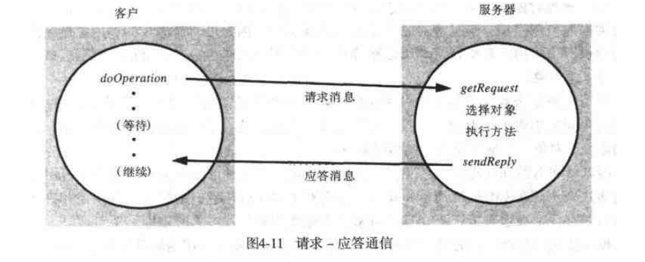
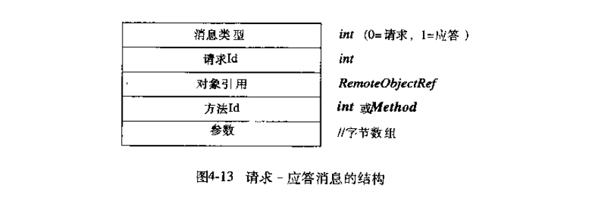

# 第四章: 进程间通信 #

## 4.1 简介 ##

UDP 应用程序接口提供了消息传递抽象, 使得一个发送进程可给一个接收进程传递一个消息(数据报), 发送方由套接字指定目的地.

TCP 应用程序接口提供了双向流抽象.

## 4.2 因特网协议的 API ##

### 4.2.1 进程间通信的特征 ###

#### 同步通信和异步通信 ####

在同步通信中, 发送进程和接收进程在每个消息上同步; 每次发送一个 send 将阻塞直到发送了相应的 receive; 每次发送一个 receive 进程将阻塞直到消息到达.

在异步通信中, send 操作只要消息被复制到一个本地缓冲区发送进程就可继续其他处理.

#### 消息目的地 ####

因特网协议中消息被发送到 (因特网地址, 本地端口) 对.

### 4.2.2 套接字 ###

对接收消息的进程, 套接字必须绑定到本地计算机的一个因特网地址和一个本地端口; 发送到特定因特网地址和端口号的消息只能被套接字与这个因特网地址和端口号相连的进程接收; 进程可以使用同一个套接字发送和接收消息.

### 4.2.3 UDP 数据包通信 ###

需要发送或接收消息的进程必须首先创建与一个因特网地址和本地端口绑定的套接字.

- 消息大小: 接收进程需要指定大小固定的用于接收消息的字节数组, 如果消息大于数组大小那么就会被截断; IP 协议允许的最大大小为 2^16 字节, 大多数环境将其大小限制为 8KB.
- 阻塞: UDP 使用非阻塞的 send 和阻塞的 receive

### 4.2.4 TCP 流通信 ###

一个应用关闭一个套接字代表它不再写任何数据到它的输出流, 在输出缓冲区的任何数据被送到流的另一端, 放在目的进程套接字的队列中, 并且指出流已经被关闭.

## 4.3 外部数据表示和编码 ##

### 4.3.1 CORBA 的公共数据表示(CDR) ###

### 4.3.2 Java对象序列化 ###

### 4.3.3 远程对象引用 ###

## 4.4 客户-服务器通信 ##

一般情况下请求-应答通信是同步的, 客户进程将一直阻塞到服务器发出的应答消息到达本地.

### 请求-应答协议 ###

传递的消息格式如下图:

### RPC交换协议 ###

有以下三种具有不同通信故障语义的协议:

- 请求(R)协议
- 请求-应答(RR)协议
- 请求-应答-确认应答(RRA)协议

### 使用 TCP 流实现请求-应答协议 ###

### HTTP: 请求-应答协议举例 ###

## 4.5 组通信 ##

### 4.5.1 IP组播-组通信的实现 ###

#### IP组播 ####

建立在 IP 的上层, 允许发送方将单个 IP 数据包发送给组成一个组播组的计算机集合. 组播组由 D 类因特网地址指定.

在应用程序的开发中, IP 组播仅通过 UDP 可用.

## 4.6 案例研究: UNIX系统的进程间通信 ##

### 4.6.1 数据报通信 ###

### 4.6.2 流通信 ###
