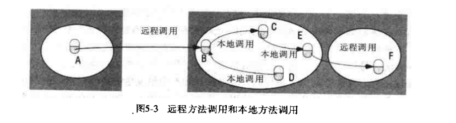
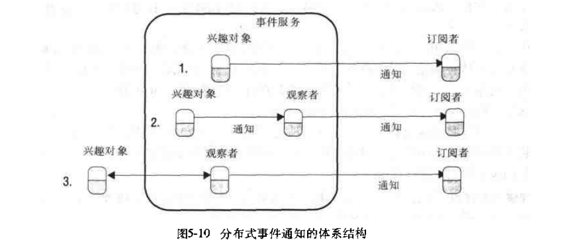

# 第五章: 分布式对象和远程调用 #

## 5.1 简介 ##

## 5.2 分布式对象间的通信 ##

### 5.2.1 对象模型 ###

### 5.2.2 分布式对象  ###

### 5.2.3 分布式对象模型  ###

### 5.2.4 RMI 的设计问题 ###

### 5.2.5 RMI 的实现 ###

### 5.2.6 分布式无用单元回收 ###

## 5.3 远程过程调用 ##

## 5.4 事件和通知 ##

### 5.4.1 分布式事件通知的参与者 ###

### 5.4.2 Jini分布式事件规范 ###

## 5.5 Java RMI实例研究 ##

### 5.5.1 创建客户程序和服务器程序 ###

### 5.5.2 Java RMI 的设计和实现 ###
