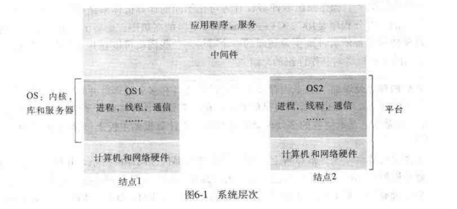
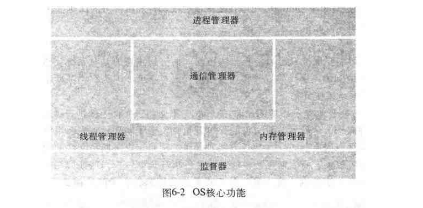

# 第六章: 操作系统支持 #

## 6.1 简介 ##

任何一个操作系统的目标都是提供一个在物理层之上面向问题的抽象.

###  网络操作系统 ###

运行于其上的结点能够独立的管理自己的进程资源, 在网络上的每一个结点都有一个系统映像, 网络操作系统并不在结点间调度进程.

### 分布式操作系统 ###

分布式操作系统只有一个单一系统映像, 它控制系统中所有的结点, 并且它能够透明的将进程定位在符合其调度策略的结点上.

## 6.2 操作系统层 ##

内核和服务器进程是用于管理资源和为客户提供资源接口的组件, 应该具有以下特点:

- 封装: 提供一个有用的服务接口以访问物理资源
- 保护: 资源需要被保护以防止非法访问
- 并发处理: 客户应该可以共享和并发地访问资源, 资源管理器负责实现并发透明性

## 6.3 保护 ##

## 6.4 进程和线程 ##

一个进程包括一个执行环境和一个或多个线程, 一个线程是一个活动的操作系统抽象; 一个执行环境是一个资源管理单元, 主要包括:

- 一个地址空间
- 线程同步和通信资源, 如信号量和通信接口
- 高级资源, 如打开的文件和窗口

### 6.4.1 地址空间 ###

一个地址空间是一个进程的虚拟内存的管理单元，可以拥有一个或多个区域，这些区域被不可访问的虚拟内存区分隔开.

### 6.4.2 新进程的创建 ###

### 6.4.2 线程 ###

## 6.5 通信和调用 ##

### 6.5.1 调用性能 ###

### 6.5.2 异步操作 ###

## 6.6 操作系统体系结构 ##
