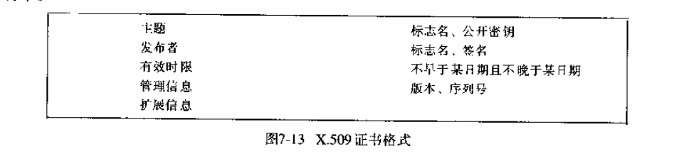

# 第七章: 安全性 #

## 7.1 简介 ##

### 7.1.1 威胁和攻击 ###

信息威胁一般可分为三大类:

- 泄露: 未经授权的接收方获得了信息
- 篡改: 未经授权就对信息进行改动 
- 恶意破坏: 干扰系统的正确操作, 对破坏者本身无益

对攻击可以分类如下:

- 窃听: 获取未经授权的消息副本
- 伪装: 未经授权而使用其他主题的身份收发消息
- 消息篡改: 在消息传往接收者之前截获并修改其中的内容
- 重发: 存储截获的信息并在以后发送它们
- 拒绝服务: 用a大量的消息淹没通道或者其他资源, 使得其他访问被拒绝

### 7.1.2 保护电子事务 ###

### 7.1.3 设计安全系统 ###

## 7.2 安全技术概述 ##

### 7.2.1 密码学 ###

### 7.2.2 密码学的应用 ###

### 7.2.3 证书 ###

### 7.2.4 访问控制 ###

### 7.2.5 凭证 ###

### 7.2.6 防火墙 ###

## 7.3 加密算法 ##

### 7.3.1 对称算法 ###

- TEA
- DES
- IDEA
- AES

### 7.3.2 非对称算法 ###

- RSA
- 椭圆曲线加密

### 7.3.3 混合密码协议 ###

## 7.4 数字签名 ##

签名需要一下特点:

- 可信性
- 不可遗忘性
- 不可抵赖性

#### 数字签名 ####

#### 摘要函数 ####

### 7.4.1 公开密钥数字签名 ###

### 7.4.2 保密密钥数字签名--MAC ###

### 7.4.3 安全摘要函数 ###

一个安全摘要函数 h=H(M) 应该有以下性质:

- 给定 M, 很容易计算 h
- 给定 h, 很难算出 M
- 给定 M, 很难找到其他消息 M', 使得 H(M)=H(M')

实际中广泛使用的摘要函数如下:

- MD5 算法: 生成一个 128 位的摘要
- SHA 算法: 生成一个 160 位的摘要, 基于 MD4 算法

### 7.4.4 证书标准和证书权威机构 ###

X.509 是运用最为广泛的证书标准格式, 是 X.500 标准的一部分, 用于进行全球命名和属性目录的构建.

## 7.5 密码实用学 ##

### 7.5.1 加密算法的性能 ###

### 7.5.2 密码学的应用和政治障碍 ###

## 7.6 实例研究 ##

### 7.6.1 Needham-Schroeder认证协议 ###

该协议是为了满足在网络上安全管理密钥的需要而开发的, 陈述了一种基于使用公开密钥认证和密钥分发协议, 该协议不依赖已有的保密密钥服务器.

上述协议中有一个不足之处, 即消息3可能是由入侵者截获并保存的, 现在一般通过给消息3增加填充值或是时间戳来弥补这个不足, 即 Kerberos 采取的解决方案.

### 7.6.2 Kerberos ###

- 票证: 授予服务给每个客户发一张标记, 该标记送给一个特殊的服务器证实 Kerberos 最近已经认证了发送者, 包括过期时间和新生成的会话密钥供客户和服务器使用
- 认证: 由客户构造的一个标记, 将它送给服务器证明用户身份以及当前与服务器的通信. 一个认证仅可以使用一次, 它包含客户的名字和时间戳, 并用恰当的会话密钥加密
- 会话密钥: 由 Kerberos 随机产生

### 7.6.3 使用安全套接字确保电子交易安全 ###

SSL 协议主要特性如下:

#### 协商加密和认证算法 ####

在连接的两端初始化握手通信时, 在进程间协商加密和认证算法.

#### 自举安全通信 ####

使用未加密的通信进行初始化交换, 然后使用公开密钥密码, 一旦建立共享保密密钥就可以转换到密码学上来, 每个转换都是可选的并通过协商进行.

- SSL记录协议层: 实现了一个安全通道，用来加密和认证通过任何面向连接的协议传输的消息
- 握手层: 包含SSL握手协议和其他两个相关协议, 在客户和服务器之间建立并维护一个 SSL 会话

### 7.6.4 小额电子交易: Millicent 协议 ###

