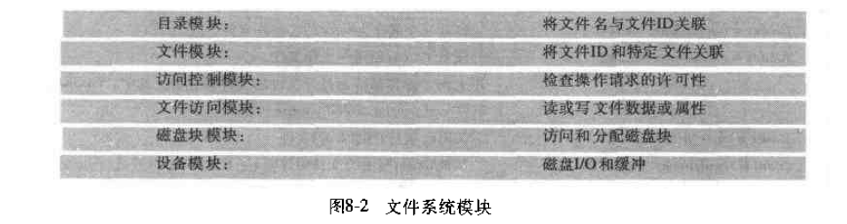
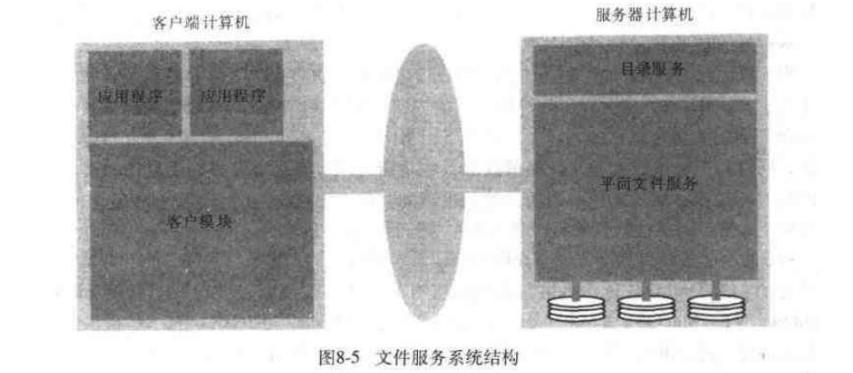

# 第八章: 分布式文件系统 #

## 8.1 简介 ##

### 8.1.1 文件系统的特点 ###

### 8.1.2 分布式文件系统的需求 ###

#### 透明性 ####

- 访问透明性: 用户通过一个统一的文件操作集来访问本地或远程文件
- 位置透明性: 使用单一的文件名空间, 多个文件或文件组应该可以在不改变路径名的情况下可以被重定位
- 移动透明性: 多个文件或文件卷可以被系统管理员移动或自动移动
- 性能透明性: 当服务负载在一个特定范围内n变化时客户程序都可以保持满意的性能
- 伸缩透明性: 文件服务可以不断的扩充以满足负载和网络规模的增长需要

#### 并发文件更新 ####

一个客户改变文件的操作不应该影响其他客户访问或改变同一文件的操作.

#### 文件复制 ####

一个文件可以表现为在不同位置文件内容的多个副本.

#### 硬件和操作系统异构性 ####

文件服务的接口必须有明确的定义.

#### 容错 ####

必须在客户和服务器出现故障时能继续使用.

#### 一致性 ####

当文件在不同的地点被复制或被缓存时, 对一个副本所做的修改要被传播到所有副本。

#### 安全性 ####

基于访问控制列表的访问控制机制.

#### 效率 ####

一个分布式文件系统应提供在性能和可靠性方面能与本地文件系统相比的, 甚至更好的服务.

### 8.1.3 案例研究 ###

## 8.2 文件服务系统结构 ##

### 平面文件服务 ###

注重于在文件内容上实现操作, 文件唯一标识符(UFID)在所有平面文件服务操作的请求中用于指明文件.

### 目录服务 ###

提供文件名到 UFID 的映射.

### 客户端模块 ###

集成和扩展了平面文件服务和目录文件服务的操作, 并为客户计算机上的用户级程序提供单一应用程序接口.

## 8.3 Sun网络文件系统 ##

## 8.4 Andrew文件系统 ##
