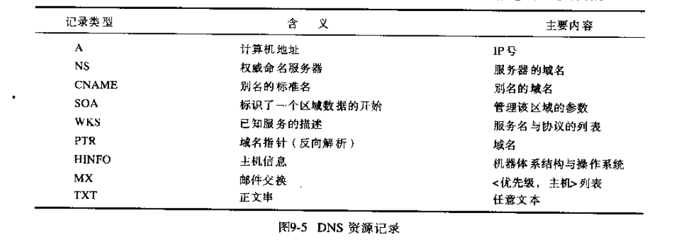

# 第九章: 命名服务 #

通过使用命名服务, 客户进程可以根据名字获取资源或对象的地址等属性, 被命名的实体可以是多种类型, 并且可由不同的服务管理.

## 9.1 简介 ##

命名服务在分布式系统中可向客户提供被命名对象的数据, 而目录服务和发现服务提供的是满足某个描述的对象的数据.

## 9.2 命名服务和域名系统 ##

一个命名服务存储了一个或多个命名上下文, 命名服务支持的主要操作是名字解析, 即根据一个给定的名字查询相应的属性.

### 9.2.1 名字空间 ###

### 9.2.2 名字解析 ###

### 9.2.3 域名系统 ###

#### 资源记录 ####

## 9.3 目录服务和发现服务 ##

## 9.4 实例研究: 全局命名服务 ##

## 9.5 实例研究: X.500目录服务 ##
