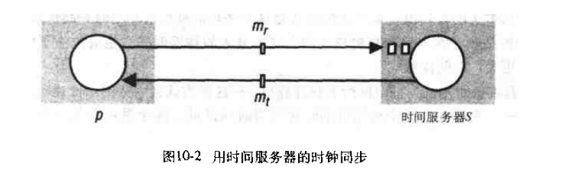

# 第十章: 时间和全局状态 #

## 10.1 简介 ##

## 10.2 时钟, 事件和进程状态 ##

## 10.3 同步物理时钟 ##

### 10.3.1 同步系统中的同步 ###

### 10.3.2 同步时钟的 Cristian 方法 ###

### 10.3.3 Berkeley算法 ###

### 10.3.4 网络时间协议 ###

网络时间协议(NTP)定义了时间服务的体系结构和在因特网上发布时间信息的协议.

- 提供一个服务, 使得跨因特网的用户能精确的同UTC同步
- 提供一个能在长久的连接损耗中生存的可靠服务
- 使得客户能经常有效的重新同步以抵消在大多数计算机中存在的偏移率
- 提供保护, 防止对时间服务的干扰

## 10.4 逻辑时间和逻辑时钟 ##

## 10.5 全局状态 ##

### 10.5.1 全局状态和一致割集 ###

### 10.5.2 全局状态谓词, 稳定性, 安全性和活性 ###

### 10.5.3 Chandy和Lamport的快照算法 ###

## 10.6 分布式调试 ##

### 10.6.1 观察一致的全局状态 ###
