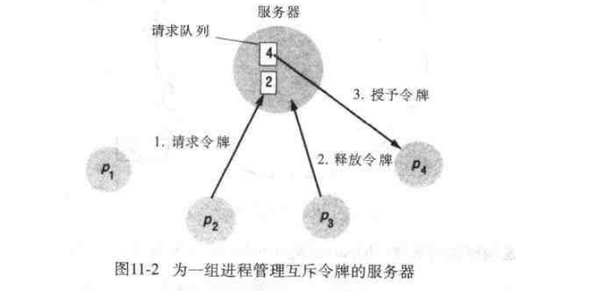
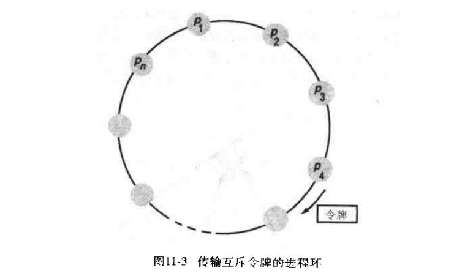

# 第十一章: 协调和协定 #

## 11.1 简介 ##

## 11.2 分布式互斥 ##

### 中央服务器算法 ###

### 基于环的算法 ###

## 11.3 选举 ##

## 11.4 组播通信 ##

### 11.4.1 基本组播 ###

### 11.4.2 可靠组播 ###

### 11.4.3 有序组播 ###

## 11.5 共识和相关问题 ##
