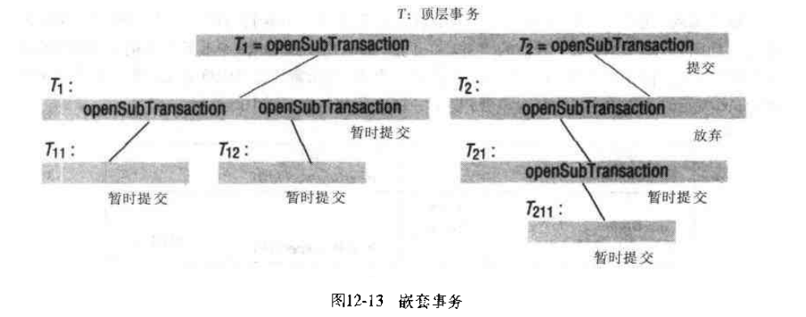
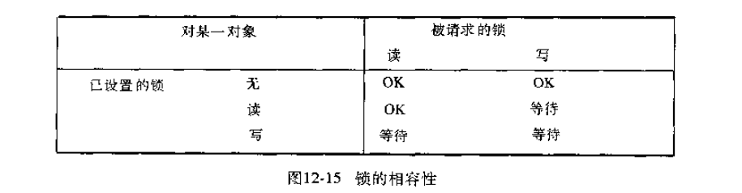
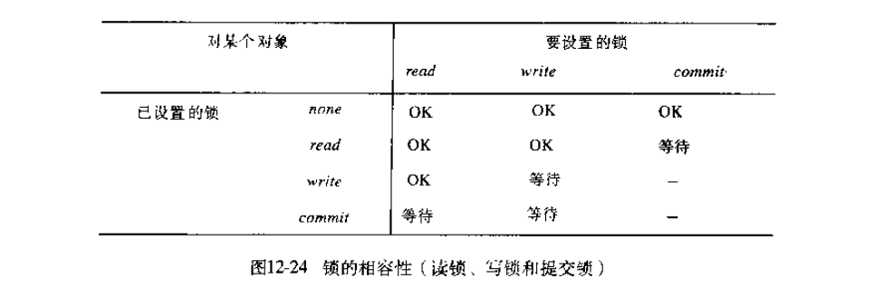
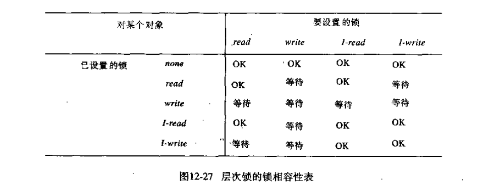

# 第十二章: 事务和并发控制 #

事务是服务器上的一个操作序列, 由服务器保证这些操作序列在多个客户并发访问和服务器出现故障的情况下的原子性. 嵌套事务定义了若干事务之间的嵌套结构, 在分布式系统中可以具有更高的并发度.

- 锁用于在多个事务访问同一个对象时, 根据这些操作访问同一个对象的先后次序给事务排序
- 乐观并发控制不会阻塞事务运行, 只是在提交时通过检查来确定已执行的操作是否存在冲突
- 时间戳排序利用时间戳将访问同一对象的事务根据其起始时间进行排序

## 12.1 简介 ##

事务的目标是在多个事务访问对象以及服务器面临崩溃的情况下, 保证所有由服务器管理的对象始终维持在一个一致的状态下. 事务是由客户定义的针对服务器对象的一组操作, 它们组成一个不可分割的单元, 由服务器执行.

### 12.1.1 简单的同步机制(无事务) ###

#### 服务器上的原子操作 ####

免受其他线程中并发操作干扰的操作被称为原子操作.

#### 通过服务器操作的同步加强客户协同 ####

### 12.1.2 事务的故障模型 ###

Lampson 提出过一个分布事务的故障模型, 包括了磁盘故障, 服务器故障以及通信故障. 该故障模型声称: 可以保证算法在可预见故障下正确工作, 但是对于不可预见的灾难性故障则不能保证正常处理.

- 对持久存储的写操作可能发生故障
- 服务器可以偶尔崩溃
- 消息传递可能有任意长的延迟

## 12.2 事务 ##

事务的 ACID 特性如下:

- 原子性(Atomicity): 事务必须是全有或全无
- 一致性(Consistency): 事务将系统从一个一致状态转换到另一个一致状态
- 隔离性(Isolation)
- 持久性(Durability)

### 12.2.1 并发控制 ###

### 12.2.2 事务放弃时的恢复 ###

## 12.3 嵌套事务 ##

## 12.4 锁 ##

### 12.4.1 死锁 ###

### 12.4.2 在加锁机制中增加并发度 ###

#### 双版本锁 ####

这是一种乐观策略: 允许一个事务针对对象的临时版本进行写操作, 而其他事务读取同一个对象提交后的版本; 读操作只在其他事务正在提交同一个对象才等待.

#### 层次锁 ####

在每一层, 设置父辈锁与设置等价的子辈锁具有相同的效果, 这可以有效减少需要设置的锁数量.

## 12.5 乐观并发控制 ##

## 12.6 时间戳排序 ##

## 12.7 并发控制方法的比较 ##
