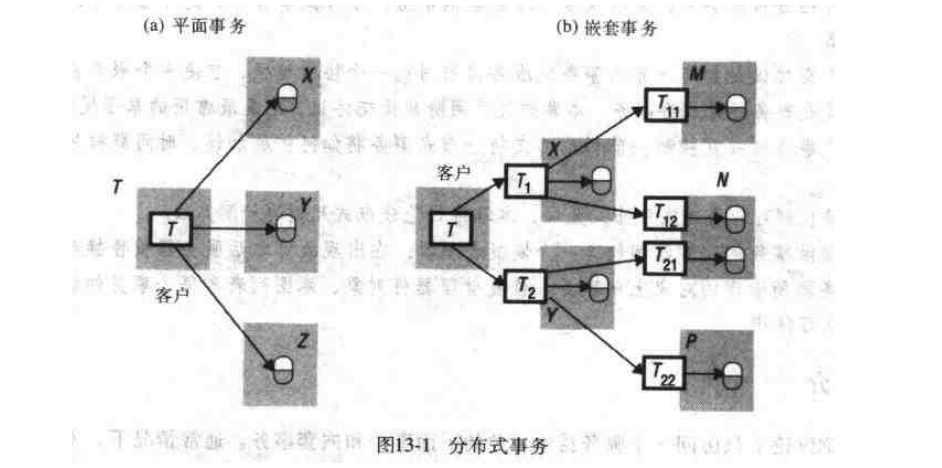

# 第十三章: 分布式事务 #

分布式事务既是涉及多个服务器的事务, 可以是平面事务, 也可以是嵌套事务.

原子提交协议是参与分布式事务的服务器使用的一个协作过程, 它使多个服务器能够共同决定是提交事务还是放弃事务.

每个提供事务的服务器都包含一个恢复管理器, 在出现故障之后服务器被替换时, 用它来恢复服务器所管理的对象上的事务. 恢复管理器将对象, 意图列表和每个事务的状态信息记录在持久存储中.

## 13.1 简介 ##

## 13.2 平面分布式事务和嵌套分布式事务 ##

## 13.3 原子提交协议 ##

### 13.3.1 两阶段提交协议 ###

在两阶段提交协议的第一个阶段, 协调者询问所有的参与者是否准备好提交; 在第二个阶段, 协调者通知它们提交或放弃事务. 如果某个参与者可以提交它那部分事务, 那么当它将所做的更新和它的状态记录到持久存储器之后它就同意提交事务, 并准备好提交.

### 13.3.2 嵌套事务的两阶段提交协议 ###

## 13.4 分布式事务的并发控制 ##

### 13.4.1 锁 ###

### 13.4.2 时间戳排序并发控制 ###

### 13.4.3 乐观并发控制 ###

## 13.5 分布式死锁 ##

## 13.6 事务恢复 ##

### 13.6.1 日志 ###

### 13.6.2 影子版本 ###

### 13.6.3 为何恢复文件需要事务状态和意图列表 ###

### 13.6.4 两阶段提交协议的恢复 ###
