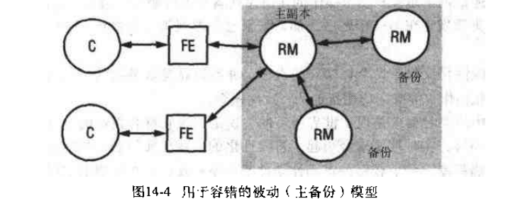
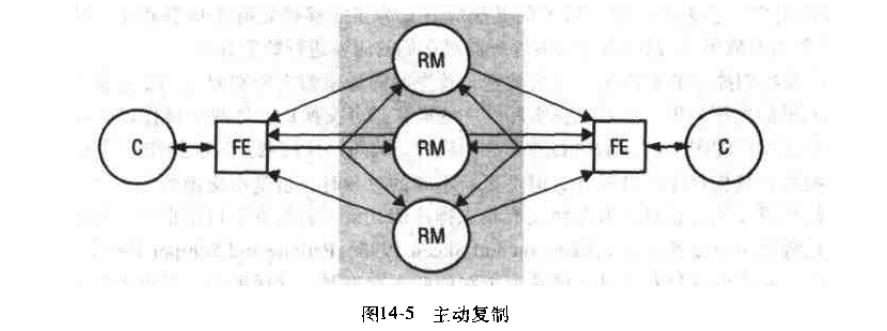
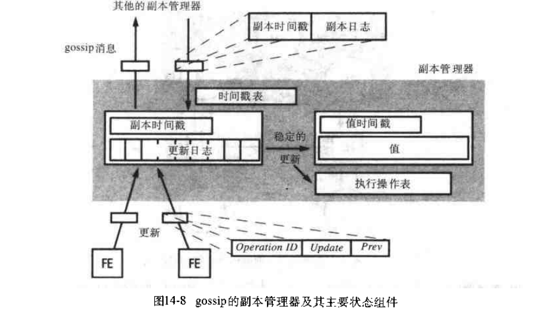

# 第十四章: 复制 #

在分布式系统中, 复制是提供高科用性和容错的关键技术.

## 14.1 简介 ##

复制能够增强性能, 提高可用性和容错能力, 是保证分布式系统有效性的一个关键技术.

## 14.2 系统模型和组通信 ##

### 14.2.1 系统模型 ###

### 14.2.2 组通信 ###

## 14.3 容错服务 ##

### 14.3.1 被动复制 ###

### 14.3.2 主动复制 ###

## 14.4 高可用服务 ##

### 14.4.1 gossip系统 ###

在 gossip系统中, 副本管理器周期的通过 gossip 消息来传送客户的更新. gossip 服务提供两种基本操作: 查询是只读操作, 更新用来变更状态但却不读取状态.

- 随着时间推移, 每个用户最终获得一致服务
- 副本之间的松弛一致性

#### 副本管理器状态 ####

- 值: 由副本管理器维持的应用状态的值
- 值的时间戳: 代表更新的时间戳向量
- 更新日志: 所有的更新操作只要被接收到就记录在这个日志中
- 复制时间戳: 代表了那些已被副本管理器接收到的更新
- 已执行操作表: 包含了已经执行的更新的唯一标识
- 时间戳表: 使用此表来建立何时一个更新已经应用于所有副本的副本管理器

### 14.4.2 Bayou系统和操作变换方法 ###

### 14.4.3 Coda文件系统 ###

## 14.5 复制数据上的事务 ##

### 14.5.1 用于复制事务的体系结构 ###

### 14.5.2 可用拷贝复制 ###

### 14.5.3 网络分区 ###

### 14.5.4 带验证的可用拷贝 ###

### 14.5.5 法定数共识方法 ###

### 14.5.6 虚拟分区算法 ###
