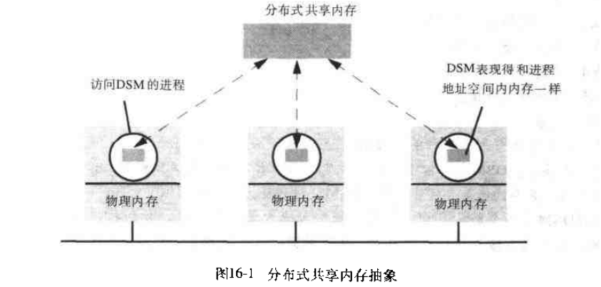

# 第十六章: 分布式共享内存 #

## 16.1 简介 ##

### 16.1.1 消息传递机制和 DSM 的比较 ###

### 16.1.2 DSM 的实现方法 ###

## 16.2 设计问题和实现问题 ##

### 16.2.1 结构 ###

### 16.2.2 同步模型 ###

### 16.2.3 一致性模型 ###

### 16.2.4 更新选项 ###

### 16.2.5 粒度 ###

### 16.2.6 系统颠簸 ###

## 16.3 顺序一致性和lvy ##

### 16.3.1 系统模型 ###

### 16.3.2 写失效 ###

### 16.3.3 失效协议 ###

### 16.3.4 一个动态分布式管理器算法 ###

### 16.3.5 系统颠簸 ###

## 16.4 释放一致性和 Munin ##

### 16.4.1 内存访问 ###

### 16.4.2 释放一致性 ###

### 16.4.3 Munin ###

## 16.5 其他一致性模型 ##
