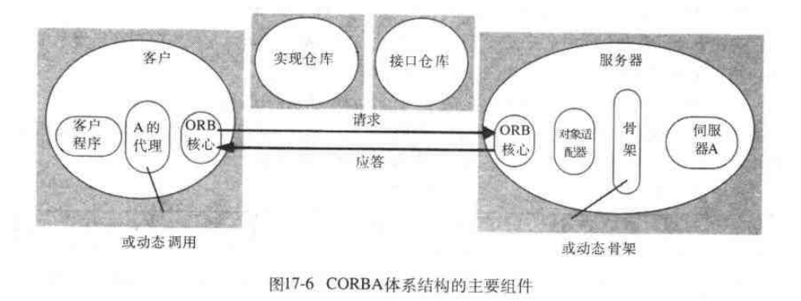

# 第十七章: CORBA实例研究 #

## 17.1 简介 ##

## 17.2 CORBA RMI ##

### 17.2.1 CORBA客户和服务器举例 ###

### 17.2.2 CORBA体系结构 ###

### 17.2.3 CORBA接口定义语言 ###

### 17.2.4 CORBA远程对象引用 ###

### 17.2.5 CORBA语言映射 ###

## 17.3 CORBA服务 ##

### 17.3.1 CORBA命名服务 ###

### 17.3.2 CORBA事件服务 ###

### 17.3.3 CORBA通知服务 ###

### 17.3.4 CORBA安全服务 ###
