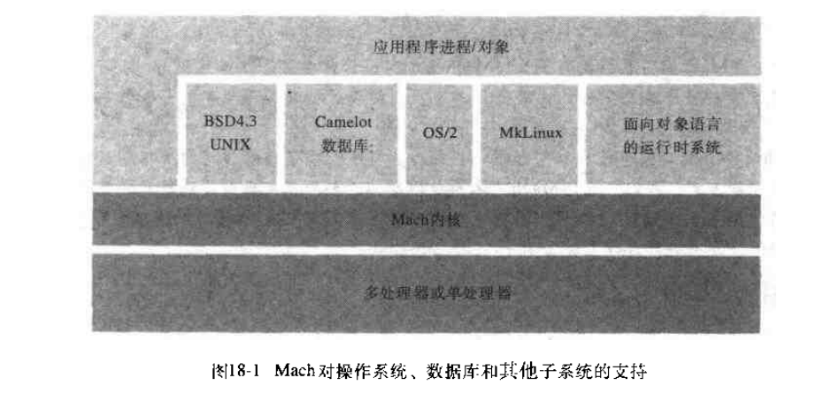
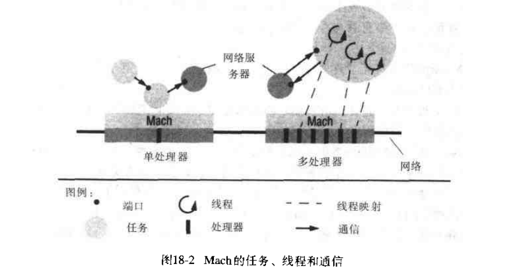

# 第十八章: Mach实例研究 #

Mach系统可以运行在多处理器系统上, 也可以运行在通过网络连接的多个单处理器的计算机系统上.

## 18.1 简介 ##

### 18.1.1 设计目标和主要设计特点 ###

Mach的主要设计目标和特点如下:

- 多处理器操作
- 对网络操作的透明扩展
- 用户级服务器
- 操作系统仿真
- 灵活的虚拟内存实现
- 可移植性

### 18.1.2 Mach主要的抽象描述 ###

- 任务: 一个Mach任务是一个执行环境, 主要包括一个被保护的地址空间和一个内核管理的权能集合
- 线程: 任务可以包含多个线程
- 端口: 一个端口是一个具有相关消息队列的单点单方向通道
- 端口集: 一个端口集是属于同一任务的接收权限的端口集合
- 消息
- 设备
- 内存对象
- 内存缓存对象

## 18.2 端口, 命名和保护 ##

## 18.3 任务和线程 ##

## 18.4 通信模型 ##

### 18.4.1 消息 ###

### 18.4.2 端口 ###

### 18.4.3 mach_msg系统调用 ###

## 18.5 通信实现 ##

### 18.5.1 透明消息传递 ###

### 18.5.2 开放性: 协议和驱动程序 ###

## 18.6 内存管理 ##

### 18.6.1 地址空间结构 ###

### 18.6.2 内存共享: 继承和消息传递 ###

### 18.6.3 对写时复制的评价 ###

### 18.6.4 外部分页 ###

### 18.6.5 对访问内存对象的支持 ###
