# 推荐引擎 #

## 什么是推荐引擎 ##

推荐引擎利用特殊的信息过滤技术, 将不同的物品或内容推荐给可能对它们感兴趣的用户. 原理图如下:

推荐引擎需要的数据源一般包括:

1. 要推荐物品或内容的元数据, 例如关键字等
2. 系统用户的基本信息
3. 用户对物品或者信息的偏好, 这些偏好信息包含两类:

- 显示的用户反馈: 例如评分等
- 隐式的用户反馈: 例如购买了物品, 查看了物品等

## 推荐引擎分类 ##

### 推荐内容 ###

根据对不同用户的推荐内容是否不同, 分为以下两类:

- 基于大众行为的推荐引擎: 对每个用户给出同样的推荐
- 个性化推荐系统: 对不同的用户根据他们的口味和喜好给出更加精确的推荐

### 数据源 ###

根据不同的数据源发现数据相关性的分类:

- 基于人口统计学的推荐: 根据系统用户的基本信息发现用户的相关程度
- 基于内容的推荐: 根据推荐物品或内容的元数据, 发现物品或内容的相关性
- 基于协同过滤的推荐: 根据用户对物品或者信息的偏好, 发现物品或者内容本身的相关性, 或者是发现用户的相关性

### 模型建立方式 ###

关于推荐模型的建立方式分类:

- 基于物品和用户本身: 将每个用户和每个物品都当作独立的实体, 预测每个用户对于每个物品的喜好程度, 为了减少计算量可以对物品和用户聚类
- 基于关联规则的推荐: 通过一些数据的依赖关系规则推荐
- 基于模型的推荐: 将用户的喜好信息作为训练样本, 训练出一个预测用户喜好的模型

## 工作原理 ##

### 基于人口统计学的推荐 ###

根据系统用户的基本信息发现用户的相关程度, 然后将相似用户喜爱的其他物品推荐给当前用户. 优势如下:

- 不使用当前用户对物品的喜好历史数据, 所以对新用户没有冷启动的问题
- 不依赖物品本身, 所以在不同的物品领域都可以使用, 是领域独立的

缺点如下:

- 分类粗糙, 在对品味要求高的领域如图书音乐等无法得到号的推荐效果
- 可能涉及到一些与信息发现问题本身无关却敏感的信息, 如用户年龄不好获取

### 基于内容的推荐 ###

根据推荐物品或内容的元数据, 发现物品或内容的相关性, 然后根据用户以往的喜好记录推荐相似的物品给用户. 能够很好的建模用户的品味并提供精确的推荐. 但是有以下缺点:

- 需要对物品进行分析和建模, 推荐的质量依赖于对物品模型的完整和全面程度. 关键词和 tag 是描述物品元数据的有效方法
- 没有考虑人对物品的态度
- 因为需要基于用户以往的历史做出推荐, 所有对新用户有冷启动问题

### 基于协同过滤的推荐 ###

根据用户对物品或者信息的偏好, 发现物品或者内容本身的相关性, 或者是发现用户的相关性, 然后再基于这些关联性进行推荐. 是当前广泛应用的推荐机制, 具有以下优点:

- 不需要对物品或用户进行建模, 是领域无关的
- 计算出的推荐是开放的, 可以共用他人的经验, 很好的支持用户发现潜在的兴趣偏好

缺点如下:

- 需要基于历史数据, 有冷启动问题
- 效果依赖于历史偏好数据的多少和准确性
- 在实现中若用户历史偏好采用稀疏矩阵存储, 则少部分人的错误偏好可能对推荐准确度造成较大影响
- 对于一些特殊品味的用户不能给予很好的推荐
- 建模偏好后比较难修改或根据用户的使用演变, 导致方法不够灵活

包含以下三种协同过滤的推荐机制:

#### 基于用户的协同过滤推荐 ####

根据所有用户对物品或者信息的偏好, 发现与当前用户口味和偏好相似的邻居用户群(一般采用计算 K邻居的算法), 然后基于 K邻居的历史偏好信息为当前用户进行推荐.

#### 基于项目的协同过滤推荐 ####

根据所有用户对物品或者信息的偏好, 发现物品和物品之间的相似性, 然后根据用户的历史偏好记录将类似的物品推荐给用户.

#### 基于模型的协同过滤推荐 ####

基于样本的用户喜好信息, 训练一个推荐模型, 然后根据实时的用户喜好的信息进行预测, 计算推荐.

### 混合的推荐机制 ###

将多种推荐方法混合在一起进行推荐, 几种组合方法如下:

- 加权混合: 用线性公式将不同的推荐按照不同的权重组合
- 切换混合: 在不同情况下采用最为合适的推荐机制
- 分层混合: 采用多种推荐机制, 并且将一个推荐机制的结果作为另一个的输入, 从而综合各推荐机制的优缺点

## 集体智慧和协同过滤 ##

### 集体智慧 ###

集体智慧是指在大量的人群的行为和数据中收集答案, 帮助你对整个人群得到统计意义上的结论, 它往往是某种趋势或者人群中共性的部分.

### 协同过滤 ###

协同过滤一般是在海量的用户中发掘出一小部分和你品味比较类似的, 然后根据他们喜欢的其他东西组织成一个排序的目录作为推荐给你. 协同过滤相对于集体智慧而言, 它从一定程度上保留了个体的特征(即你的品味偏好), 所以它更多可以作为个性化推荐的算法思想.

如果要实现协同过滤, 需要以下几个步骤:

- 收集用户偏好
- 找到相似的用户或物品
- 计算推荐

#### 收集用户偏好 ####

常见的偏好信息如下:

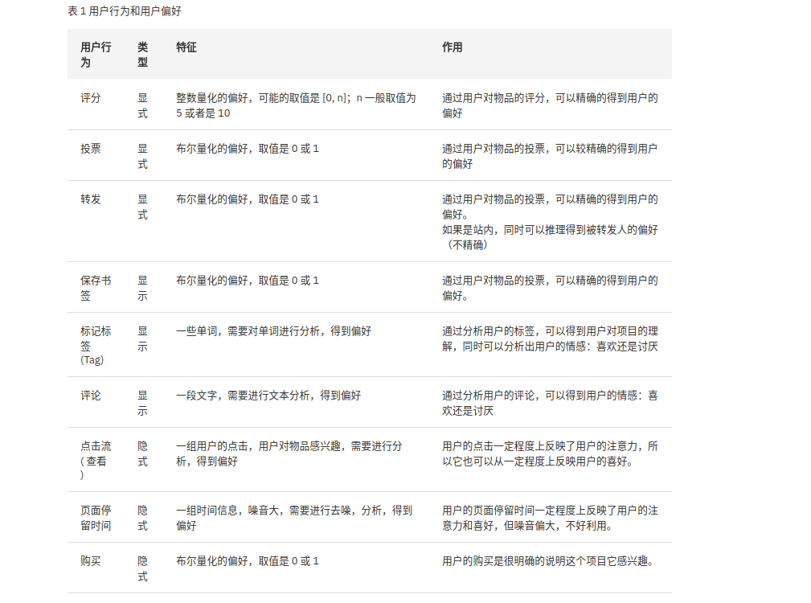

有以下两种方式来组合这些不同的用户行为:

- 将不同的行为分组, 然后基于不同的行为计算不同的用户/物品的相似度
- 根据不同行为反映用户喜好的程度将它们进行加权, 得到用户对物品的总体喜好

在收集了用户行为数据之后, 还需要对数据进行一定的预处理, 包括减噪和归一化:

- 减噪: 通过经典的数据挖掘算法过滤掉行为数据中的噪音
- 归一化: 将各个行为的数据统一在一个相同的取值范围中, 最简单的归一化处理即将各类数据除以此类中的最大值, 以保证归一化之后的数据取值在 [0. 1] 范围中

在预处理后, 可以得到一个用户偏好的二维矩阵, 一维是用户列表, 一维是物品列表, 值是用户对物品的偏好.

#### 找到相似的用户或物品 ####

##### 相似度的计算 #####

对于相似度的计算, 现有的几种方法都是基于向量的, 即两个向量的距离越近则相似度越大. 常见的相似度计算方法如下:

- 欧几里德距离

计算空间中两个点的距离, 然后进行一定的转换:

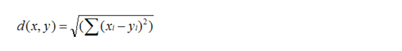
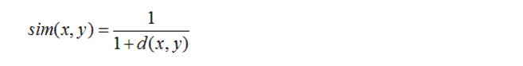

- 皮尔逊相关系数

计算两个定距变量间的紧密程度, 取值在 [-1, +1]之间.

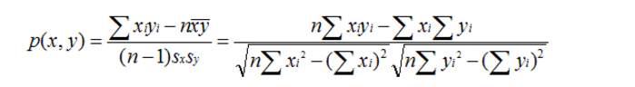

其中 Sx, Sy 是 x 和 y 样品标准偏差.

- Cosine 相似度

广泛应用于计算文档数据的相似度.

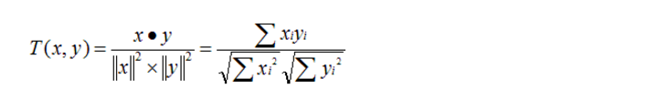

- Tanimoto 系数

也称为 Jaccard 系数, 是 Cosine 相似度的扩展, 多用于计算文档数据的相似度.

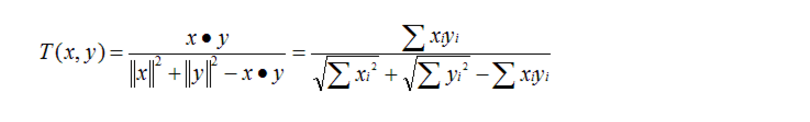

##### 相似邻居的计算 #####

在计算出相似度之后, 常用的根据相似度挑选邻居的方法如下:

- 固定数量的邻居(K-neighborhoods): 对于孤立点计算效果不好
- 基于相似度门槛的邻居(Threshold-based neighborhoods): 邻居个数不确定

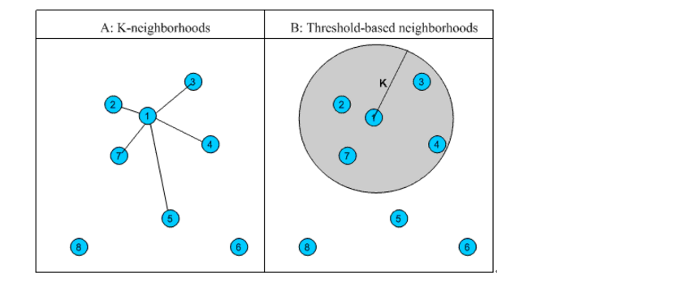

#### 计算推荐 ####

##### 基于用户的 CF (User CF) #####

基于用户对物品的偏好找到相似邻居用户, 然后将邻居用户喜欢的推荐给当前用户.

##### 基于物品的 CF (Item CF) #####

基于用户对物品的偏好找到相似的物品, 然后根据用户的历史偏好推荐相似的物品.

##### 对比 #####

- 计算复杂度: 在不同的系统中各有优势, 应根据用户和物品的数量对比进行选择
- 适用场景: 在非社交场景中, 采用 Item CF 更为合适.
- 推荐多样性和精度: 有相似的精度, Item CF 的精度略小于 User CF, 但是 Item CF 多样性比 User CF 好.
- 用户适应度: 对于 User CF, 拥有共同喜好用户数量越大适应度越高; Item CF 对喜欢物品的自相似度大的适应度越高.

## 聚类分析 ##

### 什么是聚类分析 ###

聚类是将数据对象分组成为多个类或者簇(Cluster), 在同一个簇中的对象之间具有较高的相似度, 而不同簇中的对象差别较大. 一个簇中的数据对象可以被作为一个整体来对待, 从而减少计算量或者提高计算质量.

### 不同的聚类问题 ###

- 聚类结果是排他的还是可重叠的
- 基于层次还是基于划分
- 簇数目固定的还是无限制的聚类
- 基于距离还是基于概率分布模型

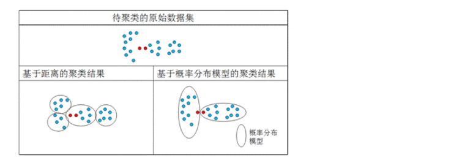

### 聚类算法 ###

#### K 均值聚类算法 ####

基于距离的排他划分方法: 给定一个 n 个对象的数据集, 构建数据的 k 个划分, 每个划分既是一个聚类, 并且满足以下条件:

- k <= n
- 每个组至少包含一个对象
- 每个对象必须属于并且只属于一个组

基本原理如下:

- 首先创建一个初始划分, 随机选择 k 个对象代表簇中心, 然后对其他的对象根据与簇中心的距离赋值给最近的簇
- 然后采用迭代的重定位方式, 藏是通过对象在划分间移动来改进划分. 即计算簇的平均值, 然后对对象重新分配, 直到没有簇中心对象的变化.

当结果簇是密集的而且簇与簇之间的区别比较明显时, k 均值的效果比较好. 它的复杂度是 O(nkt), 其中 n 是对象个数, k 是簇的数目, t 是迭代的次数.

#### Canopy 聚类算法 ####

首先应用低成本的近似的距离计算方法将数据分为多个组(称为一个 Canopy), 组之间有重叠的部分, 然后采用严格的距离计算方式计算在同一个组中的点, 将它们分配给最合适的簇. 常用于 k 均值聚类算法的预处理, 以便找到合适的 k 值和簇中心.

#### 模糊 k 均值聚类算法 ####

是 k 均值聚类的扩展, 不同点是允许聚类结果中存在对象属于多个簇, 是可重叠聚类算法. 它使用一个叫模糊参数(Fuzziness Factor) 的概念来决定分配. 在分配过程中, 并不是将向量分配给距离最近的簇, 而是计算向量与各个簇的相关性:

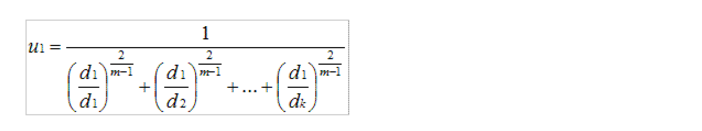

其中 d 为向量到簇中心的距离. 公式中的 m 值即为模糊参数.

#### 狄利克雷聚类算法 ####

狄利克雷聚类算法是一种基于概率分布模型的聚类算法: 首先定义一个分布模型(如圆形, 正则分布); 然后按照模型对数据进行分类, 将不同的对象加入一个模型, 模型会增长或是收缩; 每一轮中需要对模型的各个参数重新计算, 估计对象属于模型的概率.

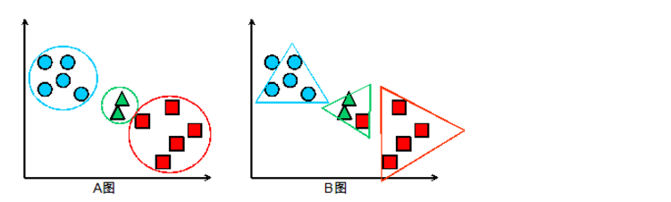

# 推荐系统 #

## 概述 ##

推荐系统是通过挖掘用户与项目之间的二元关系, 帮助用户从大量数据中发现其可能感兴趣的项目如网页, 服务, 商品, 人等, 并生成个性化推荐以满足个性化需求.

一般的推荐系统基本框架如下:

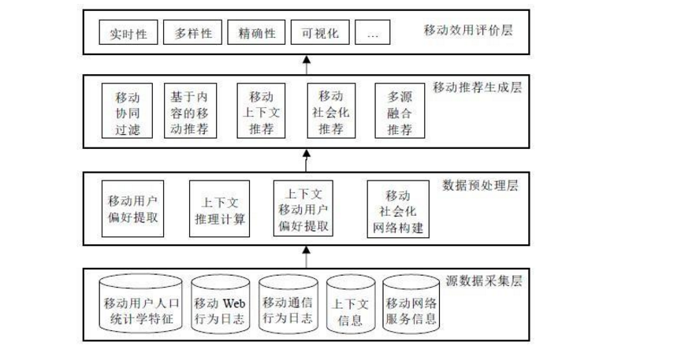

数据的生命周期如下:

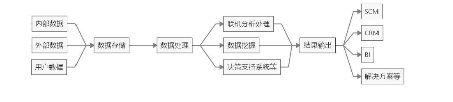

一般的思路流程如下:

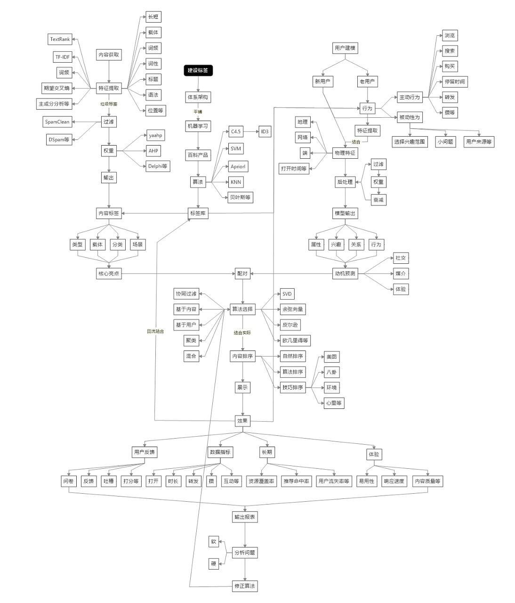

## 标签体系 ##

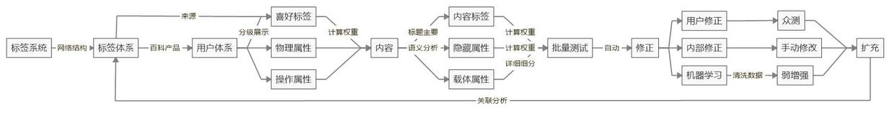

## 用户体系 ##

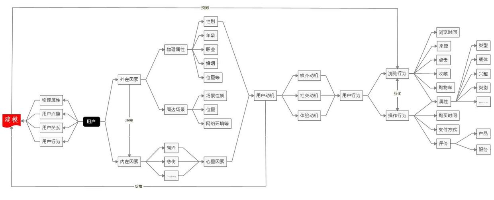

# 参考资料 #

- [推荐引擎初探](https://www.ibm.com/developerworks/cn/web/1103_zhaoct_recommstudy1/index.html?ca=drs-)
- [携程实时用户行为系统实践](http://www.dataguru.cn/article-11059-1.html)
- [深度丨从零搭建推荐体系](http://www.jianshu.com/p/d585b3938dea)
- [百分点亿级个性化推荐系统的发展历程和实践架构](http://www.open-open.com/lib/view/open1473732760777.html)
- [Netflix公布个性化和推荐系统架构](http://www.infoq.com/cn/news/2013/04/netflix-ml-architecture/)
- [达观数据是如何基于用户历史行为进行精准个性化推荐的?](http://www.chinaz.com/news/2017/0620/744324.shtml?qq-pf-to=pcqq.c2c)
- [推荐系统不相信眼泪，但此算法会给你些安慰](http://iyao.ren/2017/02/28/itemcf/)
- [实时推荐系统的3种方式](http://www.jianshu.com/p/356656ce2901)
- [Recommender systems:An introduction](./data/recommender_systems_An_introduction.pdf)
- [推荐系统](./data/推荐系统.pdf)
