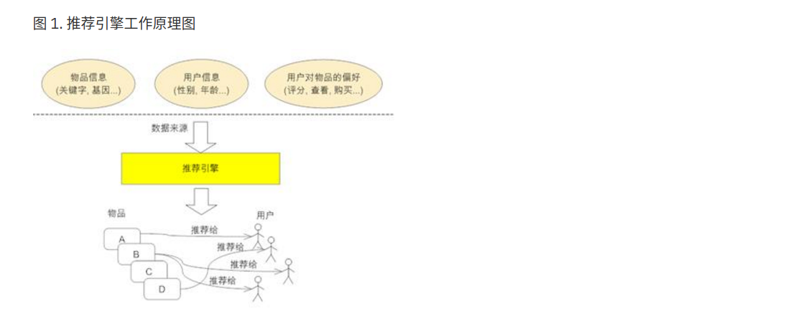

# 推荐引擎 #

## 什么是推荐引擎 ##

推荐引擎利用特殊的信息过滤技术, 将不同的物品或内容推荐给可能对它们感兴趣的用户. 原理图如下:

推荐引擎需要的数据源一般包括:

1. 要推荐物品或内容的元数据, 例如关键字等
2. 系统用户的基本信息
3. 用户对物品或者信息的偏好, 这些偏好信息包含两类:

- 显示的用户反馈: 例如评分等
- 隐式的用户反馈: 例如购买了物品, 查看了物品等
