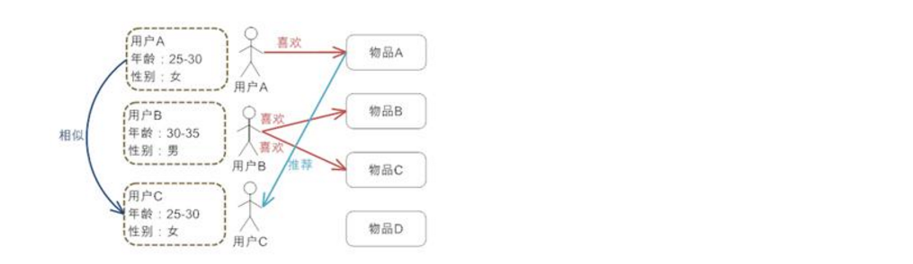
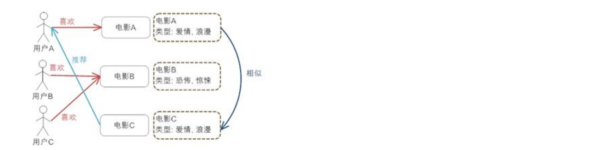
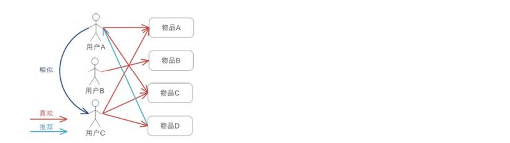
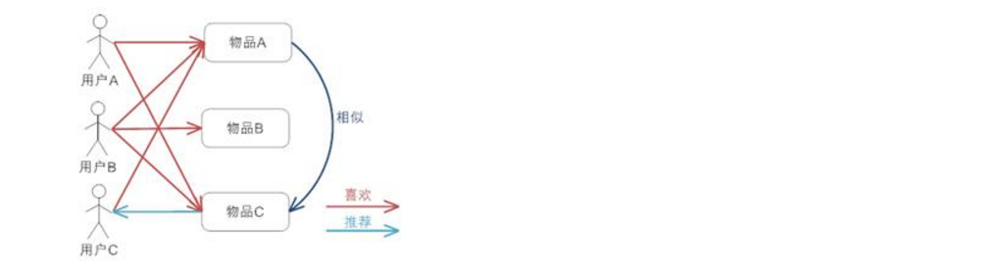

# 推荐引擎 #

## 什么是推荐引擎 ##

推荐引擎利用特殊的信息过滤技术, 将不同的物品或内容推荐给可能对它们感兴趣的用户. 原理图如下:

推荐引擎需要的数据源一般包括:

1. 要推荐物品或内容的元数据, 例如关键字等
2. 系统用户的基本信息
3. 用户对物品或者信息的偏好, 这些偏好信息包含两类:

- 显示的用户反馈: 例如评分等
- 隐式的用户反馈: 例如购买了物品, 查看了物品等

## 推荐引擎分类 ##

### 推荐内容 ###

根据对不同用户的推荐内容是否不同, 分为以下两类:

- 基于大众行为的推荐引擎: 对每个用户给出同样的推荐
- 个性化推荐系统: 对不同的用户根据他们的口味和喜好给出更加精确的推荐

### 数据源 ###

根据不同的数据源发现数据相关性的分类:

- 基于人口统计学的推荐: 根据系统用户的基本信息发现用户的相关程度
- 基于内容的推荐: 根据推荐物品或内容的元数据, 发现物品或内容的相关性
- 基于协同过滤的推荐: 根据用户对物品或者信息的偏好, 发现物品或者内容本身的相关性, 或者是发现用户的相关性

### 模型建立方式 ###

关于推荐模型的建立方式分类:

- 基于物品和用户本身: 将每个用户和每个物品都当作独立的实体, 预测每个用户对于每个物品的喜好程度, 为了减少计算量可以对物品和用户聚类
- 基于关联规则的推荐: 通过一些数据的依赖关系规则推荐
- 基于模型的推荐: 将用户的喜好信息作为训练样本, 训练出一个预测用户喜好的模型

## 工作原理 ##

### 基于人口统计学的推荐 ###

根据系统用户的基本信息发现用户的相关程度, 然后将相似用户喜爱的其他物品推荐给当前用户. 优势如下:

- 不使用当前用户对物品的喜好历史数据, 所以对新用户没有冷启动的问题
- 不依赖物品本身, 所以在不同的物品领域都可以使用, 是领域独立的

缺点如下:

- 分类粗糙, 在对品味要求高的领域如图书音乐等无法得到号的推荐效果
- 可能涉及到一些与信息发现问题本身无关却敏感的信息, 如用户年龄不好获取

### 基于内容的推荐 ###

根据推荐物品或内容的元数据, 发现物品或内容的相关性, 然后根据用户以往的喜好记录推荐相似的物品给用户. 能够很好的建模用户的品味并提供精确的推荐. 但是有以下缺点:

- 需要对物品进行分析和建模, 推荐的质量依赖于对物品模型的完整和全面程度. 关键词和 tag 是描述物品元数据的有效方法
- 没有考虑人对物品的态度
- 因为需要基于用户以往的历史做出推荐, 所有对新用户有冷启动问题

### 基于协同过滤的推荐 ###

根据用户对物品或者信息的偏好, 发现物品或者内容本身的相关性, 或者是发现用户的相关性, 然后再基于这些关联性进行推荐. 是当前广泛应用的推荐机制, 具有以下优点:

- 不需要对物品或用户进行建模, 是领域无关的
- 计算出的推荐是开放的, 可以共用他人的经验, 很好的支持用户发现潜在的兴趣偏好

缺点如下:

- 需要基于历史数据, 有冷启动问题
- 效果依赖于历史偏好数据的多少和准确性
- 在实现中若用户历史偏好采用稀疏矩阵存储, 则少部分人的错误偏好可能对推荐准确度造成较大影响
- 对于一些特殊品味的用户不能给予很好的推荐
- 建模偏好后比较难修改或根据用户的使用演变, 导致方法不够灵活

包含以下三种协同过滤的推荐机制:

#### 基于用户的协同过滤推荐 ####

根据所有用户对物品或者信息的偏好, 发现与当前用户口味和偏好相似的邻居用户群(一般采用计算 K邻居的算法), 然后基于 K邻居的历史偏好信息为当前用户进行推荐.

#### 基于项目的协同过滤推荐 ####

根据所有用户对物品或者信息的偏好, 发现物品和物品之间的相似性, 然后根据用户的历史偏好记录将类似的物品推荐给用户.

#### 基于模型的协同过滤推荐 ####

基于样本的用户喜好信息, 训练一个推荐模型, 然后根据实时的用户喜好的信息进行预测, 计算推荐.

### 混合的推荐机制 ###

将多种推荐方法混合在一起进行推荐, 几种组合方法如下:

- 加权混合: 用线性公式将不同的推荐按照不同的权重组合
- 切换混合: 在不同情况下采用最为合适的推荐机制
- 分层混合: 采用多种推荐机制, 并且将一个推荐机制的结果作为另一个的输入, 从而综合各推荐机制的优缺点
