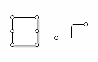

# ditaa #

[官网](http://ditaa.sourceforge.net/)

## 简介 ##

ditaa 是一个使用java语言编写的命令行工具, 可以将ascii字符组成的图形转换为图片.

## 安装及使用 ##

在 Ubuntu16.04 中, 可以使用 *apt install ditaa* 安装ditaa工具, 使用的命令行如下:

```
ditaa example.dit [example.png]
```

例如使用以下内容, [ditaa01](./ditaa/ditaa01.dit):

```
+--------+   +-------+    +-------+
|        | --+ ditaa +--> |       |
|  Text  |   +-------+    |diagram|
|Document|   |!magic!|    |       |
|     {d}|   |       |    |       |
+---|----+   +-------+    +-------+
    :                         ^
    |       Lots of work      |
    +-------------------------+
```

生成的效果图如下:


## 语法 ##

### 矩形 ###

可以使用 / 以及 \ 来连接转角, ditaa会将这两个字符绘制为圆角, 例如 [ditaa02](./ditaa/ditaa02.dit):

```
/--+
|  |
+--/
```

生成的效果图如下:


### 颜色 ###

可以在图形中定义颜色, 对于颜色代码的语法如下:

```
cXXX
```

其中 XXX 是一个16进制的数字, 一个示例如下 [ditaa03](./ditaa/ditaa03.dit):

```
/----\  /----\
|c33F|  |cC02|
|    |  |    |
\----/  \----/

/----\  /----\
|c1FF|  |c1AB|
|    |  |    |
\----/  \----/
```

生成的效果图如下:


也可以使用一些可读的字符串来定义颜色, 一个示例如下 [ditaa04](./ditaa/ditaa04.dit):

```
Color codes
/-------------|-------------\
|cRED RED     |cBLU BLU     |
+-------------|-------------+
|cGRE GRE     |cPNK PNK     |
+-------------|-------------+
|cBLK BLK     |cYEL YEL     |
\-------------|-------------/
```

生成的效果图如下:


如果定义了颜色的形状中包含文字, 文字的颜色会根据形状的颜色而自动变化. 颜色代码只在闭合的形状中生效, 在其他地方是不生效的.

### 形状 ###

ditaa 支持一些其他的形状, 形状的代码在 {} 中定义, 常见的形状如下表:

| 形状 | 代码 | 图形 |
|:--|:--|:--|
| Document | {d} |  |
| Storage | {s} |  |
| Input/Output | {io} |  |

#### Document ####

定义内容如下 [ditaa05](./ditaa/ditaa05.dit):

```
+-----+
|{d}  |
|     |
|     |
+-----+
```

生成的效果图如下:


#### Storage ####

定义内容如下 [ditaa06](./ditaa/ditaa06.dit):

```
+-----+
|{s}  |
|     |
|     |
+-----+
```

生成的效果图如下:


#### Input/Output ####

定义内容如下 [ditaa07](./ditaa/ditaa07.dit):

```
+-----+
|{io} |
|     |
|     |
+-----+
```

生成的效果图如下:


### 线条 ###

所有的包含一个 =(横线) 或者 :(竖线) 的线条会被绘制为虚线, 一个示例如下 [ditaa08](./ditaa/ditaa08.dit):

```
----+  /----\  +----+
    :  |    |  :    |
    |  |    |  |{s} |
    v  \-=--+  +---=+
```

生成的效果图如下:


### 线上的链接点 ###

如果 * 字符在一条线上, 而且不是在线的结尾处, 那么它会被绘制为一个链接点, 一个示例如下 [ditaa09](./ditaa/ditaa09.dit):

```
*----*
|    |      /--*
*    *      |
|    |  -*--+
*----*
```

生成的效果图如下:



### 文本 ###

如果文本中包含 *o XXXXX* 格式的内容, 其中 XXXXX 是需要显示的文字, 那么字符 o 会被绘制为一个句点, 一个示例如下 [ditaa10](./ditaa/ditaa10.dit):

```
/-----------------\
| Things to do    |
|cGRE             |
| o Cut the grass |
| o Buy jam       |
| o Fix car       |
| o Make website  |
\-----------------/
```

生成的效果图如下:


### HTML格式 ###

如果在命令行中使用了 --html 参数, 那么输入的文件应该是一个 HTML 文件, 其中 \<pre class="textdiagram"\> 标签中的内容会被绘制成图形且保存到 images 目录中, 而且一个包含  标签的新 HTML 文件被生成.

如果在 pre 标签中设置了 id 参数, 那么 id 的值将作为绘制的图形的文件名, 否则图片文件名将是 ditaa\_digram\_X.png 形式, 其中 X 是数字.
同样的, 如果没有指定导出文件的名称, 那么新HTML文件的名称将是 xxxx\_processed.html, 其中xxxx是原文件名.

在这个模式中, 已经处理过的文件将被跳过, 可以使用 --overwrite 参数来强制指定重新生成文件.
