# 活动图 #

## 稳定版本 ##

### 简单例子 ###

使用 * 符号来表示活动图的起始点和结束点, 可以使用 (*top) 符号来让起始点出现在图的顶点. 使用 --> 符号来表示箭头.

将以下内容保存为 [activity01](./activity/activity01.pum):

```
@startuml

(*) --> "First Activity"
"First Activity" --> (*)

@enduml
```

生成的效果图如下:

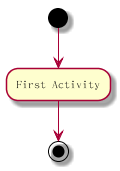

### 文本标签 ###

默认的, 一个箭头是从最后一个使用的 activity 开始的, 而且可以在箭头上使用文本标签.

将以下内容保存为 [activity02](./activity/activity02.pum):

```
@startuml

(*) --> "First Activity"
-->[You can put also labels] "Second Activity"
-->(*)

@enduml
```

生成的效果图如下:

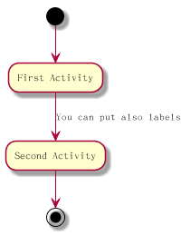

### 改变箭头方向 ###

可以使用 -> 来表示竖向箭头, 也可以使用以下示例中的方法修改箭头的方向.

将以下内容保存为 [activity03](./activity/activity03.pum):

```
@startuml

(*) -up-> "First Activity"
-right-> "Second Activity"
--> "Third Activity"
-left-> (*)

@enduml
```

生成的效果图如下:

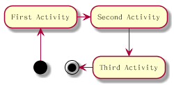

### 分支 ###

可以使用 if, then, else 等关键字来定义分支.

将以下内容保存为[activity04](./activity/activity04.pum):

```
@startuml

(*) --> "Initialization"

if "Some Test" then
-->[true] "Some Activity"
--> "Another Activity"
-right-> (*)
else
-->[false] "Something else"
-->[Ending process] (*)
endif

@enduml
```

生成的效果图如下:

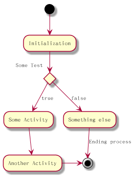

默认的, 一个分支的开始是从最后一个活动的 activity 开始的, 但是也可以使它从一个另外的 activity 开始. 而且分支也可以嵌套.

将以下内容保存为[activity05](./activity/activity05.pum):

```
@startuml

(*) --> if "Some Test" then

-->[true] "activity 1"

if "" then
-> "activity 3" as a3
else
if "Other test" then
-left-> "activity 5"
else
--> "activity 6"
endif
endif

else

->[false] "activity 2"

endif

a3 --> if "last test" then
--> "activity 7"
else
-> "activity 8"

endif

@enduml
```

生成的效果图如下:

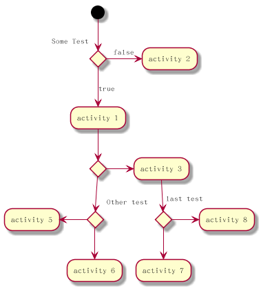

### 同步 ###

可以使用 === 字符来定义同步方法.

将以下内容保存为[activity06](./activity/activity06.pum):

```
@startuml

(*) --> ===B1===
--> "Parallel Activity 1"
--> ===B2===

===B1=== --> "Parallel Activity 2"
--> ===B2===

--> (*)

@enduml
```

生成的效果图如下:


### 长描述 ###

在定义一个 activity 节点的时候可以添加多行的描述, 也可以通过 as 关键字给节点一个短的名称, 以便之后引用.

将以下内容保存为[activity07](./activity/activity07.pum):

```
@startuml

(*) -left-> "this <size:20>activity</size>
is <b>very</b> <color:red>long2</color>
and defined on several lines
that contains many <i>text</i>" as A1

-up-> "Another activity\n on several lines"

A1 --> "Short activity "

@enduml
```

生成的效果图如下:

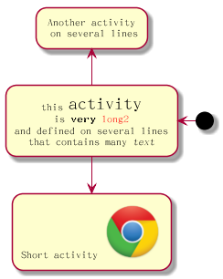

### 注解 ###

可以使用 note left, note right, note top 或者 note bottom 等关键字来定义 activity 节点的注解, 如果需要对开始节点定义注解, 可以在图形定义的开头使用注解. 也可以使用 endnote 关键字来定义多行注解.

将以下内容保存为[activity08](./activity/activity08.pum):

```
@startuml

(*) --> "Some Activity"
note right: This activity has to be defined
"Some Activity" --> (*)

note left
This note is on
several lines
end note

@enduml
```

生成的效果图如下:

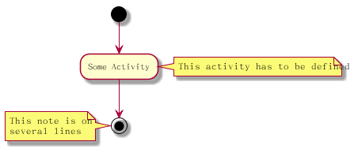

### 分区 ###

可以使用 partition 关键字来定义不同的分区, 每个分区都可以定义使用 html 颜色值或名称来定义背景色. 默认的, 一个 activity 节点是被自动的放在最后一个使用的分区中.

将以下内容保存为[activity09](./activity/activity09.pum):

```
@startuml

partition Conductor {
(*) --> "Climbs on Platform"
--> === S1 ===
--> Bows
}

partition Audience #LightSkyBlue {
=== S1 === --> Applauds
}

partition Conductor {
Bows --> === S2 ===
--> WavesArmes
Applauds --> === S2 ===
}

partition Orchestra #CCCCEE {
WavesArmes --> Introduction
--> "Play music"
}

@enduml
```

生成的效果图如下:

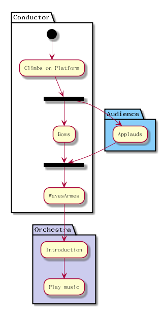

### Skinparam ###

可以使用 skinparam 命令来修改颜色和字体, 使用方式包括以下几种:

- 在图形的定义中
- 在一个包含文件中
- 在一个配置文件中

将以下内容保存为[activity10](./activity/activity10.pum):

```
@startuml

skinparam backgroundColor #AAFFFF
skinparam activity {
StartColor red
BarColor SaddleBrown
EndColor Silver
BackgroundColor Peru
BackgroundColor<< Begin >> Olive
BorderColor Peru
FontName Impact
}

(*) --> "Climbs on Platform" << Begin >>
--> === S1 ===
--> Bows
--> === S2 ===
--> WavesArmes
--> (*)

@enduml
```

生成的效果图如下:

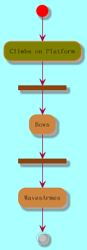

### 八边形 ###

可以使用 skinparam activityShape octagon 命令来修改 activity 节点的形状.

将以下内容保存为[activity11](./activity/activity11.pum):

```
@startuml

'Default is skinparam activityShape roundBox
skinparam activityShape octagon

(*) --> "First Activity"
"First Activity" --> (*)

@enduml
```

生成的效果图如下:

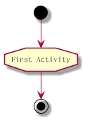

### 完整实例 ###

将以下内容保存为[activity12](./activity/activity12.pum):

```
@startuml

title Servlet Container

(*) --> "ClickServlet.handleRequest()"
--> "new Page"

if "Page.onSecurityCheck" then
->[true] "Page.onInit()"

if "isForward?" then
->[no] "Process controls"

if "continue processing?" then
-->[yes] ===RENDERING===
else
-->[no] ===REDIRECT_CHECK===
endif

else
-->[yes] ===RENDERING===
endif

if "is Post?" then
-->[yes] "Page.onPost()"
--> "Page.onRender()" as render
--> ===REDIRECT_CHECK===
else
-->[no] "Page.onGet()"
--> render
endif

else
-->[false] ===REDIRECT_CHECK===
endif

if "Do redirect?" then
->[yes] "redirect request"
--> ==BEFORE_DESTROY===
else
if "Do Forward?" then
-left->[yes] "Forward request"
--> ==BEFORE_DESTROY===
else
-right->[no] "Render page template"
--> ==BEFORE_DESTROY===
endif

endif

--> "Page.onDestroy()"
--> (*)

@enduml
```

生成的效果图如下:

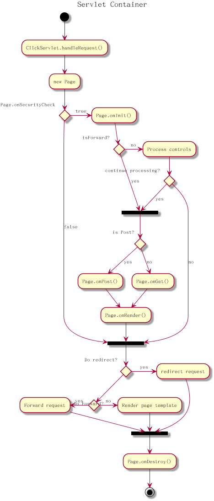

## Beta版 ##

### 简单例子 ###

在之前描述的语法中包含一些限制, 所以从 V7949 版之后提供了新的 beta语法.

在 beta语法中, activity 节点的文本是以 :符号开始, ;符号结束.

将以下内容保存为[activity13](./activity/activity13.pum):

```
@startuml

:Hello world;
:This is on defined on
several **lines**;

@enduml
```

生成的效果图如下:

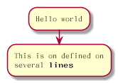

### 开始节点和结束节点 ###

可以使用 start 关键字定义开始节点, 使用 stop 或 end 关键字来定义结束节点.

将以下内容保存为[activity14](./activity/activity14.pum):

```
@startuml

start

:Hello world;
:This is on defined on
several **lines**;

stop
/' 也可以使用 end 关键字, 这样节点的形状会不同 '/

@enduml
```

生成的效果图如下:

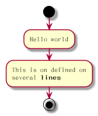

### 条件 ###

可以使用 if, elseif, then, else, endif 等关键字来定义条件分支.

将以下内容保存为[activity15](./activity/activity15.pum):

```
@startuml

start

if (Graphviz installed?) then (yes)
:process all\ndiagrams;
else (no)
:process only
__sequence__ and __activity__ diagrams;
endif

if (condition A) then (yes)
:Text 1;
elseif (condition B) then (yes)
:Text 2;
stop
elseif (condition C) then (yes)
:Text 3;
elseif (condition D) then (yes)
:Text 4;
else (nothing)
:Text else;
endif

stop

@enduml
```

生成的效果图如下:

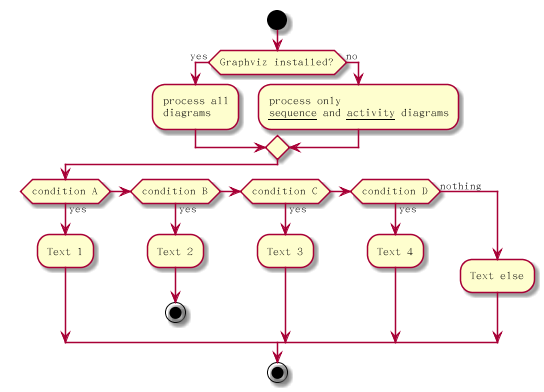

### Repeat ###

使用 repeat 和 repeatwhile 关键字来定义 repeat 循环.

将以下内容保存为[activity16](./activity/activity16.pum):

```
@startuml

start

repeat
:read data;
:generate diagrams;
repeat while (more data?)

stop

@enduml
```

生成的效果图如下:

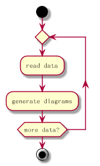

### while ###

使用 while 和 end while 关键字定义 while 循环.

将以下内容保存为[activity17](./activity/activity17.pum):

```
@startuml

start

while (data available?)
:read data;
:generate diagrams;
endwhile (empty)

stop

@enduml
```

生成的效果图如下:


### parallel ###

使用 fork, fork again 和 end fork 关键字来定义 parallel processing.

将以下内容保存为[activity18](./activity/activity18.pum):

```
@startuml

start

if (multiprocessor?) then (yes)
fork
:Treatment 1;
fork again
:Treatment 2;
end fork
else (monoproc)
:Treatment 1;
:Treatment 2;
endif

stop

@enduml
```

生成的效果图如下:

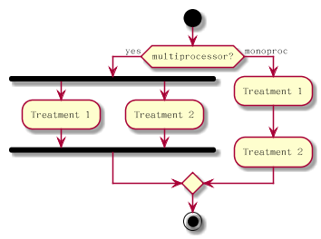

### 注解 ###

可以使用 floating 关键字来定义浮动的注解.

将以下内容保存为[activity19](./activity/activity19.pum):

```
@startuml

start

:foo1;
floating note left: This is a note
:foo2;
note right
This note is on several
//lines// and can
contain <b>HTML</b>
====
* Calling the method ""foo()"" is prohibited
end note


stop

@enduml
```

生成的效果图如下:

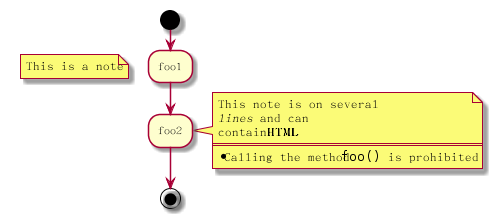

### 颜色 ###

将以下内容保存为[activity20](./activity/activity20.pum):

```
@startuml

start

:starting progress;
#HotPink:reading configuration files
These files should edited at this point!;
#AAAAAA:ending of the process;

@enduml
```

生成的效果图如下:


### 箭头 ###

将以下内容保存为[activity21](./activity/activity21.pum):

```
@startuml

:foo1;
-> You can put text on arrows;
if (test) then
-[#blue]->
:foo2;
-[#green,dashed]-> The text can
多行
and **very** long...;
:foo3;
else
-[#black,dotted]->
:foo4;
endif
-[#gray,bold]->
:foo5;

@enduml
```

生成的效果图如下:

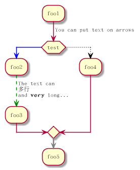

### 分组 ###

将以下内容保存为[activity22](./activity/activity22.pum):

```
@startuml

start

partition Initialization {
:read config file;
:init internal variable;
}

partition Running {
:wait for user interaction;
:print information;
}

stop

@enduml
```

生成的效果图如下:

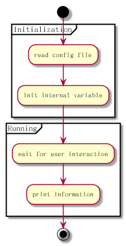

### swimlanes ###

将以下内容保存为[activity23](./activity/activity23.pum):

```
@startuml

|Swimlane1|
start
:foo1;
|#AntiqueWhite|Swimlane2|
:foo2;
:foo3;
|Swimlane1|
:foo4;
|Swimlane2|
:foo5;
stop

@enduml
```

生成的效果图如下:

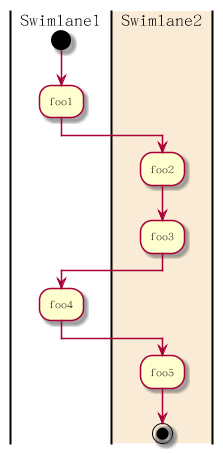

### Detach ###

可以使用 detach 关键字来移除箭头.

将以下内容保存为[activity24](./activity/activity24.pum):

```
@startuml

:start;
fork
:foo1;
:foo2;
fork again
:foo3;
detach
endfork

if (foo4) then
:foo5;
detach
endif

:foo6;
detach
:foo7;

stop

@enduml
```

生成的效果图如下:

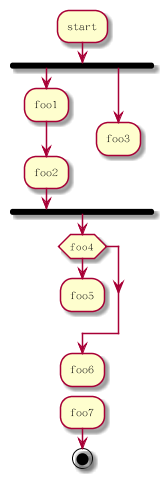

### SDL ###

可以使用以下字符来修改 activity 节点的形状: |, <, >, /, ], } .

将以下内容保存为[activity25](./activity/activity25.pum):

```
@startuml

:Ready;
:next(o)|
:Recerving;
split
:nak(i)<
:ack(o)>
split again
:ack(i)<
:next(o)
on several line|
:i := i + 1]
:ack(o)>
split again
:err(i)<
:nak(o)>
split again
:foo/
split again
:i > 5}

stop

end split
:finish;

@enduml
```

生成的效果图如下:

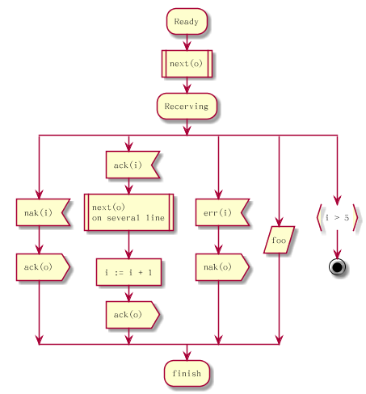

### 完整实例 ###

将以下内容保存为[activity26](./activity/activity26.pum):

```
@startuml

start
:ClickServlet.handleRequest();
:new page;
if (Page.onSecurityCheck) then (true)
:Page.onInit();
if (isForward?) then (no)
:Process controls;
if (continue processing?) then (no)
stop
endif

if (isPost?) then (yes)
:Page.onPost();
else (no)
:Page.onGet();
endif
:Page.onRender();
endif
else (false)
endif

if (do recirect?) then (yes)
:redirect process;
else
if (do forward?) then (yes)
:Forward request;
else (no)
:Render page template;
endif
endif

stop

@enduml
```

生成的效果图如下:

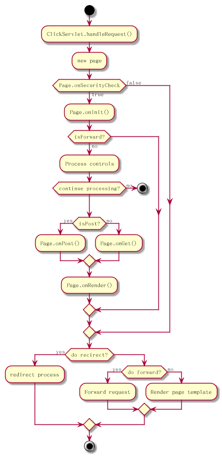
