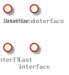
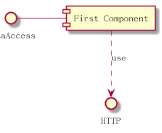
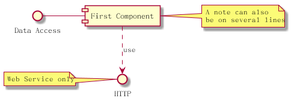
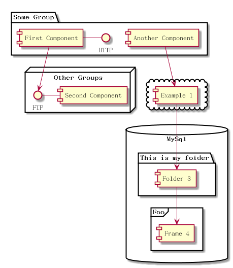

# 组件图 #

## 组件 ##

组件需要使用中括号包含, 也可以使用 component 关键字来定义组件, 使用 as 关键字定义别名.

将以下内容保存为 [component01](./component/component01.pum):

```
@startuml

[First component]
[Another component] as Comp2
component Comp3
component [Last\ncomponent] as Comp4

@enduml
```

生成的效果图如下:


## interface ##

interface 的定义需要使用小括号包含, 也可以使用 interface 关键字定义, 使用 as 关键字定义别名.

将以下内容保存为 [component02](./component/component02.pum):

```
@startuml

() "First Interface"
() "Another interface" as Interf2

interface Interf3
interface "Last\ninterface" as Interf4

@enduml
```

生成的效果图如下:



## 简单例子 ##

对于各个元素之间的关系, 可以使用 .. 符号表示虚线, -- 符号表示实线, > 符号表示箭头.

将以下内容保存为 [component03](./component/component03.pum):

```
@startuml

DataAccess - [First Component]
[First Component] ..> HTTP : use

@enduml
```

生成的效果图如下:



## 注解 ##

可以使用 note left, note right, note top 或者 note bottom 等关键字来定义注解. 注解也可以使用 note 关键字定义, 然后使用 .. 符号连接到具体的节点.

将以下内容保存为 [component04](./component/component04.pum):

```
@startuml

interface "Data Access" as DA

DA - [First Component]
[First Component] ..> HTTP : use

note left of HTTP : Web Service only

note right of [First Component]
A note can also
be on several lines
end note

@enduml
```

生成的效果图如下:



## 分组 ##

可以使用  package, folder, frame, cloud, database 等关键字来定义分组.

将以下内容保存为 [component05](./component/component05.pum):

```
@startuml

package "Some Group" {
HTTP - [First Component]
[Another Component]
}

node "Other Groups" {
FTP - [Second Component]
[First Component] --> FTP
}

cloud {
[Example 1]
}

database "MySql" {
folder "This is my folder" {
[Folder 3]
}
frame "Foo" {
[Frame 4]
}
}

[Another Component] --> [Example 1]
[Example 1] --> [Folder 3]
[Folder 3] --> [Frame 4]

@enduml
```

生成的效果图如下:


