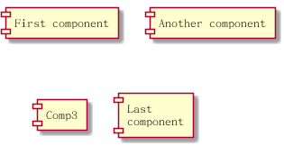

# 组件图 #

## 组件 ##

组件需要使用中括号包含, 也可以使用 component 关键字来定义组件, 使用 as 关键字定义别名.

将以下内容保存为 [component01](./component/component01.pum):

```
@startuml

[First component]
[Another component] as Comp2
component Comp3
component [Last\ncomponent] as Comp4

@enduml
```

生成的效果图如下:


