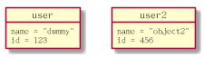

# 对象图 #

## 定义对象 ##

使用 object 关键字来定义对象.

将以下内容保存为 [object01](./object/object01.pum):

```
@startuml

object firstObject
object "My Second Object" as o2

@enduml
```

生成的效果图如下:


## 关系 ##

使用 <|-- 符号来定义 Extension 关系, 使用 *-- 符号来定义 Composition 关系, 使用 o-- 符号来定义 Aggregation 关系. 其中的 -- 可以替换为 .., 以便定义虚线.

将以下内容保存为 [object02](./object/object02.pum):

```
@startuml

object Object01
object Object02
object Object03
object Object04
object Object05
object Object06
object Object07
object Object08

Object01 <|-- Object02
Object03 *-- Object04
Object05 o-- Object06
Object07 .. Object08 : some labels

@enduml
```

生成的效果图如下:


## 属性 ##

将以下内容保存为 [object03](./object/object03.pum):

```
@startuml

object user

user : name = "dummy"
user : id = 123

object user2 {
name = "object2"
id = 456
}

@enduml
```

生成的效果图如下:



## 与类图相同的特性 ##

以下的特性与类图的使用方式是相同的:

- Visibility
- Defines notes
- Use packages
- Skin the output
