# 其他内容 #

## 通用命令 ##

### 注释 ###

使用 ' 符号开始的行被视作注释, 多行注释可以使用 /' 开始, 使用 '/ 结束.

### footer 和 header ###

可以使用 header 关键字添加 header, 使用 footer 关键字添加 footer, 并且使用 center, left 或 right 关键字来定义对齐方式.

将以下内容保存为[rest01](./rest/rest01.pum):

```
@startuml

Alice -> Bob : Authentication Request

header
<font color=red>Warning:</font>
Do not user in production.
endheader

center footer Generated for damonstration

@enduml
```

生成的效果图如下:

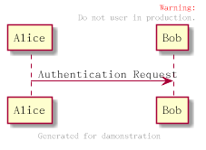

### 缩放 ###

可以使用 scale 关键字来缩放图片, 加上一个数字作为缩放因子, 也可以分别指定宽度和高度的缩放比例. 使用方式如下:

- scale 1.5
- scale 2/3
- scale 200 width
- scale 200 height
- scale 200*100
- scale max 300*200
- scale max 1024 width
- scale max 800 height

将以下内容保存为[rest02](./rest/rest02.pum):

```
@startuml

scale 180*90
Bob -> Alice : hello

@enduml
```

生成的效果图如下:

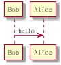

### title 和 caption ###

使用 title 关键字定义标题, 使用 caption 关键字定义图像下方的标题.

将以下内容保存为[rest03](./rest/rest03.pum):

```
@startuml

title
<u>Simple</u> communication example
on <i>several</i> lines and using <back:cadetblue>creole tags</back>
end title

caption figure 1

Alice --> Bob : Authentication Request
Bob -> Alice : Authentication Response

@enduml
```

生成的效果图如下:

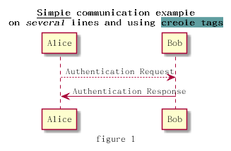

### legend ###

使用 legend 和 end legend 关键字来定义图例, 并且可以使用 center, left 或 right 关键字来定义对齐方式.

将以下内容保存为[rest04](./rest/rest04.pum):

```
@startuml

Alice -> Bob : Hello
legend right
Short
legend
endlegend

@enduml
```

生成的效果图如下:

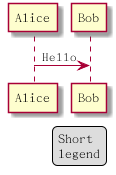

## Salt ##

可以使用 @startsalt, 或者 @startuml salt 来定义 salt 图形.

### 基本图形 ###

可以使用以下符号来定义图形:

- [] 定义按钮
- () 定义单选框
- [] 定义复选框
- " 定义文本

将以下内容保存为[rest05](./rest/rest05.pum):

```
@startuml
salt
{
Just plain test
[This is my button]
() Unchecked radio
(x) Checked radio
[] Unchecked box
[x] Checked box
"Enter text here    "
^This is a droplist^
}
@enduml
```

生成的效果图如下:

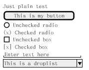

### grid ###

{ 符号会自动创建表格, 可以使用 | 来划分不同的列. 也可以使用以下符号来定义表格中的线如何显示:

- #: 显示所有的线
- !: 显示水平线
- -: 显示竖直线
- +: 显示边框

将以下内容保存为[rest06](./rest/rest06.pum):

```
@startsalt
{-
Login | "MyName    "
Password | "****      "
[Cancel] | [  OK  ]
}
@endsalt
```

生成的效果图如下:

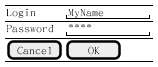

### 分割线 ###

将以下内容保存为[rest07](./rest/rest07.pum):

```
@startsalt
{
Text1
..
"Some field"
==
Note on usage
--
Another text
--
[OK]
}
@endsalt
```

生成的效果图如下:

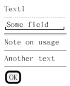

### 树形控件 ###

将以下内容保存为[rest08](./rest/rest08.pum):

```
@startsalt
{
{T
+ World
++ America
+++ Canada
+++ USA
++++ New York
++++ Boston
+++ Mexico
++ Europe
+++ Italy
+++ Germany
++++ Berlin
++ Africa
}
}
@endsalt
```

生成的效果图如下:

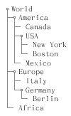

### Enclosing brackets ###

将以下内容保存为[rest09](./rest/rest09.pum):

```
@startsalt
{
Name | "         "
Modifiers: | { (X) public | () default | () private | () protected
[] abstract | [] final | [] static}
Superclass: | { "java.lang.Object" | [Browse...] }
}
@endsalt
```

生成的效果图如下:

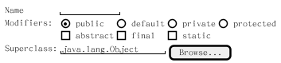

### tabs ###

将以下内容保存为[rest10](./rest/rest10.pum):

```
@startsalt
{+
{/ <b>General | Fullscreen | Behavior | Saving }
{
{ Open image in: | ^Smart Mode^ }
[x] Smooth images when zoomed
[x] confirm image deletion
[ ] show hidden images
}
[Close]
}
@endsalt

# 或使用以下方式定义竖直的tabs
@startsalt
{+
{/ <b>General
Fullscreen
Behavior
Saving } |
{
{ Open image in: | ^Smart Mode^ }
[x] Smooth images when zoomed
[x] confirm image deletion
[ ] show hidden images
[Close]
}
}
@endsalt
```

生成的效果图如下:

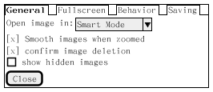

### menu ###

将以下内容保存为[rest11](./rest/rest11.pum):

```
@startsalt
{+
{* File | Edit | Source | Refactor
Refactor | New | Open File | - | Close | Close All }
{/ General | Fullscreen | Behavior | Saving }
{
{ Open image in: | ^Smart Mode^ }
[x] Smooth images when zoomed
[x] confirm image deletion
[ ] show hidden images
}
[Close]
}
@endsalt
```

生成的效果图如下:

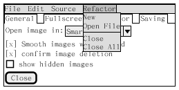

### 表格 ###

将以下内容保存为[rest12](./rest/rest12.pum):

```
@startsalt
{#
. | Column 2 | Column 3
Row header 1 | Value 1 | Value 2
Row header 2 | A long cell | *
}
@endsalt
```

生成的效果图如下:


## Creole ##

可以使用 Creole 引擎来定义文本的风格.

### Emphasized text ###

将以下内容保存为[rest13](./rest/rest13.pum):

```
@startuml

Alice -> Bob : hello --there--
... Some --long delay-- ...
Bob -> Alice : ok
note left
This is **bold**
This is //italics//
This is ""monospaced""
This is --stroked--
This is __underlined__
This is ~~waved~~
end note

@enduml
```

生成的效果图如下:

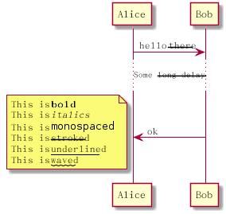
