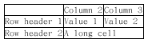

# 其他内容 #

## 通用命令 ##

### 注释 ###

使用 ' 符号开始的行被视作注释, 多行注释可以使用 /' 开始, 使用 '/ 结束.

### footer 和 header ###

可以使用 header 关键字添加 header, 使用 footer 关键字添加 footer, 并且使用 center, left 或 right 关键字来定义对齐方式.

将以下内容保存为[rest01](./rest/rest01.pum):

```
@startuml

Alice -> Bob : Authentication Request

header
<font color=red>Warning:</font>
Do not user in production.
endheader

center footer Generated for damonstration

@enduml
```

生成的效果图如下:


### 缩放 ###

可以使用 scale 关键字来缩放图片, 加上一个数字作为缩放因子, 也可以分别指定宽度和高度的缩放比例. 使用方式如下:

- scale 1.5
- scale 2/3
- scale 200 width
- scale 200 height
- scale 200*100
- scale max 300*200
- scale max 1024 width
- scale max 800 height

将以下内容保存为[rest02](./rest/rest02.pum):

```
@startuml

scale 180*90
Bob -> Alice : hello

@enduml
```

生成的效果图如下:


### title 和 caption ###

使用 title 关键字定义标题, 使用 caption 关键字定义图像下方的标题.

将以下内容保存为[rest03](./rest/rest03.pum):

```
@startuml

title
<u>Simple</u> communication example
on <i>several</i> lines and using <back:cadetblue>creole tags</back>
end title

caption figure 1

Alice --> Bob : Authentication Request
Bob -> Alice : Authentication Response

@enduml
```

生成的效果图如下:


### legend ###

使用 legend 和 end legend 关键字来定义图例, 并且可以使用 center, left 或 right 关键字来定义对齐方式.

将以下内容保存为[rest04](./rest/rest04.pum):

```
@startuml

Alice -> Bob : Hello
legend right
Short
legend
endlegend

@enduml
```

生成的效果图如下:


## Salt ##

可以使用 @startsalt, 或者 @startuml salt 来定义 salt 图形.

### 基本图形 ###

可以使用以下符号来定义图形:

- [] 定义按钮
- () 定义单选框
- [] 定义复选框
- " 定义文本

将以下内容保存为[rest05](./rest/rest05.pum):

```
@startuml
salt
{
Just plain test
[This is my button]
() Unchecked radio
(x) Checked radio
[] Unchecked box
[x] Checked box
"Enter text here    "
^This is a droplist^
}
@enduml
```

生成的效果图如下:


### grid ###

{ 符号会自动创建表格, 可以使用 | 来划分不同的列. 也可以使用以下符号来定义表格中的线如何显示:

- #: 显示所有的线
- !: 显示水平线
- -: 显示竖直线
- +: 显示边框

将以下内容保存为[rest06](./rest/rest06.pum):

```
@startsalt
{-
Login | "MyName    "
Password | "****      "
[Cancel] | [  OK  ]
}
@endsalt
```

生成的效果图如下:


### 分割线 ###

将以下内容保存为[rest07](./rest/rest07.pum):

```
@startsalt
{
Text1
..
"Some field"
==
Note on usage
--
Another text
--
[OK]
}
@endsalt
```

生成的效果图如下:


### 树形控件 ###

将以下内容保存为[rest08](./rest/rest08.pum):

```
@startsalt
{
{T
+ World
++ America
+++ Canada
+++ USA
++++ New York
++++ Boston
+++ Mexico
++ Europe
+++ Italy
+++ Germany
++++ Berlin
++ Africa
}
}
@endsalt
```

生成的效果图如下:


### Enclosing brackets ###

将以下内容保存为[rest09](./rest/rest09.pum):

```
@startsalt
{
Name | "         "
Modifiers: | { (X) public | () default | () private | () protected
[] abstract | [] final | [] static}
Superclass: | { "java.lang.Object" | [Browse...] }
}
@endsalt
```

生成的效果图如下:


### tabs ###

将以下内容保存为[rest10](./rest/rest10.pum):

```
@startsalt
{+
{/ <b>General | Fullscreen | Behavior | Saving }
{
{ Open image in: | ^Smart Mode^ }
[x] Smooth images when zoomed
[x] confirm image deletion
[ ] show hidden images
}
[Close]
}
@endsalt

# 或使用以下方式定义竖直的tabs
@startsalt
{+
{/ <b>General
Fullscreen
Behavior
Saving } |
{
{ Open image in: | ^Smart Mode^ }
[x] Smooth images when zoomed
[x] confirm image deletion
[ ] show hidden images
[Close]
}
}
@endsalt
```

生成的效果图如下:


### menu ###

将以下内容保存为[rest11](./rest/rest11.pum):

```
@startsalt
{+
{* File | Edit | Source | Refactor
Refactor | New | Open File | - | Close | Close All }
{/ General | Fullscreen | Behavior | Saving }
{
{ Open image in: | ^Smart Mode^ }
[x] Smooth images when zoomed
[x] confirm image deletion
[ ] show hidden images
}
[Close]
}
@endsalt
```

生成的效果图如下:


### 表格 ###

将以下内容保存为[rest12](./rest/rest12.pum):

```
@startsalt
{#
. | Column 2 | Column 3
Row header 1 | Value 1 | Value 2
Row header 2 | A long cell | *
}
@endsalt
```

生成的效果图如下:



## Creole ##

可以使用 Creole 引擎来定义文本的风格.

### Emphasized text ###

将以下内容保存为[rest13](./rest/rest13.pum):

```
@startuml

Alice -> Bob : hello --there--
... Some --long delay-- ...
Bob -> Alice : ok
note left
This is **bold**
This is //italics//
This is ""monospaced""
This is --stroked--
This is __underlined__
This is ~~waved~~
end note

@enduml
```

生成的效果图如下:


### List ###

将以下内容保存为[rest14](./rest/rest14.pum):

```
@startuml

object demo {
* Bullet list
* Second item
** Sub item
}

legend
# Numbered list
# Second item
## Sub item
## Another sub item
# Third item
end legend

@enduml
```

生成的效果图如下:


### Escape character ###

可以使用 ~ 符号来转义 creole 中的特殊字符.

将以下内容保存为[rest15](./rest/rest15.pum):

```
@startuml

object demo {
This is not ~___underscored__.
This is note ~""monospaced"".
}

@enduml
```

生成的效果图如下:


### Horizontal lines ###

将以下内容保存为[rest16](./rest/rest16.pum):

```
@startuml

database DB1 as "
You can have horizontal lines
----
Or double lines
====
Or strong lines
____
Or dotted lines
..My title..
Enjoy!
"

note right
This is working also in notes
You can also add title in all these lines
==Title==
--Another title--
end note

@enduml
```

生成的效果图如下:


### Headings ###

将以下内容保存为[rest17](./rest/rest17.pum):

```
@startuml

usecase UC1 as "
= Extra-large heading
Some text
== Large heading
Other text
=== Medium heading
Information
....
==== Small heading
"

@enduml
```

生成的效果图如下:


### Legacy HTML ###

将以下内容保存为[rest18](./rest/rest18.pum):

```
@startuml

:* You can change <color:red>text color</color>
* You can change <back:cadetblue>background color</back>
* You can change <size:18>size</size>
* You use <u>legacy</u> <b>HTML <i>rag</i></b>
* You use <u:red>color</u> <s:green>in HTML</s> <w:#0000FF>tag</w>
----
* Use image : 
;

@enduml
```

生成的效果图如下:


### table ###

将以下内容保存为[rest19](./rest/rest19.pum):

```
@startuml

skinparam titleFontSize 14

title
Example of simple table

|= |= table |= header |
| a | table | row |
|<#FF8080> red |<#80FF80> green |<#8080FF> blue |
<#yellow>| b | table | row |
end title

[*] --> State1

@enduml
```

生成的效果图如下:


### Tree ###

将以下内容保存为[rest20](./rest/rest20.pum):

```
@startuml

skinparam titleFontSize 14

title
Example of tree

|_ First line
|_ **Bom(Model)**
|_ prop1
|_ prop2
|_ prop3
|_ Last line

end title

[*] --> State1

@enduml
```

生成的效果图如下:


### Special characters ###

可以使用 &# 或者 <U+XXXX> 符号来定义 unicode 字符.

将以下内容保存为[rest21](./rest/rest21.pum):

```
@startuml

usecase foo as "this is &#8734; long"
usecase bar as "this is also <U+221E> long"

@enduml
```

生成的效果图如下:


### OpenIconic ###

将以下内容保存为[rest22](./rest/rest22.pum):

```
@startuml

title: <size:20><&heart>Use of OpenIconic<&heart></size>
class Wifi
note left
Click on <&wifi>
end note

@enduml
```

生成的效果图如下:


可以通过以下内容来显示 OpenIconic 支持的所有图标:

```
@startuml
listopeniconic
@enduml
```

所有的图标列表如下:


### 定义和使用 sprite ###

一个 sprite 是指一个小的图像元素, 可以有 4, 8, 或者 16 三个灰度等级. 使用 sprite 关键字来定义 sprite.

将以下内容保存为[rest23](./rest/rest23.pum):

```
@startuml

sprite $foo1 {
FFFFFFFFFFFFFFF
F0123456789ABCF
F0123456789ABCF
F0123456789ABCF
F0123456789ABCF
F0123456789ABCF
F0123456789ABCF
F0123456789ABCF
F0123456789ABCF
FFFFFFFFFFFFFFF
}

Alice -> Bob : Testing <$foo1{scale=3}>

@enduml
```

生成的效果图如下:


