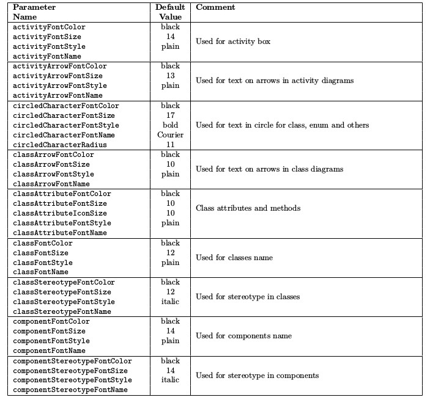

# 其他内容 #

## 通用命令 ##

### 注释 ###

使用 ' 符号开始的行被视作注释, 多行注释可以使用 /' 开始, 使用 '/ 结束.

### footer 和 header ###

可以使用 header 关键字添加 header, 使用 footer 关键字添加 footer, 并且使用 center, left 或 right 关键字来定义对齐方式.

将以下内容保存为[rest01](./rest/rest01.pum):

```
@startuml

Alice -> Bob : Authentication Request

header
<font color=red>Warning:</font>
Do not user in production.
endheader

center footer Generated for damonstration

@enduml
```

生成的效果图如下:


### 缩放 ###

可以使用 scale 关键字来缩放图片, 加上一个数字作为缩放因子, 也可以分别指定宽度和高度的缩放比例. 使用方式如下:

- scale 1.5
- scale 2/3
- scale 200 width
- scale 200 height
- scale 200*100
- scale max 300*200
- scale max 1024 width
- scale max 800 height

将以下内容保存为[rest02](./rest/rest02.pum):

```
@startuml

scale 180*90
Bob -> Alice : hello

@enduml
```

生成的效果图如下:


### title 和 caption ###

使用 title 关键字定义标题, 使用 caption 关键字定义图像下方的标题.

将以下内容保存为[rest03](./rest/rest03.pum):

```
@startuml

title
<u>Simple</u> communication example
on <i>several</i> lines and using <back:cadetblue>creole tags</back>
end title

caption figure 1

Alice --> Bob : Authentication Request
Bob -> Alice : Authentication Response

@enduml
```

生成的效果图如下:


### legend ###

使用 legend 和 end legend 关键字来定义图例, 并且可以使用 center, left 或 right 关键字来定义对齐方式.

将以下内容保存为[rest04](./rest/rest04.pum):

```
@startuml

Alice -> Bob : Hello
legend right
Short
legend
endlegend

@enduml
```

生成的效果图如下:


## Salt ##

可以使用 @startsalt, 或者 @startuml salt 来定义 salt 图形.

### 基本图形 ###

可以使用以下符号来定义图形:

- [] 定义按钮
- () 定义单选框
- [] 定义复选框
- " 定义文本

将以下内容保存为[rest05](./rest/rest05.pum):

```
@startuml
salt
{
Just plain test
[This is my button]
() Unchecked radio
(x) Checked radio
[] Unchecked box
[x] Checked box
"Enter text here    "
^This is a droplist^
}
@enduml
```

生成的效果图如下:


### grid ###

{ 符号会自动创建表格, 可以使用 | 来划分不同的列. 也可以使用以下符号来定义表格中的线如何显示:

- #: 显示所有的线
- !: 显示水平线
- -: 显示竖直线
- +: 显示边框

将以下内容保存为[rest06](./rest/rest06.pum):

```
@startsalt
{-
Login | "MyName    "
Password | "****      "
[Cancel] | [  OK  ]
}
@endsalt
```

生成的效果图如下:


### 分割线 ###

将以下内容保存为[rest07](./rest/rest07.pum):

```
@startsalt
{
Text1
..
"Some field"
==
Note on usage
--
Another text
--
[OK]
}
@endsalt
```

生成的效果图如下:


### 树形控件 ###

将以下内容保存为[rest08](./rest/rest08.pum):

```
@startsalt
{
{T
+ World
++ America
+++ Canada
+++ USA
++++ New York
++++ Boston
+++ Mexico
++ Europe
+++ Italy
+++ Germany
++++ Berlin
++ Africa
}
}
@endsalt
```

生成的效果图如下:


### Enclosing brackets ###

将以下内容保存为[rest09](./rest/rest09.pum):

```
@startsalt
{
Name | "         "
Modifiers: | { (X) public | () default | () private | () protected
[] abstract | [] final | [] static}
Superclass: | { "java.lang.Object" | [Browse...] }
}
@endsalt
```

生成的效果图如下:


### tabs ###

将以下内容保存为[rest10](./rest/rest10.pum):

```
@startsalt
{+
{/ <b>General | Fullscreen | Behavior | Saving }
{
{ Open image in: | ^Smart Mode^ }
[x] Smooth images when zoomed
[x] confirm image deletion
[ ] show hidden images
}
[Close]
}
@endsalt

# 或使用以下方式定义竖直的tabs
@startsalt
{+
{/ <b>General
Fullscreen
Behavior
Saving } |
{
{ Open image in: | ^Smart Mode^ }
[x] Smooth images when zoomed
[x] confirm image deletion
[ ] show hidden images
[Close]
}
}
@endsalt
```

生成的效果图如下:


### menu ###

将以下内容保存为[rest11](./rest/rest11.pum):

```
@startsalt
{+
{* File | Edit | Source | Refactor
Refactor | New | Open File | - | Close | Close All }
{/ General | Fullscreen | Behavior | Saving }
{
{ Open image in: | ^Smart Mode^ }
[x] Smooth images when zoomed
[x] confirm image deletion
[ ] show hidden images
}
[Close]
}
@endsalt
```

生成的效果图如下:


### 表格 ###

将以下内容保存为[rest12](./rest/rest12.pum):

```
@startsalt
{#
. | Column 2 | Column 3
Row header 1 | Value 1 | Value 2
Row header 2 | A long cell | *
}
@endsalt
```

生成的效果图如下:


## Creole ##

可以使用 Creole 引擎来定义文本的风格.

### Emphasized text ###

将以下内容保存为[rest13](./rest/rest13.pum):

```
@startuml

Alice -> Bob : hello --there--
... Some --long delay-- ...
Bob -> Alice : ok
note left
This is **bold**
This is //italics//
This is ""monospaced""
This is --stroked--
This is __underlined__
This is ~~waved~~
end note

@enduml
```

生成的效果图如下:


### List ###

将以下内容保存为[rest14](./rest/rest14.pum):

```
@startuml

object demo {
* Bullet list
* Second item
** Sub item
}

legend
# Numbered list
# Second item
## Sub item
## Another sub item
# Third item
end legend

@enduml
```

生成的效果图如下:


### Escape character ###

可以使用 ~ 符号来转义 creole 中的特殊字符.

将以下内容保存为[rest15](./rest/rest15.pum):

```
@startuml

object demo {
This is not ~___underscored__.
This is note ~""monospaced"".
}

@enduml
```

生成的效果图如下:


### Horizontal lines ###

将以下内容保存为[rest16](./rest/rest16.pum):

```
@startuml

database DB1 as "
You can have horizontal lines
----
Or double lines
====
Or strong lines
____
Or dotted lines
..My title..
Enjoy!
"

note right
This is working also in notes
You can also add title in all these lines
==Title==
--Another title--
end note

@enduml
```

生成的效果图如下:


### Headings ###

将以下内容保存为[rest17](./rest/rest17.pum):

```
@startuml

usecase UC1 as "
= Extra-large heading
Some text
== Large heading
Other text
=== Medium heading
Information
....
==== Small heading
"

@enduml
```

生成的效果图如下:


### Legacy HTML ###

将以下内容保存为[rest18](./rest/rest18.pum):

```
@startuml

:* You can change <color:red>text color</color>
* You can change <back:cadetblue>background color</back>
* You can change <size:18>size</size>
* You use <u>legacy</u> <b>HTML <i>rag</i></b>
* You use <u:red>color</u> <s:green>in HTML</s> <w:#0000FF>tag</w>
----
* Use image : 
;

@enduml
```

生成的效果图如下:


### table ###

将以下内容保存为[rest19](./rest/rest19.pum):

```
@startuml

skinparam titleFontSize 14

title
Example of simple table

|= |= table |= header |
| a | table | row |
|<#FF8080> red |<#80FF80> green |<#8080FF> blue |
<#yellow>| b | table | row |
end title

[*] --> State1

@enduml
```

生成的效果图如下:


### Tree ###

将以下内容保存为[rest20](./rest/rest20.pum):

```
@startuml

skinparam titleFontSize 14

title
Example of tree

|_ First line
|_ **Bom(Model)**
|_ prop1
|_ prop2
|_ prop3
|_ Last line

end title

[*] --> State1

@enduml
```

生成的效果图如下:


### Special characters ###

可以使用 &# 或者 <U+XXXX> 符号来定义 unicode 字符.

将以下内容保存为[rest21](./rest/rest21.pum):

```
@startuml

usecase foo as "this is &#8734; long"
usecase bar as "this is also <U+221E> long"

@enduml
```

生成的效果图如下:


### OpenIconic ###

将以下内容保存为[rest22](./rest/rest22.pum):

```
@startuml

title: <size:20><&heart>Use of OpenIconic<&heart></size>
class Wifi
note left
Click on <&wifi>
end note

@enduml
```

生成的效果图如下:


可以通过以下内容来显示 OpenIconic 支持的所有图标:

```
@startuml
listopeniconic
@enduml
```

所有的图标列表如下:


### 定义和使用 sprite ###

一个 sprite 是指一个小的图像元素, 可以有 4, 8, 或者 16 三个灰度等级. 使用 sprite 关键字来定义 sprite.

将以下内容保存为[rest23](./rest/rest23.pum):

```
@startuml

sprite $foo1 {
FFFFFFFFFFFFFFF
F0123456789ABCF
F0123456789ABCF
F0123456789ABCF
F0123456789ABCF
F0123456789ABCF
F0123456789ABCF
F0123456789ABCF
F0123456789ABCF
FFFFFFFFFFFFFFF
}

Alice -> Bob : Testing <$foo1{scale=3}>

@enduml
```

生成的效果图如下:


### Encoding Sprite ###

可以使用以下命令来生成 sprite 图形:

```
java -jar plantuml.jar -encodesprite 16z foo.png
```

其中 encodesprite 的值可以是 4, 8, 16, 4z, 8z 及 16z 之一, 其中的 z 代表可以压缩.

### 实例 ###

将以下内容保存为[rest24](./rest/rest24.pum):

```
@startuml

sprite $bug [15x15/16z] PKzR2i0m2BFMi15p__FEjQEqB1z27aeqCqixa8S4OT7C53cKpsHpaYPDJY_12MHM-BLRyywPhrrlw3qumqNThmXgd1TOterAZmOW8sgiJafogofWRwtV3nCF
sprite $printer [15x15/8z] NOtH3W0W208HxFz_kMAhj7lHWpa1XC716sz0Pq4MVPEWfBHIuxP3L6kbTcizR8tAhzaqFvXwvFfPEqm0

sprite $disk {
444445566677881
436000000009991
43600000000ACA1
53700000001A7A1
53700000012B8A1
53800000123B8A1
63800001233C9A1
634999AABBC99B1
744566778899AB1
7456AAAAA99AAB1
8566AFC228AABB1
8567AC8118BBBB1
867BD4433BBBBB1
39AAAAABBBBBBC1
}

title Use of sprites (<$printer>, <$bug>...)
class Example {
Can have some bug : <$bug>
Click on <$disk> to save
}

note left : The printer <$printer> is available

@enduml
```

生成的效果图如下:


## 修改字体和颜色 ##

### 用法 ###

可以使用 skinparam 命令来修改字体和颜色, 例如以下命令:

```
skinparam backgroundColor yellow
```

可以在以下地方使用该命令:

- 在图形的定义中
- 在一个包含文件中
- 在一个配置文件中

### 嵌套 ###

对于多个 skinparam 命令, 可以使用如下方式嵌套定义:

```
skinparam xxxx {
Param1 value1
Param2 value2
Param3 value3
Param4 value4
}

相当于:
skinparam xxxxParam1 value1
skinparam xxxxParam2 value2
skinparam xxxxParam3 value3
skinparam xxxxParam4 value4
```

### 颜色 ###

可以使用如下图的颜色值:


### 字体颜色, 名称和字号 ###

可以使用如下的方式来修改字体:

```
skinparam classFontColor red
skinparam classFontSize 10
skinparam classFontName Aapex
skinparam defaultFontName Aapex
```

常用的设置如下表:




### 黑白色 ###

将以下内容保存为[rest25](./rest/rest25.pum):

```
@startuml

skinparam monochrome true

actor User
participant "First Class" as A
participant "Second Class" as B
participant "Last Class" as C

User -> A : DoWork
activate A

A -> B : Create Request
activate B

B -> C : DoWork
activate C
C --> B : WorkDown
destroy C

B --> A : Request Created
deactivate B

A --> User : Done
deactivate A

@enduml
```

生成的效果图如下:


## Preprocessing ##

### Including files ###

可以使用 !include 来包含其他文件.

假设有一个rest-list.iuml 文件, 内容如下[rest-list.iuml](./rest/rest-list.pum):

```
interface List
List : int size()
List : void clear()
```

将以下内容保存为[rest26](./rest/rest26.pum):

```
@startuml

!include rest-list.iuml
List <|.. ArrayList

@enduml
```

生成的效果图如下:


一个文件在只能包含不同的其他文件, 每个文件可以包含一次. 如果需要多次包含, 可以使用 !include\_many .
也可以在被包含文件中定义多个 @startuml/@enduml 段, 然后在包含文件中使用 !number 的方式来引入段, 例如 !include foo.txt!1. 同样的, 可以对每个段指定ID, 形式如 @startuml(id=MY\_OWN\_ID), 然后使用 !include foo.txt!MY\_OWN\_ID 的方式引用.

### Including url ###

可以使用 !includeurl 的方式引入url的内容.

### 常量 ###

将以下内容保存为[rest27](./rest/rest27.pum):

```
@startuml

!define SEQUENCE (S,#AAAAAA) Database Sequence
!define TABLE (T,#FFAAAA) Database Table

class USER << TABLE >>
class ACCOUNT << TABLE >>
class UID << SEQUENCE >>
USER "1" -- "*" ACCOUNT
USER -> UID

@enduml
```

生成的效果图如下:


### 宏 ###

将以下内容保存为[rest28](./rest/rest28.pum):

```
@startuml

!define send(a,b,c) a->b : c
send(Alice, Bob, Hello)
send(Bob, Alice, ok)

!define DOUBLE(x) x x
!definelong AUTHEN(x, y)
x -> y : DOUBLE(hello)
y -> x : ok
!enddefinelong

AUTHEN(Bob, Alice)

!define some_macro(x, y="some default", z="another defualt") x and y and z
class foo {
some_macro(Z1, Z2, Z3)
some_macro(Z1, Z2)
some_macro(A)
}

@enduml
```

生成的效果图如下:


### 日期时间 ###

将以下内容保存为[rest29](./rest/rest29.pum):

```
@startuml

!define ANOTHER_DATE %date[yyyy.MM.dd 'at' HH:mm]%
Title Generated %date% or ANOTHER_DATE
alice -> bob

@enduml
```

生成的效果图如下:


### 特殊变量 ###

有以下的特殊变量:

- %dirpath%: 当前文件路径
- %filename%: 当前文件名

### Conditions ###

将以下内容保存为[rest30](./rest/rest30.pum):

```
@startuml

!define SHOW_METHODS

class ArrayList
!ifdef SHOW_METHODS
ArrayList : int size()
ArrayList : void clear()
!endif

!define SHOW_FIELDS
!undef SHOW_METHODS
class foo {
!ifdef SHOW_FIELDS || SHOW_METHODS
This is shown
!endif
!ifdef SHOW_METHODS && SHOW_FIELDS
This is NOT shown
!endif
}

@enduml
```

生成的效果图如下:


### Advanced features ###

将以下内容保存为[rest31](./rest/rest31.pum):

```
@startuml

!definelong COMP_TEXTGENCOMP(name)
[name] << Comp >>
interface Ifc << IfcType >> AS name##Ifc
name##Ifc - [name]
!enddefinelong

COMP_TEXTGENCOMP(dummy)

!define module(x) component x <<module>>
!define module(x,y) component x as y <<module>>

module(foo)
module(bar, barcode)

@enduml
```

生成的效果图如下:


## 国际化 ##

将以下内容保存为[rest32](./rest/rest32.pum):

```
@startuml

skinparam backgroundColor #EEEBDC
actor 使用者
participant "頭等艙 " as A
participant "第二類 " as B
participant "最後一堂課 " as 別的東西
使用者 -> A: 完成這項工作
activate A
A -> B: 創建請求
activate B
B -> 別的東西 : 創建請求
activate 別的東西
別的東西 --> B: 這項工作完成
destroy 別的東西
B --> A: 請求創建
deactivate B
A --> 使用者 : 做完
deactivate A

@enduml
```

生成的效果图如下:


