# 序列图 #

## 简单例子 ##

将以下内容保存为 [plantuml02](./sequence/plantuml02.pum):

```
Alice -> Bob: Authentication Request
Bob --> Alice: Authentication Response

Alice -> Bob: Another authentication Request
Alice <-- Bob: Another authentication Response
```

生成的效果图如下:

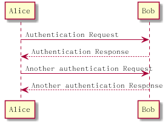

## 注释 ##

以单引号开始的行即是一个单行注释, 多行注释的使用中, / 表示注释内容的开始, 然后再用 / 表示注释内容的结束.

## 申明参与者 ##

可以使用 participant 关键字申明参与者, 也可以使用下列单词标明参与者的分类: actor, boundary, control, entity, database.

不同的参与者的图标是不同的, 将以下内容保存为 [plantuml03](./sequence/plantuml03.pum):

```
actor Foo1
boundary Foo2
control Foo3
entity Foo4
database Foo5

Foo1 -> Foo2 : To boundary
Foo1 -> Foo3 : To control
Foo1 -> Foo4 : To entity
Foo1 -> Foo5 : To database
```

生成的效果图如下:

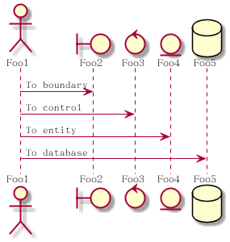

使用 as 关键字可以为参与者起一个别名, 这样在引用长名的参与者时会方便很多. 在参与者申明语句后行尾可以追加背景色的设置, 只要把标准的 HTML 颜色值写在后面就行.

将以下内容保存为 [plantuml04](./sequence/plantuml04.pum):

```
actor Bob #red
' The only defference between actor
' and participant is the drawing
participant Alice
participant "I have a really\nlong name" as L #99ff99
/' You can also declare:
   participant L as "I have a really\long name" #99ff99
  '/

Alice -> Bob : Authentication Request
Bob -> Alice : Authentication Response
Bob -> L : Log transaction
```

生成的效果图如下:

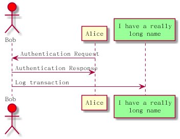

针对非字母的参与者名, 可以使用双引号, 同样也可以为比较长的名字起个别名, 方法同使用 as 关键字.

使用上面的关键字来申明参与者, 是一种显式申明; 而采用引号来申明参与者则是一种隐式申明方法, 它不需要专门的位置去定义.

将以下内容保存为 [plantuml05](./sequence/plantuml05.pum):

```
Alice -> "Bob()" : Hello
"Bob()" -> "This is very\nlong" as Long
' You can also declare:
' "Bob()" -> Long as "This is very\long"
Long --> "Bob()" : ok
```

生成的效果图如下:

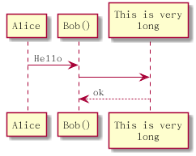

## 发送消息给自己 ##

一个参与者可以给自己发送消息, 消息名如果需要有多行文本, 可以使用 \n 来表示换行.

将以下内容保存为 [plantuml06](./sequence/plantuml06.pum):

```
Alice -> Alice : This is a signal to self.\nIt also demonstrates\nmultiline \ntext
```

生成的效果图如下:

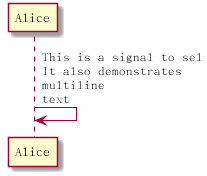

## 改变箭头的样式 ##

在用例图中可以通过以下方式来改变箭头的样式:

- 使用 \ 或 / 来替换 \< 或 \> 可以让箭头只显示上半部分或下半部分;
- 重复输入箭头或斜杠 [>> //] 可以绘制空心箭头
- 使用双横线 -- 替换单横线 - 可以用来绘制点线
- 在箭头后面加个 o 可以在箭头前绘制一个圆圈
- 使用 \<-\> 可用来绘制双向箭头

将以下内容保存为 [plantuml07](./sequence/plantuml07.pum):

```
Bob -> Alice
Bob ->> Alice
Bob -\ Alice
Bob \\- Alice
Bob //-- Alice

Bob ->o Alice
Bob o\\-- Alice

Bob <-> Alice
Bob <<-\\o Alice
```

生成的效果图如下:

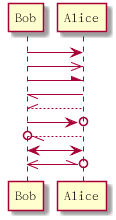

## 改变箭头的颜色 ##

要改变箭头的颜色, 可以使用 [HTML颜色符号](https://www.w3schools.com/HTML/html_colors.asp).

将以下内容保存为 [plantuml08](./sequence/plantuml08.pum):

```
Bob -[#red]> Alice : hello
Alice -[#0000ff]-> Bob : ok
```

生成的效果图如下:

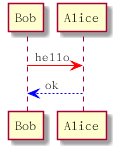

## 消息序号 ##

关键词 autonumber 用来自动的给消息添加上序号.

将以下内容保存为 [plantuml09](./sequence/plantuml09.pum):

```
autonumber
Bob -> Alice : Authentication Request
Bob -> Alice : Authentication Response
```

生成的效果图如下:

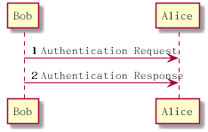

如果需要指定一个起始号码, 可以直接在 autonumber 后面加一个数字即可, 如果需要设置自增量, 则再加一个数字.

将以下内容保存为 [plantuml10](./sequence/plantuml10.pum):

```
autonumber
Bob -> Alice : Authentication Request
Bob <- Alice : Authentication Response

autonumber 15
Bob -> Alice : Another authentication Request
Bob <- Alice : Another authentication Response

autonumber 40 10
Bob -> Alice : Yet Another authentication Request
Bob <- Alice : Yet Another authentication Response
```

生成的效果图如下:

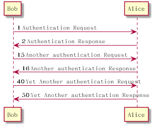

也可以为序号指定数字格式, 这个格式化的过程实际上是Java类 DecimalFormat 来执行的, 0表示数字, # 缺省补零位数.
同样的, 也可以使用一些 HTML 标签来控制数字的样式.

使用 autonumber stop 关键字来停止序号, 使用 autonumber resume 'increment' 'format' 来重新启用序号.

将以下内容保存为 [plantuml11](./sequence/plantuml11.pum):

```
autonumber "<b>[000]"
Bob -> Alice : Authentication Request
Bob <- Alice : Authentication Response

autonumber 15 "<b>(<u>##</u>)"
Bob -> Alice : Another authentication Request
Bob <- Alice : Another authentication Response

autonumber stop
Bob -> Alice : dummy

autonumber resume 1 "<font color=red>Message 0  "
Bob -> Alice : Yet Another authentication Request
Bob <- Alice : Yet Another authentication Response
```

生成的效果图如下:

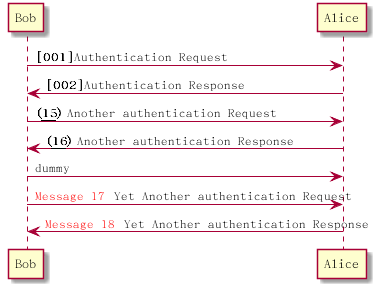

## 标题 ##

要给图形加一个标题可以用 title 关键字来设置.
在标题中可以使用 creole 格式, 并使用 \n 字符来换行.
也可以使用 title 和 end title 关键字来定义多行的标题.


将以下内容保存为 [plantuml12](./sequence/plantuml12.pum):

```
/' title Simple Comunication example '/

/' title __Simple__ **communication** example \n newline'/

title
__Simple__ communication example
on <i>serveral</i> lines and using <font color=red>html</font>
end title

Bob -> Alice : Authentication Request
Bob <- Alice : Authentication Response
```

生成的效果图如下:

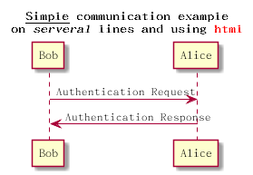

## 图形图例 ##

使用 legend 和 end legend 关键字可以设置图形的图例, 图例可以设置为左对齐, 右对齐和居中对齐.

将以下内容保存为 [plantuml13](./sequence/plantuml13.pum):

```
Alice -> Bob : Hello

legend right
Short
legend
end legend
```

生成的效果图如下:

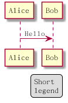

## 分割图形 ##

关键词 newpage 用来把图形分割成几个图片, 每一个被分割出的图片可以看作是一个新的页面, 如果要给新的页面一个标题, 可以紧跟在关键词 newpage 之后来设置.

使用这个方法可以方便的在Word里面把比较长的u图形分别打印到几个不同的页面上.

将以下内容保存为 [plantuml14](./sequence/plantuml14.pum):

```
Bliss -> Tia : I love you
Bliss -> Tia : I miss you

newpage

Bliss -> Tia : Let's go home
Bliss -> Tia : Quick

newpage

Tia -> Bliss : Give me money
Tia -> Bliss : No money No love
```

## 消息分组 ##

有时候可能需要对消息进行分组, 那么可以使用下列的关键字来实现: alt/else, opt, loop, par, break, critical, group(该关键字后面的文字会作为组名显示在图形上).

这些关键字后可以添加一些文本用来显示在头部(除了group), 在组嵌套组的结构里可以用关键字 end 来关闭组或者表示一个组符号的结束符.

将以下内容保存为 [plantuml15](./sequence/plantuml15.pum):

```
Alice -> Bob : Authentication Request

alt successful case
    Bob -> Alice : Authentication Accepted
else some kind of failure
    Bob -> Alice : Authentication Failue
    group My own label
          Alice -> Log : Log attack start
          loop 1000 times
               Alice -> Bob : DNS Attack
          end
          Alice -> Log : Log alice end
    end
else Another type of failure
    Bob -> Alice : Please repeat
end
```

生成的效果图如下:

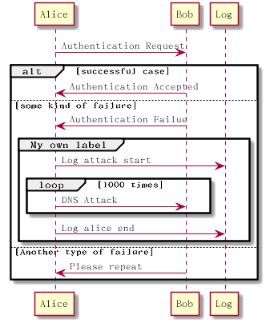

## 消息注解 ##

我们可能经常会在消息的左边或者右边使用注解. 要添加注解, 只要使用 note left 或 note right 关键词即可.

将以下内容保存为 [plantuml16](./sequence/plantuml16.pum):

```
Alice -> Bob : hello
note left: this is a first note

Bob -> Alice : ok
note right: this is another note

Bob -> Bob : I am thinking
note left
     a note
     can also be defined
     on several lines
end note
```

生成的效果图如下:

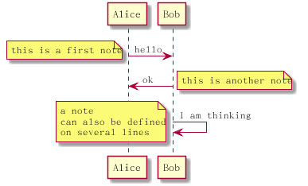

## 其他注解方式 ##

通过使用关键字 note left of, note right of 或 note over, 我们还可以把注解放置在与之相关的参与者的左边或是右边, 或者下方.

通过改变注解的背景色, 我们还可以高亮显示一个注解文本块.

如果要使用多行注解, 可以使用关键词 end note 来表示注解的结束.

也可以使用 hnote 和 rnote 关键字来改变注解的形状.

将以下内容保存为 [plantuml17](./sequence/plantuml17.pum):

```
participant Alice
participant Bob

note left of Alice #aqua
     This is displayed
     left of Alice.
end note

note right of Alice : This is displayed right of Alice.

rnote over Alice: This displayed over Alice.

hnote over Alice, Bob #FFAAAA: This is displayed\n over Bob and Alice

note over Bob, Alice
     This is yet another
     example of
     a long note.
end note
```

生成的效果图如下:

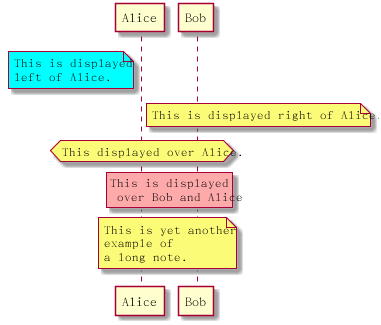

## 使用 HTML 进行格式化 ##

可以使用少量的 HTML 标签来格式化文本:

- \<b\>: 加粗文本
- \<u\> 或 \<u:#AAAAAA\> 或 \<u:colorName\>: 加下划线
- \<i\>: 斜体
- \<s\> 或 \<s:#AAAAAA\> 或 \<s:colorName\>: 加删除线
- \<w\> 或 \<w:#AAAAAA\> 或 \<w:colorName\>: 加波浪线
- \<color:#AAAAAA\> 或 \<color:colorName\>: 设置文本颜色
- \<back:#AAAAAA\> 或 \<back:colorName\>: 设置背景颜色
- \<size:nn\>: 设置字体大小
- \ 或 \: 添加图片文件
- \ 或 \: 添加互联网图片

将以下内容保存为 [plantuml18](./sequence/plantuml18.pum):

```
participant Alice
participant "The <b>Famous</b> Bob" as Bob

Alice -> Bob : A <i>well formated</i> message
note right of Alice
     This is <back:cadetblue><size:18>displayed</size></back>
     <u>left of</u> Alice.
end note

note left of Bob
     <u:red>This</u> is <color #118888>displayed</color>
     <b><color purple>left of</color> <s:red>Alice</strike> Bob</b>
end note

note over Alice, Bob
     <w:#FF33FF>This is hosted</w> by 
end note
```

生成的效果图如下:


## 划分图形 ##

可以使用 == 字符来将图形划分为不同的逻辑部分.

将以下内容保存为 [plantuml19](./sequence/plantuml19.pum):

```
@startuml

== Initialization ==

Alice -> Bob : Authentication Request
Bob --> Alice : Authentication Response

== Repetition ==

Alice -> Bob : Another authentication Request
Alice <-- Bob : another authentication Response

@enduml
```

生成的效果图如下:


## 引用 ##

使用 ref 关键字来引用一个图形.

将以下内容保存为 [plantuml20](./sequence/plantuml20.pum):

```
@startuml
participant Alice
actor Bob

ref over Alice, Bob : init

Alice -> Bob : hello

ref over Bob
This can be on
several lines
end ref
@enduml
```

生成的效果图如下:


## 延迟 ##

可以用 ... 字符来指定一个 Delay, 同时可以指定一个消息文本.

将以下内容保存为 [plantuml21](./sequence/plantuml21.pum):

```
@startuml

Alice -> Bob : Authentication Request
...
Bob --> Alice : Authentication Response
... 5 minutes latter...
Bob --> Alice : Bye !

@enduml
```

生成的效果图如下:


## 空白 ##

可以用 ||| 字符来指定一个 Space, 同时可以指定空白的像素数量.

将以下内容保存为 [plantuml22](./sequence/plantuml22.pum):

```
@startuml

Alice -> Bob: message 1
Bob --> Alice: ok
|||
Alice -> Bob: message 2
Bob --> Alice: ok
||45||
Alice -> Bob: message 3
Bob --> Alice: ok

@enduml
```

生成的效果图如下:

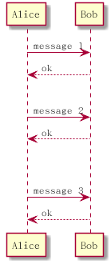

## 生命周期 ##

使用 activate 和 deactivate 关键字来声明参与者的生命周期.

将以下内容保存为 [plantuml23](./sequence/plantuml23.pum):

```
@startuml
participant User

User -> A: DoWork
activate A

A -> B: << createRequest >>
activate B

B -> C: DoWork
activate C
C --> B: WorkDone
destroy C

B --> A: RequestCreated
deactivate B

A -> User: Done
deactivate A

@enduml
```

生成的效果图如下:

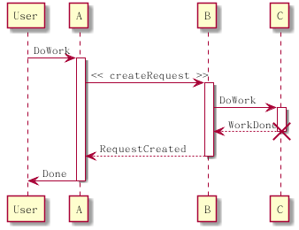

也可以设定嵌套的生命周期, 并且为它设置颜色.

将以下内容保存为 [plantuml24](./sequence/plantuml24.pum):

```
@startuml
participant User

User -> A: DoWork
activate A #FFBBBB

A -> A: Internal call
activate A #DarkSalmon

A -> B: << createRequest >>
activate B

B --> A:RequestCreated
deactivate B
deactivate A
A -> User: Done
deactivate A

@enduml
```

生成的效果图如下:

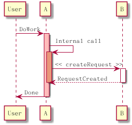

## 创建参与者 ##

可以使用 create 关键字来临时创建一个参与者.

将以下内容保存为 [plantuml25](./sequence/plantuml25.pum):

```
@startuml
Bob -> Alice : hello

create Other
Alice -> Other : new

create control String
Alice -> String
note right: You can also put notes!

Alice --> Bob : ok

@enduml
```

生成的效果图如下:

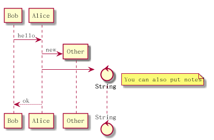

## 输入及输出消息 ##

可以将箭头的一部分放置在图形上, 使用 [ 以及 ] 符号即可.

将以下内容保存为 [plantuml26](./sequence/plantuml26.pum):

```
@startuml

[-> A: DoWork
activate A

A -> A: Internal call
activate A

A ->]: << createRequest >>

A <--]: RequestCreated
deactivate A
[<- A: Done
deactivate A

@enduml
```

生成的效果图如下:

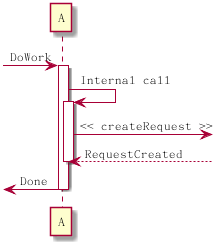

也可以使用下面的语法.
将以下内容保存为 [plantuml27](./sequence/plantuml27.pum):

```
@startuml
[-> Bob
[o-> Bob
[o->o Bob
[x-> Bob

[<- Bob
[x<- Bob

Bob ->]
Bob ->o]
Bob o->o]
Bob ->x]

Bob <-]
Bob x<-]
@enduml
```

生成的效果图如下:


## 模板信息 ##

可以使用 << 和 >> 字符来指定一些模板的信息, 并且可以使用 (X, color) 形式来指定颜色.
可以通过 guillemet 字符来指定模板信息的包围符号.

将以下内容保存为 [plantuml28](./sequence/plantuml28.pum):

```
@startuml

skinparam guillemet false

participant "Famous Bob" as Bob << Generated >>
participant Alice << (C,#ADD1B2) Testable >>
Bob -> Alice: First message

@enduml
```

生成的效果图如下:

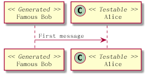

## 参与者组合 ##

可以使用 box 和 end box 关键字将多个参与者绘制到一个矩形中.

将以下内容保存为 [plantuml29](./sequence/plantuml29.pum):

```
@startuml

box "Internal Service" #LightBlue
participant Bob
participant Alice
end box
participant Other

Bob -> Alice: hello
Alice -> Other: hello

@enduml
```

生成的效果图如下:


## 删除页脚 ##

将以下内容保存为 [plantuml30](./sequence/plantuml30.pum):

```
@startuml

hide footbox
title Footer reomved

Bob -> Alice: hello
Alice -> Bob: hello

@enduml
```

生成的效果图如下:

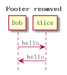

## Skinparam ##
 
可以使用 skinparam 命令来修改颜色和字体, 使用方式包括以下几种:

- 在图形的定义中
- 在一个包含文件中
- 在一个配置文件中
 
将以下内容保存为 [plantuml31](./sequence/plantuml31.pum):

```
@startuml

/' 
 ' skinparam sequenceArrowThickness 2
 ' skinparam roundcorner 20
 ' skinparam maxmessagesize 60
 ' skinparam sequenceParticipant underline
 '/

skinparam backgroundColor #EEEBDC
skinparam handwritten true

skinparam sequence {
ArrowColor DeepSkyBlue
ActorBorderColor DeepSkyBlue
LifeLineBorderColor blue
LifeLineBackgroundColor #A9DCDF

ParticipantBorderColor DeepSkyBlue
ParticipantBackgroundColor DodgerBlue
ParticipantFontName Impact
ParticipantFontSize 17
ParticipantFontColor #A9DCDF

ActorBackgroundColor aqua
ActorFontColor DeepSkyBlue
ActorFontSize 17
ActorFontName Aapex
}

actor User
participant "First Class" as A
participant "Second Class" as B
participant "Last Class" as C

User -> A: DoWork
activate A

A -> B : Create Request
activate B

B -> C : DoWork
activate C

C --> B : WorkDone
destroy C

B --> A : Request Created
deactivate B

A --> User : Done
deactivate A

@enduml
```

生成的效果图如下:

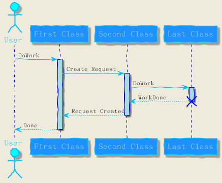

## 修改间隔 ##

将以下内容保存为 [plantuml32](./sequence/plantuml32.pum):

```
@startuml

skinparam ParticipantPadding 30
skinparam BoxPadding 10

box "Foo1"
participant Alice1
participant Alice2
end box

box "Foo2"
participant Bob1
participant Bob2
end box

Alice1 -> Bob1 : hello
Alice1 -> Out : out

@enduml
```

生成的效果图如下:


