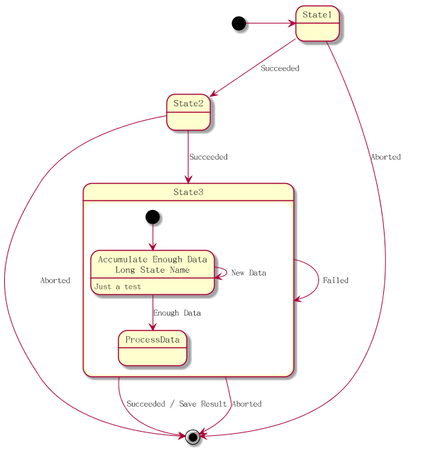

# 状态图 #

## 简单例子 ##

可以使用 [*] 符号作为开始节点和结束节点, 使用 --> 表示箭头.

将以下内容保存为 [state01](./state/state01.pum):

```
@startuml

[*] --> State1
State1 --> [*]
State1 : this is a string
State1 : this is another string

State1 -> State2
State2 --> [*]

@enduml
```

生成的效果图如下:


## 组合 ##

使用 state 关键字和 {} 来定义组合的状态.

将以下内容保存为 [state02](./state/state02.pum):

```
@startuml

scale 360 width
[*] --> NotShooting

state NotShooting {
[*] --> Idle
Idle --> Configuring : EvConfig
Configuring --> Idle : EvConfig
}

state Configuring {
[*] --> NewValueSelection
NewValueSelection --> NewValuePreview : EvNewValue
NewValuePreview --> NewValueSelection : EvNewValueRejected
NewValuePreview --> NewValueSelection : EvNewValueSaved

state NewValuePreview {
State1 -> State2
}

}

@enduml
```

生成的效果图如下:


## 长描述 ##

可以使用 state 关键字来定义状态的长描述文本.

将以下内容保存为 [state03](./state/state03.pum):

```
@startuml

scale 600 width

[*] -> State1
State1 --> State2 : Succeeded
State1 --> [*] : Aborted
State2 --> State3 : Succeeded
State2 --> [*] : Aborted

state State3 {
state "Accumulate Enough Data\nLong State Name" as long1
long1 : Just a test
[*] --> long1
long1 --> long1 : New Data
long1 --> ProcessData : Enough Data
}

State3 --> State3 : Failed
State3 --> [*] : Succeeded / Save Result
State3 --> [*] : Aborted

@enduml
```

生成的效果图如下:



## Concurrent ##

可以使用 -- 或 || 符号作为分隔符来在组合状态里定义 Concurrent state.

将以下内容保存为 [state04](./state/state04.pum):

```
@startuml

[*] --> Active

state Active {
[*] -> NumLockOff
NumLockOff --> NumLockOn : EvNumLockPressed
NumLockOn --> NumLockOff : EvNumLockPressed
--
[*] -> CapsLockOff
CapsLockOff --> CapsLockOn : EvCapsLockPressed
CapsLockOn --> CapsLockOff : EvCapsLockPressed
--
[*] -> ScrollLockOff
ScrollLockOff --> ScrollLockOn : EvCapsLockPressed
ScrollLockOn --> ScrollLockOff : EvCapsLockPressed
}

@enduml
```

生成的效果图如下:


## 箭头方向 ##

也可以使用 left, right, up 和 down 等关键字来定义方向, 可以只使用关键字的一个或二个字母.

将以下内容保存为 [state05](./state/state05.pum):

```
@startuml

[*] -up-> First
First -right-> Second
Second --> Third
Third -left-> Last

@enduml
```

生成的效果图如下:


## 注解 ##

可以使用 note left, note right, note top 或者 note bottom 等关键字来定义注解.

将以下内容保存为 [state06](./state/state06.pum):

```
@startuml

[*] --> Active
Active --> Inactive

note left of Active : this is a short \nnote

note right of Inactive
A note can also
be defined on
several lines
end note

state foo
note "This is a floating note" as N1

[*] --> NotShooting

state "Not Shooting State" as NotShooting {
state "Idle mode" as Idle
state "Configuring mode" as Configuring
[*] --> Idle
Idle --> Configuring : EvConfig
Configuring --> Idle : EvConfig
}

note right of NotShooting : This is a note on a composite state

@enduml
```

生成的效果图如下:


## Skinparam ##

可以使用 skinparam 命令来修改颜色和字体, 使用方式包括以下几种:

- 在图形的定义中
- 在一个包含文件中
- 在一个配置文件中

将以下内容保存为 [state07](./state/state07.pum):

```
@startuml

skinparam backgroundColor LightYellow
skinparam state {
StartColor MediumBlue
EndColor Red
BackgroundColor Peru
BackgroundColor<<Warning>> Olive
BorderColor Gray
FontName Impact
}

[*] --> NotShooting

state "Not Shooting State" as NotShooting {
state "Idle mode" as Idle <<Warning>>
state "Configuring mode" as Configuring
[*] --> Idle
Idle --> Configuring : EvConfig
Configuring --> Idle : EvConfig
}

NotShooting --> [*]

@enduml
```

生成的效果图如下:


