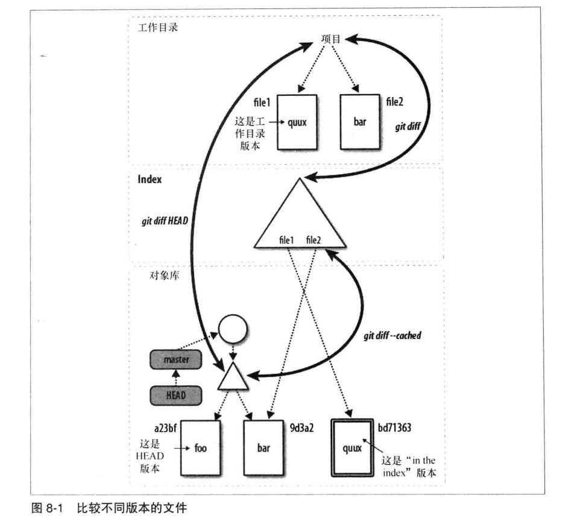

# 第八章: diff #

在 Linux 和 UNIX 系统中, diff 命令会逐行比较两个文本的差异然后显示. 例如如下操作, 比较 initial 和 rewrite 文件的差异:

在 diff 输出的开始部分, 原始文件被 "---" 符号标记, 新文件被 "+++" 符号标记.
@@符号之间表示两个不同文件版本的上下文行号, 其中 -符号表示第一个文件, 1表示第一行, 4表示连续4行, 即下面是第一个文件从第一行开始的连续4行; 后续输出同理.
以 -号开始的行代表从原始文件删除该行以得到新文件, +号表示从原始文件添加该行以产生新文件, 以空格开始的行表示两个版本都有的行, 是由 -u 选项作为上下文提供的.

Git 也有自己的 diff工具, 命令 git diff 一样可以进行文件间的比较.

## git diff 命令的格式 ##

如果对两个不同的根级树对象进行比较, git diff 将会得到这两个项目状态的所有不同. 以下是三个可供树或类树对象使用 git diff 命令的基本来源:

- 整个提交图中的任意树对象
- 工作目录
- 索引

git diff 命令可以使用上述三种来源的组合进行如下 4 种基本比较:

1. git diff
    显示工作目录和索引之间的差异, 同时会显示工作目录中什么是脏的, 并把它们作为下个提交暂存的候选.

2. git diff commit
    显示工作目录和给定提交间的差异, 常见的用法是用 HEAD 或者一个特定的分支名作为 commit

3. git diff --cached commit
    显示索引中的变更和给定提交中的变更之间的差异, commit 默认为 HEAD. 同 --staged 选项.
    
4. git diff commit1 commit2
    显示两个提交之间的差异.

下图描述了上述前3中比较的例子:

git diff 常用的选项如下表:

| 选项 | 描述 |
|:--|:--|
| --M | 查找重命名并生成一个简化的输出 |
| -w, --ignore-all-space | 忽略空白字符 |
| --stat | 显示针对两个树状态之间差异的统计数据, 例如多少行修改, 多少行添加, 删除 |
| --color | 使用多种颜色显示 diff 中的变化 |

git diff 命令也可以限定为一组指定文件或目录间的差异.

## 简单的 git diff 例子 ##

## git diff 和提交范围 ##

## 路径限制的 git diff ##

## 比较 SVN 和 Git 如何产生 diff ##
