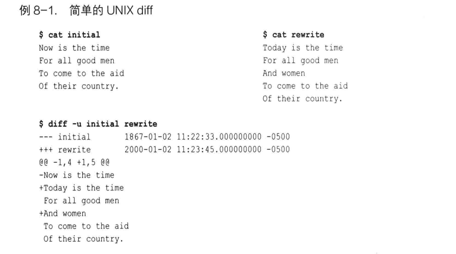

# 第八章: diff #

在 Linux 和 UNIX 系统中, diff 命令会逐行比较两个文本的差异然后显示. 例如如下操作, 比较 initial 和 rewrite 文件的差异:

在 diff 输出的开始部分, 原始文件被 "---" 符号标记, 新文件被 "+++" 符号标记.
@@符号之间表示两个不同文件版本的上下文行号, 其中 -符号表示第一个文件, 1表示第一行, 4表示连续4行, 即下面是第一个文件从第一行开始的连续4行; 后续输出同理.
以 -号开始的行代表从原始文件删除该行以得到新文件, +号表示从原始文件添加该行以产生新文件, 以空格开始的行表示两个版本都有的行, 是由 -u 选项作为上下文提供的.

Git 也有自己的 diff工具, 命令 git diff 一样可以进行文件间的比较.

## git diff 命令的格式 ##

## 简单的 git diff 例子 ##

## git diff 和提交范围 ##

## 路径限制的 git diff ##

## 比较 SVN 和 Git 如何产生 diff ##
