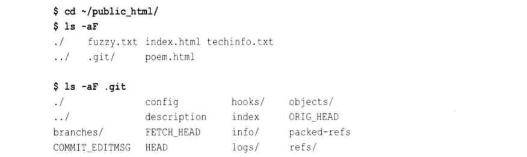
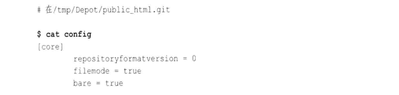

# 第十二章: 远程版本库 #

一个克隆是版本库的副本, 包含所有的原始对象; 远程版本库是一个引用或句柄, 通过文件系统或网络指向另一个版本库; Git 使用远程追踪分支来跟踪其他版本库中的数据.

## 版本库概念 ##

### 裸版本库和开发版本库 ###

开发版本库用于常规的日常开发, 它保持当前分支的概念, 并且在工作目录中提供检出当前分支的副本. 一个裸版本库没有工作目录, 并且不应该用于日常开发, 也没有检出分支的概念. 其他开发人员从裸版本库中克隆和抓取, 并推送更新. 如果你使用带 --bare 选项的 git clone 命令, Git 会创建一个裸版本库.

如果你要创建一个版本库供开发人员推送修改, 那么它应该是裸版本库.

### 版本库克隆 ###

git clone 命令会创建一个新的 Git 版本库, 它并不会复制原始版本库的所有信息, 并且会忽略只跟原始版本库相关的信息(例如远程追踪分支). 原始版本库的标签会被复制到克隆版本库中, 但是原始版本库的特定信息, 例如钩子, 配置文件, 引用日志和储藏不在克隆中重现.

默认情况下, 每个克隆版本库都通过一个名为 origin 的远程版本库, 建立一个链接指回它的父版本库, 并且这是一个单向关系. 如果你想使用其他名称, 只需要在克隆操作中通过 --origin 选项指定替代名称.

Git 还用默认的 fetch refspec 配置默认的 origin 远程版本库:

```
fetch = +refs/heads/*:refs/remotes/origin/*
```

建立这个 refspec 预示你要通过原始版本库中抓取变更来持续更新本地版本库, 远程版本库的分支在克隆版本库中是可用的, 只需要在分支名称前加上 origin/ 前缀, 例如 origin/master .

### 远程版本库 ###

Git 使用远程版本库和远程追踪分支来引用同一个版本库, 并有助于与该版本库建立连接. 使用 git config 命令创建, 删除, 操作和查看远程版本库, 你引入的所有远程版本库都记录在 .git/config 文件中, 可以用 git config 来操作.

常见的与远程版本库有关的命令有:

```
# 从远程版本库抓取对象及其相关的元数据
$ git fetch
# 类似与 fetch, 但合并修改到相应的本地分支
$ git pull
# 转移对象及其相关的元数据到远程版本库
$ git push
# 显示一个给定的远程版本库的引用列表, 间接的返回是否有更新
$ git ls-remote
```

### 追踪分支 ###

分支可以进一步分为以下类别:

- 远程追踪分支(remote-tracking branch): 与远程版本库关联, 专门用来追踪远程版本库中每个分支的变化
- 本地追踪分支(local-tracking branch): 与远程追踪分支配对, 是一种集成分支, 用于收集本地开发和远程追踪分支中的变更
- 特性(topic)或开发(development)分支: 任何本地的非追踪分支
- 远程分支(remote branch): 设在非本地的远程版本库的分支, 可能是远程追踪分支的上游源

在克隆操作过程中, Git 会创建一个远程追踪分支并作为每个主题分支在上游版本库的克隆. 远程追踪分支在专门用于远程克隆的本地版本库中引入一个新的, 单独的命名空间, 它们不是远程版本库中的分支.

本地特性分支实际在 refs/heads/ 命令空间中, 远程追踪分支保留在 refs/remotes/ 命名空间中.

## 引用其他版本库 ##

一个远程版本库是指存在版本库配置文件中的一个实体名, 由两个不同的部分组成: 第一部分以 URL 的形式指出其他版本库的名称; 第二部分称为 refspec, 指定一个引用(通常表示一个分支)是如何从一个版本库的命名空间映射到其他版本库的命令空间.

### 引用远程版本库 ###

Git 支持多种的 URL, 来指定访问协议和数据的位置或地址. Git 的 URL 形式不完全符合 RFC1738 和 RFC2396 的定义, 通常称为 Git URL, 而且在 .git/config 文件中也使用 Git URL.

Git URL 可以是如下的几种形式:

1. 指代本地文件系统上的版本库

可以是本地的物理文件系统, 或是通过 NFS 挂载到本地的虚拟文件系统, 形式如下:

```
/path/to/repo.git
file://path/to/repo.git
```

两者的形式相似, 但是第一种使用文件系统中的硬链接来共享对象, 后者直接复制对象. 通常建议使用第二种形式.

2. Git 原生协议

Git 原生协议是指 Git 内部用来传输数据的自定义协议, 形式如下:

```
git://example.com/path/to/repo.git
git://example.com/~user/path/to/repo.git
```

使用这些格式的客户端不用经过身份验证, 不要求输入密码. ~user 格式可以用来指代用户的主目录, 并且只有当服务器端使用 --user-path 选项允许时 ~user 格式才有效.

3. ssh 协议

对经过身份验证的安全链接, 可以使用如下形式:

```
ssh://[user@]example.com[:port]/path/to/repo.git
ssh://[user@]example.com/path/to/repo.git
ssh://[user@]example.com/~user2/path/to/repo.git
ssh://[user@]example.com/~/path/to/repo.git
```

第三种形式允许存在两个不同的用户名, 第一个是验证会话的用户, 第二个是访问目录的用户.

4. scp URL

形式类似于 SSH 形式, 但无法指定端口参数:

```
[user@]example.com/path/to/repo.git
[user@]example.com:~user/path/to/repo.git
[user@]example.com:path/to/repo.git
```

5. HTTP/HTTPS 协议

```
http://example.com/path/to/repo.git
https://example.com/path/to/repo.git
```

需要注意的是, 大多数企业的防火墙允许 HTTP 的 80 端口和 HTTPS 的 443 端口, 而 Git 默认的 9418 端口通常是关闭的.

6. Rsync 协议

```
rsync://example.com/path/to/repo.git
```

不鼓励使用.

### refspec ###

refspec 把远程版本库中的分支名映射到本地版本库的分支名. 因为 refspec 必须同时从本地版本库和远程版本库指定分支, 所以完整的分支名在 refspec 中是很常见且必须的. 通常开发分支名有 refs/heads/ 前缀, 远程追踪分支名有 refs/remotes/ 前缀.

refspec 的语法如下:

```
[+]source:destination
```

主要由源引用, 冒号和目标引用组成, 完整的格式还有一个可选的加号, 有加号表示不会在传输过程中进行正常的快进安全检查, 星号运行用有限形式的通配符匹配分支名.

在某些应用中, 源引用是可选的; 在另一些应用中, 冒号和目标引用是可选的.

源和目标依赖于正在执行的 Git 操作, 关系总结于下表:

| 操作 | 源 | 目标 |
|:--|:--|:--|
| push | 推送的本地引用 | 更新的远程引用 |
| fetch | 抓取的远程引用 | 更新的本地引用 |

典型的 git fetch 命令会如下使用 refspec:

```
+refs/heads/*:refs/remotes/remote/*
```

此处的 refspec 解释如下:

> 在命名空间的 refs/heads/ 中来自远程版本库的所有源分支(i)映射到本地版本库, 使用远程版本库名来构造名字(ii), 并放在 refs/remotes/remote/ 命名空间中.

惯例是将给定的远程版本库分支放在 refs/remotes/remote/* 下. 可以使用 git show-ref 列出当前版本库中的引用, 使用 git ls-remote 列出远程版本库的引用.

在典型的 git push 命令中, 会把你的版本库中的源分支发送到远程版本库, 使用的 refspec 如下:

```
+refs/heads/*:refs/heads/*
```

如果命令中没有指定远程版本库, 则默认使用 origin; 如果没有 refspec, 则将提交发送到远程版本库中你与上游版本库共有的所有分支.

默认的 refspec 使用以下两条等价的命令:

```
git push origin branch
git push origin branch:refs/heads/branch
```

## 使用远程版本库的示例 ##

一般会建立一个所有的开发人员都认为是权威的一个版本库, 所有人都一致对待该版本库, 这个版本库会存放在一个特殊的目录中, 该目录称为仓库(depot). 仓库会使所有开发人员的 remote origin.

### 创建权威版本库 ###

第一步是用一个初始版本库填充 /tmp/Depot, 假设在 ~/public_html 下已经是 Git 版本库的网站内容, 那么使用以下命令复制内容:

```
$ cd /tmp/Depot
$ git clone --bare ~/public_html public_html.git
```

clone 命令把 ~/public_html 中的 Git 远程版本库复制到当前工作目录 /tmp/Depot 下. 最后一个参数给版本库赋予了一个新的名字. 按照惯例, 裸版本库名有个 .git 后缀.

原始的开发版本库的内容如下:



裸版本库中没有工作目录, 内容如下:


因为在克隆操作过程中使用了 --bare 选项, 所以 Git 没有引入一般默认的 origin 远程版本库. 裸版本库的配置如下:



### 制作你自己的 origin 远程版本库 ###

### 在版本库中进行开发 ###

### 推送变更 ###

### 添加新开发人员 ###

### 获取版本库更新 ###

## 图解远程版本库开发周期 ##

### 克隆版本库 ###

### 交替的历史记录 ###

### 非快进推送 ###

### 获取交替历史记录 ###

### 合并历史记录 ###

### 合并冲突 ###

### 推送合并后的历史记录 ###

## 远程版本库配置 ##

### 使用 git remote ###

### 使用 git config ###

### 使用手动编辑 ###

## 使用追踪分支 ##

### 创建追踪分支 ###

### 领先和落后 ###

## 添加和删除远程分支 ##

## 裸版本库和 git 推送 ##
