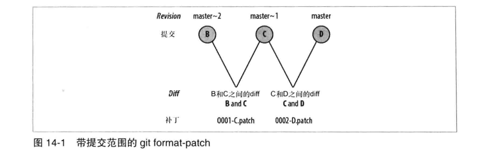

# 第十四章: 补丁 #

Git 实现了三个命令来交换补丁:

1. git format-patch 会生成 email 形式的补丁
2. git send-email 通过 SMTP 来发送一个 Git 补丁
3. git am 应用邮件消息中的补丁

## 为什么要使用补丁 ##

1. 有些情况下, Git 原生协议和 HTTP 协议都不能用来在版本库之间交换数据, 例如存在防火墙
2. 对等开发模型的一个巨大优势是合作, 而补丁是一种向同行评审(peer review) 公开分发修改建议的手段

## 生成补丁 ##

git format-patch 会使用 git diff 机制, 但是它与普通的 git diff 命令有以下两个区别:

1. git diff 会生成一个整合了所有选中提交差异的补丁, 而 git format-patch 会为每个提交生成一条邮件消息
2. git diff 不会生成邮件头, 但 git format-patch 会生成包括邮件头的完整邮件消息, 列出提交作者, 提交日期以及与该变更相关的提交日志消息

为最近 n 次提交生成补丁的最简方式是使用 -n 选项, 默认情况下 Git 为每个补丁生成单独的文件, 用一系列数字加上提交日志消息为其命名.

也可以使用一个提交范围来指定把哪些提交格式化为补丁, 例如在提交 B~D 中列出补丁:



虽然范围 B~D 包含了三个提交, 但是只会生成两个补丁, 分别是 B 和 C 之间的 diff 以及 C 和 D 之间的 diff.

下面添加一个基于提交 B 的 alt 分支, 并进行一次合并:


下面格式化 D..F 范围的提交补丁:

```
$ git format-patch master~2..master
0001-X.patch
0002-Y.patch
0003-Z.patch
0004-F.patch
```

合并提交本身并不会生成补丁.

当为 git format-patch 指定单个提交时, 默认会解释为指定范围 commit..HEAD, 而且根提交默认不生成补丁. 如果确实需要为每个提交(包括根提交)生成补丁, 可以指定 --root 选项:

```
git format-patch --root end -commit
```

如果需要生成在某个分支中的提交补丁, 可以使用如下方式:

```
$ git checkout master
$ git format-patch alt
0001-C.patch
0002-D.patch
0003-F.patch
```

**补丁和拓扑排序**

补丁是通过 git format-patch 命令按照拓扑排序顺序创建的, 对于一个给定的提交, 所有父提交的补丁会先于该提交的补丁生成和发出.

## 邮递补丁 ##


## 应用补丁 ##

## 坏补丁 ##

## 补丁与合并 ##
