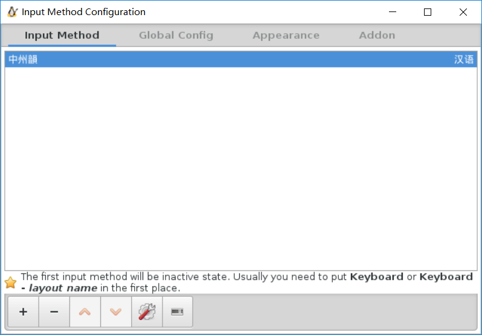
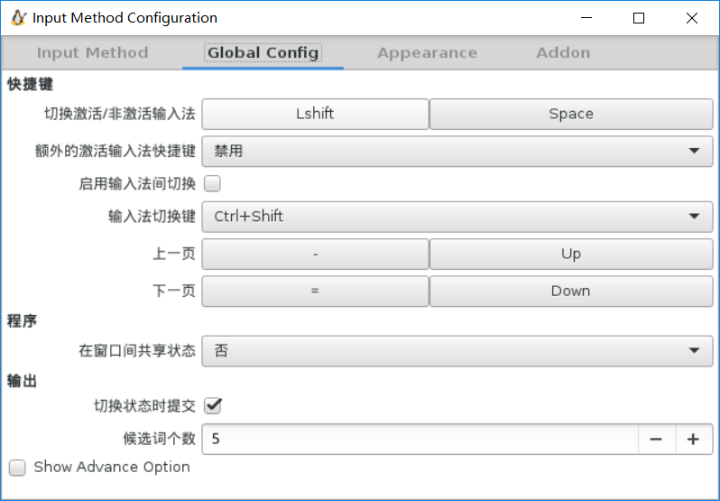

# WSL #

## 安裝 ##

### 開啓 WSL 功能 ###

首先需要確保 Win10 的版本已經支持了 WSL, 然後依次點擊 控制面板->程序->啓用或關閉 Windows 功能, 然後選擇 適用於 Linux 的 Windows 子系統, 這時會提示重啓系統, 重啓之後 WSL 就可以使用了.

### 下載 Ubuntu 子系統 ###

打開命令行, 輸入 bash 命令, 然後等待子系統下載完成, 之後會提示選擇 locale 以及創建 Linux 用戶, 等待所有的命令執行完成就進入了 Ubuntu 子系統.

### lxrun 命令 ###

也可以使用 lxrun 命令對子系統進行管理, 常用的命令如下:

```
# 安裝子系統
lxrun /install
# 卸載子系統（保留用戶數據等）
lxrun /uninstall
# 完全卸載子系統
lxrun /uninstall /full
```

## 配置 GUI ##

默認情況下, WSL 是不支持 GUI 工具的顯示的, 但是我們可以使用 X Server 的方式在 WSL 中運行 GUI 程序.

### 安裝 X Server ###

首先需要在宿主機(Win10)上安裝 X Server, 可以選擇 [XMing](https://xming.en.softonic.com/) 或者 [VcXsrv](https://sourceforge.net/projects/vcxsrv/), 我選擇的是 VcXsrv, 直接下載安裝然後啓動即可.

### 配置 WSL ###

在安裝了 X Server 之後, 進入 WSL 在 .bashrc 中輸入以下內容:

```
# 配置使用 X Server
export DISPLAY=:0.0
```

然後任意開啓一個 GUI 程序即可看見正確的顯示.

## 中文 ##

### 確認 locale ###

首先輸入 locale 命令, 確保輸出類似如下:

```
LANG=zh_CN.UTF-8
LANGUAGE=
LC_CTYPE="zh_CN.UTF-8"
LC_NUMERIC="zh_CN.UTF-8"
LC_TIME="zh_CN.UTF-8"
LC_COLLATE="zh_CN.UTF-8"
LC_MONETARY="zh_CN.UTF-8"
LC_MESSAGES="zh_CN.UTF-8"
LC_PAPER="zh_CN.UTF-8"
LC_NAME="zh_CN.UTF-8"
LC_ADDRESS="zh_CN.UTF-8"
LC_TELEPHONE="zh_CN.UTF-8"
LC_MEASUREMENT="zh_CN.UTF-8"
LC_IDENTIFICATION="zh_CN.UTF-8"
LC_ALL=
```

否則需要修改 /etc/default/locale 文件, 輸入如下內容或確保內容如上:

```
LANG=zh_CN.UTF-8
```

### 配置中文顯示 ###

需要在 WSL 中安裝一個中文字體用於顯示中文:

```
sudo apt install fonts-wqy-microhei
```

### 配置中文輸入 ###

#### 安裝 fcitx 輸入法框架 ####

使用以下命令安裝 fcitx 輸入法框架及中文輸入法:

```
# 安裝輸入法框架
sudo apt install dbus-x11 fcitx
# 安裝中文輸入法
# 拼音輸入法
sudo apt install fcitx-pinyin
# 繁體字（臺灣中文輸入法）
sudo apt install fcitx-rime
```

指定環境變量, 在 .bashrc 中增加以下內容:

```
export XMODIFIERS="@im=fcitx"
export GTK_IM_MODULE=fcitx
export QT_IM_MODULE=fcitx
```

#### 啓動 fcitx ####

依次啓動 dbus 以及 fcitx:

```
sudo service dbus start
fcitx
```

#### 配置 fcitx ####

輸入以下命令配置 fcitx:

```
fcitx-configtool
```

確保配置內容如下圖:




然後在 WSL 中即可以使用 LShift+Space 來切換輸入法.
