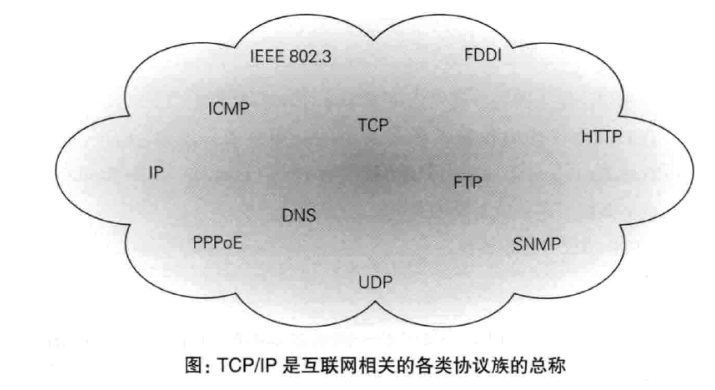
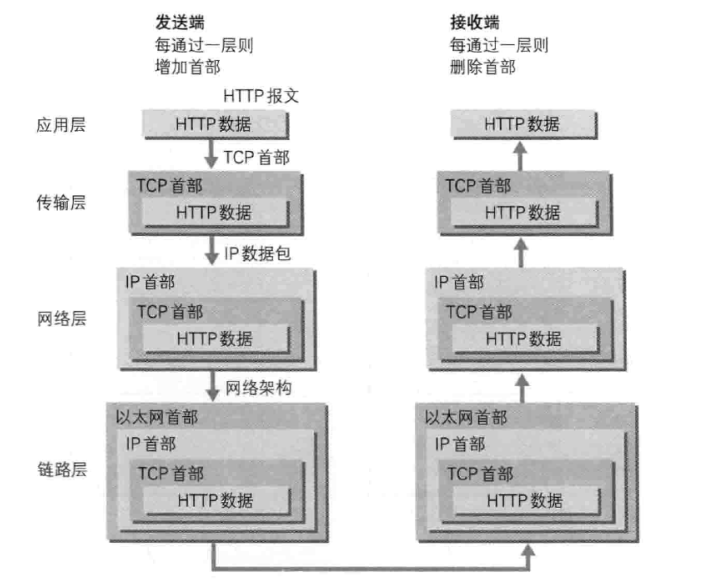
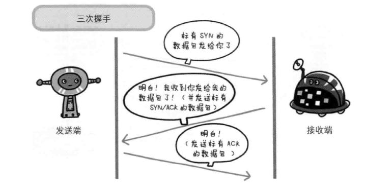
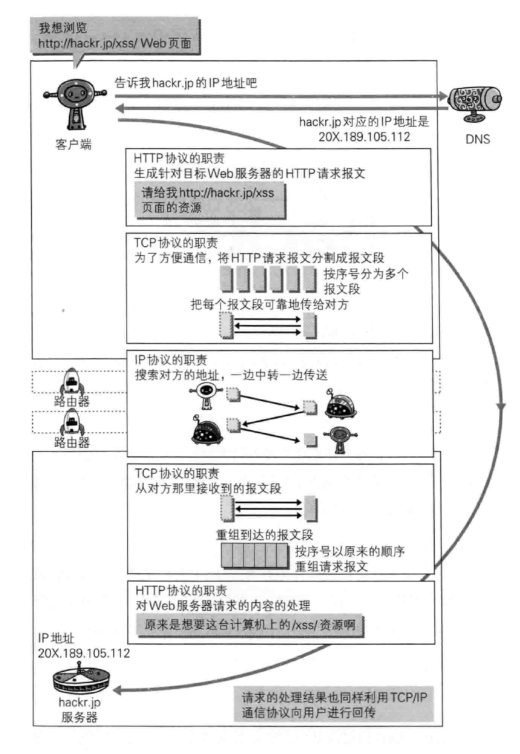
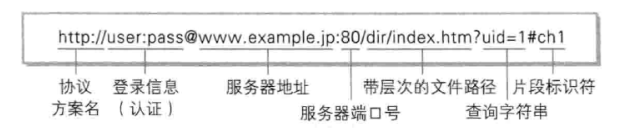

# 第1章: 了解Web及网络基础 #

## 1.1 使用 HTTP 协议访问 Web ##

Web使用一种名为 HTTP(HyperText Transfer Protocol, 超文本传输协议) 的协议作为规范, 完成从客户端到服务器等一系列运作流程. 而协议是指规则的约定.

## 1.2 HTTP 的诞生 ##

### 1.2.1 为知识共享而规划 Web ###

现在已提出了 3 项 WWW 构建技术, 分别是:

1. 把 SGML(Standard Generalized Markup Language, 标准通用标记语言) 作为页面的文本标记语言的 HTML(HyperText Markup Language, 超文本标记语言)
2. 作为文档传递协议的 HTTP
3. 指定文档所在地址的 URL(Uniform Resource Locator, 统一资源定位符)

### 1.2.2 Web成长时代 ###

### 1.2.3 驻足不前的 HTTP ###

#### HTTP/0.9 ####

1990年问世, 没有作为正式的标准被建立.

#### HTTP/1.0 ####

HTTP 作为正式标准在1996年5月公布, 命名为 HTTP/1.0

#### HTTP/1.1 ####

1997年1月公布的该版本是目前主流的 HTTP 协议版本.

## 1.3 网络基础TCP/IP ##

### 1.3.1 TCP/IP 协议簇 ###

### 1.3.2 TCP/IP 的分层管理 ###

TCP/IP协议簇按层次分别为以下4层:

#### 应用层 ####

决定了向用户提供应用服务时通信的活动 包括 FTP, DNS, HTTP 等.

#### 传输层 ####

提供处于网络连接中的两台计算机之间的数据传输. 包括 TCP, UDP 等协议.

#### 网络层 ####

处理在网络上流动的数据包, 数据包是网络传输的最小数据单位.

#### 链路层 ####

处理连接网络的硬件部分.

### 1.3.3 TCP/IP 通信传输流 ###

## 1.4 与 HTTP 关系密切的协议: IP, TCP和DNS ##

### 1.4.1 负责传输的 IP 协议###

IP 协议处于网络层, 作用是把数据包传送给对方. IP 地址指明了节点被分配的地址, MAC 地址是指网卡所属的固定地址.

#### 使用 ARP 协议凭借 MAC 地址进行通信 ####

ARP 是一种用以解析地址的协议, 根据通信方的 IP 地址查询 MAC 地址.

### 1.4.2 确保可靠性的 TCP 协议 ###

TCP 处于传输层, 提供可靠的字节流服务.

#### 确保数据能到达目标 ####

TCP 协议采用三次握手策略, TCP 会向对方确认是否成功送达. 握手过程使用了 TCP 的标志 SYN 和 ACK.

## 1.5 负责域名解析的 DNS 服务 ##

DNS 位于应用层, 提供域名到 IP 地址之间的解析服务.

## 1.6 各种协议与 HTTP 协议的关系 ##

## 1.7 URI 和 URL ##

### 1.7.1 统一资源标识符 ###

URI 是由某个协议方案表示的资源的定位标识符. URI 用字符串标识某一互联网资源, 而 URL 表示资源的地点, 即 URL 是 URI 的子集.

### 1.7.2 URI 格式 ###

