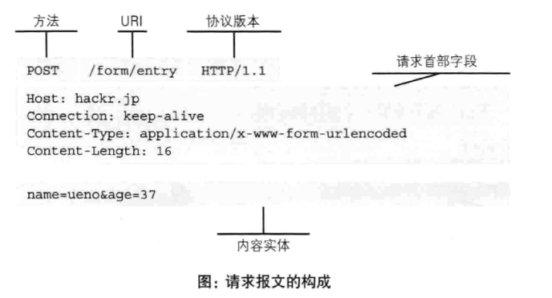
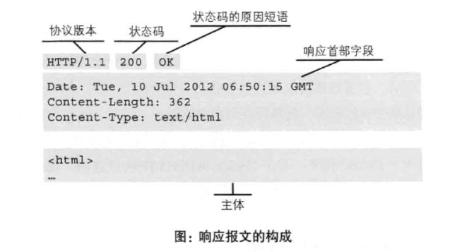

# 第2章: 简单的HTTP协议 #

## 2.1 http协议用于客户端和服务器端之间的通信 ##

HTTP 协议用于客户端和服务器之间的通信, 请求访问文本或图像等资源的一端称为客户端, 而提供资源响应的一端称为服务器端.

## 2.2 通过请求和响应的交换达成通信 ##

HTTP 协议规定, 请求从客户端发出, 最后服务器端响应该请求并返回.

## 2.3 http是不保存状态的协议 ##

HTTP 是一种无状态协议, 不对请求和响应之间的通信转该进行保存.

## 2.4 请求 URI 定位资源 ##

## 2.5 告知服务器意图的 http 方法 ##

HTTP/1.1 可使用的方法如下:

### GET: 获取资源 ###

GET 方法用来请求访问已被 URI 识别的资源, 指定的资源经服务器短解析后返回响应内容.

### POST: 传输实体主体 ###

POST 用来传输实体的主体.

### PUT: 传输文件 ###

PUT 方法用来传输文件, 要求在请求报文的主体中包含文件内容, 然后保存到请求 URI 指定的位置.

### HEAD: 获得报文首部 ###

同 GET, 但是不返回报文主体内容, 用于确认 URI 的有效性及资源更新的日期时间等.

### DELETE: 删除文件 ###

用于删除 URI 指定的文件, 与 PUT 相反.

### OPTIONS: 询问支持的方法 ###

用来查询针对请求 URI 指定的资源支持的方法.

### TRACE: 追踪路径 ###

让 Web 服务器将之前的请求通信环回给客户端.

### CONNECT: 要求用隧道协议连接代理 ###

要求在与代理服务器通信时建立隧道, 实现用隧道协议进行 TCP 通信. 主要使用 SSL 和 TLS 协议把通信内容加密后经网络隧道传输.

## 2.6 使用方法下达命令 ##

## 2.7 持久连接节省通信量 ##

在 HTTP 协议的初始版本中, 每进行一次通信就要建立/断开一个 TCP 连接.

### 2.7.1 持久连接 ###

为解决上述的 TCP 连接的问题, HTTP/1.1 和一部分的 HTTP/1.0 使用了持久连接(HTTP keep-alive) 的方法, 只要任意一端没有明确提出断开连接则保持 TCP 连接状态.

在 HTTP/1.1 中所有的连接默认都是持久连接.

### 2.7.2 管线化 ###

持久连接使得多数请求以管线化的方式发送成为可能, 即不用等待响应亦可直接发送下一个请求.

## 2.8 使用 cookie 的状态管理 ##

Cookie 技术通过在请求和响应报文中写入 Cookie 信息来控制客户端的状态. Cookie 会根据从服务器发送的响应报文中一个叫做 Set-Cookie 的首部字段信息通知客户端保存 Cookie, 当下次发送请求时客户端会自动在请求报文中加入 Cookie 值之后发送.
