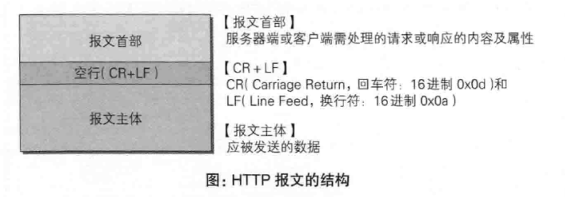
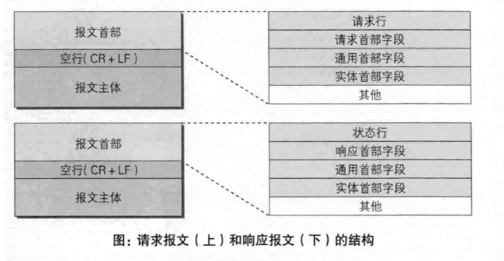

# 第3章: HTTP报文内的HTTP信息 #

## 3.1 HTTP 报文 ##

用于 HTTP 协议交互的信息被称为 HTTP 报文, 是由多行(CR+LF作换行符)数据构成的字符串文本.

报文主体不是必须存在的.

## 3.2 请求报文及响应报文的结构 ##

### 请求行 ###

包含用于请求的方法, 请求 URI 和 HTTP 版本.

### 状态行 ###

包含表明响应结果的状态码, 原因短语和 HTTP 版本.

### 首部字段 ###

包含表示请求和响应的各种条件和属性的各类首部, 一般为 4 种: 通用首部, 请求首部, 响应首部和实体首部.

### 其他 ###

可能包含 HTTP 的 RFC 里为定义的首部(Cookie等).

## 3.3 编码提升传输速率 ##

### 3.3.1 报文主体和实体主体的差异 ###

#### 报文 ####

HTTP 通信的基本单位, 由 8 位字节流组成.

#### 实体 ####

作为请求或响应的有效载荷数据被传输, 内容由实体首部和实体主体组成.

### 3.3.2 压缩传输的内容编码 ###

HTTP 协议中的内容编码指明应用在实体内容上的编码格式, 并保持实体信息原样压缩, 由客户端接收并负责解码. 常用的内容编码如下:

- gzip
- compress
- deflate(zlib)
- identity(不编码)

### 3.3.3 分割发送的分块传输编码 ###

在传输大容量数据时, 可以把数据分割成多块传输, 称为分块传输编码.

分块传输编码会将实体主体分成多个部分, 每个块使用 16 进制来标记块的大小, 最后一块使用 "0(CR+LF)" 来标记.

## 3.4 发送多种数据的多部分对象集合 ##

HTTP 也采用了多部分对象集合, 发送的一份报文主体可以含有多类型实体, 包含的对象如下:

- multipart/form-data: 在 Web表单文件上传时使用
- multipart/byteranges: 状态码206响应报文包含了多个范围的内容时使用

在 HTTP 报文中使用多部分对象集合时, 需要在首部字段加上 Content-Type, 并使用 boundary 字符串来划分多部分对象集合指明的各类实体, 并在 boundary 字符串指定的各个实体的起始位置和结束位置插入 "--boundary" 标记.

## 3.5 获取部分内容的范围请求 ##

可以通过范围请求来获取指定的实体范围. 使用首部字段 Range 来制定资源的 byte 范围.

针对范围请求, 响应会返回状态码 206 , 如果无法响应则返回 200 和完整内容.

## 3.6 内容协商返回最合适的内容 ##

当浏览器默认语言为中文或英语时, 访问 URI 则会显示对应的英语版或中文版页面, 这样的机制称为内容协商.

内容协商机制是指客户端和服务器就响应的资源内容进行交涉, 然后提供给客户端最合适的资源. 内容协商以响应资源的语言, 字符集和编码方式等作为判断基准. 例如如下的首部字段:

- Accept
- Accept-Charset
- Accept-Encoding
- Accept-Language
- Content-Language

内容协商技术有以下三种类型:

### 服务器驱动协商 ###

由服务器以请求的首部字段为参考自动处理.

### 客户端驱动协商 ###

由客户端从可选项列表中选择.

### 透明协商 ###

由服务端和客户端各自进行内容协商.
