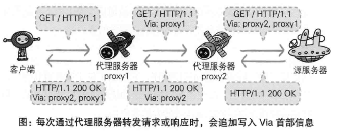
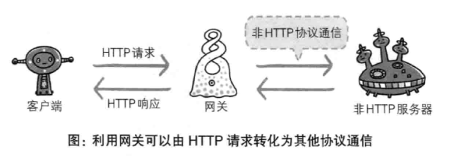

# 第5章: 与HTTP协作的Web服务器 #

## 5.1 用单台虚拟主机实现多个域名 ##

HTTP/1.1 规范允许一台 HTTP 服务器搭建多个 Web 站点. 需要在 Host 首部内完整指定主机名或域名的 URI.

## 5.2 通信数据转发程序: 代理, 网关, 隧道 ##

### 5.2.1 代理 ###

接收客户端发送的请求后转发给其他服务器.

代理有如下分类:

#### 缓存代理 ####

保存资源的副本并在下一次访问时直接返回.

#### 透明代理 ####

转发请求或响应时不对报文做任何加工处理.

### 5.2.2 网关 ###

工作机制类似代理, 可以为服务器提供非 HTTP 协议服务.

### 5.2.3 隧道 ###

确保客户端能与服务器进行安全的通信, 将请求保持原样中转给之后的服务器.

## 5.3 保存资源的缓存 ##

### 5.3.1 缓存的有效期限 ###

### 5.3.2 客户端的缓存 ###

