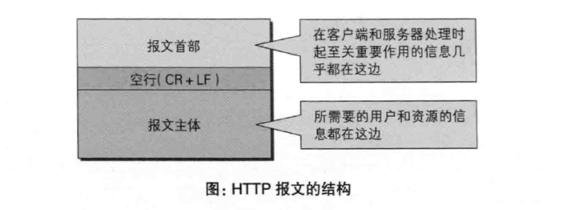
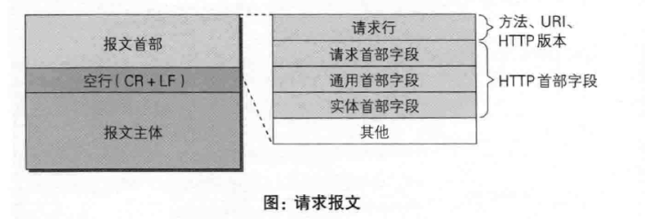
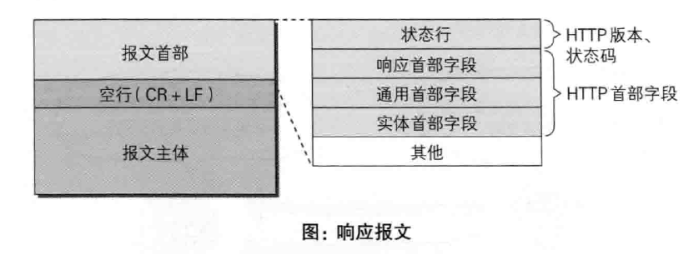

# 第6章: HTTP首部 #

## 6.1 HTTP报文首部 ##



HTTP协议的请求和响应报文中必定包含 HTTP 首部.

### HTTP请求报文 ###



### HTTP响应报文 ###



## 6.2 HTTP首部字段 ##

### 6.2.1 HTTP首部字段传递重要信息 ###

使用首部字段是为了给浏览器和服务器提供报文主体大小, 所使用的语言和认证信息等内容.

### 6.2.2 HTTP首部字段结构 ###

HTTP 首部字段由字段名和字段值组成, 格式如下:

```
首部字段名: 字段值
```

单个首部字段可以有多个值.

### 6.2.3 4种HTTP首部字段类型 ###

#### 通用首部字段 ####

请求和响应都会使用的首部.

#### 请求首部字段 ####

请求使用的首部.

#### 响应首部字段 ####

响应使用的首部.

#### 实体首部字段 ####

针对请求和响应报文的实体部分使用的首部.

### 6.2.4 HTTP/1.1首部字段一览 ###

#### 通用首部字段 ####

| 首部字段名 | 说明 |
|:--|:--|
| Cache-Control | 控制缓存的行为 |
| Connection | 逐跳首部, 连接的管理 |
| Date | 创建报文的日期时间 |
| Pragma | 报文指令 |
| Trailer | 报文末端的首部一览 |
| Transfer-Encoding | 指定报文主体的传输编码方式 |
| Upgrade | 升级为其他协议 |
| Via | 代理服务器的相关信息 |
| Warning | 错误通知 |

#### 请求首部字段 ####

| 首部字段名 | 说明 |
|:--|:--|
| Accept | 用户代理可处理的媒体类型 |
| Accept-Charset | 优先的字符集 |
| Accept-Encoding | 优先的内容编码 |
| Accept-Language | 优先的语言 |
| Authorization | Web 认证信息 |
| Expect | 期待服务器的特定行为 |
| From | 用户的电子邮箱地址 |
| Host | 请求资源所在的服务器 |
| If-Match | 比较实体标记(ETag) |
| If-Modified-Since | 比较资源的更新时间 |
| If-None-Match | 比较实体标记 |
| If-Range | 资源未更新时发送实体Byte范围请求 |
| If-Unmodified-Since | 比较资源的更新时间 |
| Max-Forwards | 最大传输逐跳数 |
| Proxy-Authorization | 代理服务器要求客户端的认证信息 |
| Range | 实体的字节范围请求 |
| Referer | 对请求中 URI 的原始获取方 |
| TE | 传输编码的优先级 |
| User-Agent | HTTP 客户端程序的信息 |

#### 响应首部字段 ####

| 首部字段名 | 说明 |
|:--|:--|
| Accept-Ranges | 是否接受字节范围请求 |
| Age | 推算资源创建经过时间 |
| ETag | 资源的匹配信息 |
| Location | 令客户端重定向至指定 URI |
| Proxy-Authenticate | 代理服务器对客户端的认证信息 |
| Retry-After | 对再次发起请求的时机要求 |
| Server | HTTP服务器的安装信息 |
| Vary | 代理服务器缓存的管理信息 |
| WWW-Authenticate | 服务器对客户端的认证信息 |

#### 实体首部字段 ####

| 首部字段名 | 说明 |
|:--|:--|
| Allow | 资源可支持的 HTTP 方法 |
| Content-Encoding | 实体主体适用的编码方式 |
| Content-Language | 实体主体的自然语言 |
| Content-Length | 实体主体的字节大小 |
| Content-Location | 替代对应资源的 URI |
| Content-MD5 | 实体主体的报文摘要 |
| Content-Range | 实体主体的位置范围 |
| Content-Type | 实体主体的媒体类型 |
| Expires | 实体主体过期的日期时间 |
| Last-Modified | 资源的最后修改日期时间 |

### 6.2.5 非HTTP/1.1首部字段 ###

非正式的首部字段统一归纳在 RFC4229 HTTP Header Field Registrations 中, 其中的 Cookie, Set-Cookie 和 Content-Disposition 等使用频率也很高.

### 6.2.6 end-to-end首部和hop-by-hop首部 ###

#### 端到端首部 ####

会转发给请求/响应的最终接收目标, 且必须保存在缓存生成的响应中.

#### 逐跳首部 ####

只对单次转发有效, 会因为缓存或代理而不再转发. 在 HTTP/1.1 及之后的版本如果要使用需提供 Connection 首部字段.

HTTP/1.1 中的逐跳首部包括: Connection, Keep-Alive, Proxy-Authenticate, Proxy-Authorization, Trailer, TE, Transfer-Encoding, Upgrade.

## 6.3 HTTP/1.1通用首部字段 ##

### 6.3.1 Cache-Control ###

通过 Cache-Control 指令可以操作缓存的工作机制, 例如:

```
Cache-Control: private, max-age=0, no-cache
```

#### Cache-Control 指令一览 ####

##### 缓存请求指令 #####

| 指令 | 参数 | 说明 |
|:--|:--|:--|
| no-cache | 无 | 强制向源服务器再次验证 |
| no-store | 无 | 不缓存请求或响应的任何内容 |
| max-age=[秒] | 必须 | 响应的最大 Age 值 |
| max-stale(=[秒]) | 可省略 | 接收已过期的响应 |
| min-fresh=[秒] | 必须 | 期望在指定时间内的响应仍有效 |
| no-transfrom | 无 | 代理不可更改媒体类型 |
| only-if-cached | 无 | 从缓存获取资源 |
| cache-extension | - | 新指令标记 |

##### 缓存响应指令 #####

| 指令 | 参数 | 说明 |
|:--|:--|:--|
| public | 无 | 可向任意方提供响应的缓存 |
| private | 可省略 | 仅向特定用户返回响应 |
| no-cache | 可省略 | 缓存前必须先确认其有效性 |
| no-store | 无 | 不缓存请求或响应的任何内容 |
| no-transfrom | 无 | 代理不可更改媒体类型 |
| must-revalidate | 无 | 可缓存但必须向源服务器进行确认 |
| proxy-revalidate | 无 | 要求中间缓存服务器对缓存的响应有效性再进行确认 |
| max-age=[秒] | 必须 | 响应的最大 Age 值 |
| s-maxage=[秒] | 必须 | 公共缓存服务器响应的最大 Age 值 |
| cache-extension | - | 新指令标记 |

### 6.3.2 Connection ###

该字段具有如下的作用:

#### 控制不再转发给代理的首部字段 ####

```
Connection: 不再转发的首部字段名
```

#### 管理持久连接 ####

```
Connection: Keep-Alive
Connection: Close
```

### 6.3.3 Date ###

表明创建 HTTP报文的日期和时间, HTTP/1.1 协议使用 RFC1123 中规定的日期时间格式:

```
Date: Tue, 03 Jul 2012 04:40:59 GMT
```

### 6.3.4 Pragma ###

遗留字段, 唯一形式如下:

```
Pragma: no-cache
```

### 6.3.5 Trailer ###

指定在报文主体之后记录了哪些首部字段, 用于 HTTP/1.1 版本分块传输编码时.

### 6.3.6 Transfer-Encoding ###

指定传输报文主体时采用的编码方式, 在 HTTP/1.1 中仅对分块传输编码有效.

### 6.3.7 Upgrade ###

用于检测 HTTP 协议以及其他协议是否可使用更高的版本进行通信:

```
Upgrade: TLS/1.0
Connection: Upgrade             # 需同时指定
```

服务器可用 101 Switching Protocols 状态码作为响应.

### 6.3.8 Via ###

用于追踪客户端与服务器之间的请求和响应报文的传输路径.

### 6.3.9 Warning ###

常用于告知用户一些与缓存相关的问题的警告, 格式如下:

```
Warning: [警告码] [警告的主机:端口号] "[警告内容]" ([日期时间])
```

HTTP/1.1 中定义的警告码如下:

| 警告码 | 警告内容 | 说明 |
|:--|:--|:--|
| 110 | Response is stale(响应已过期) | 代理返回已过期的资源 |
| 111 | Revalidation failed | 代理验证资源有效性时失败 |
| 112 | Disconnection operation | 代理与互联网连接被故意切断 |
| 113 | Heuristic expiration(试探性过期) | 响应的使用期超过24小时(有效缓存的设定时间大于24小时时) |
| 199 | Miscellaneous warning(杂项警告) | 任意的警告内容 |
| 214 | Tranformation applied | 代理对内容编码或媒体类型执行了某些处理 |
| 299 | Miscellaneous persistent warning | 任意的警告内容 |

## 6.4 请求首部字段 ##

### 6.4.1 Accept ###

通知服务器用户代理能处理的媒体类型及媒体类型的相对优先级.

```
Accept: text/html,application/xhtml+xml,application/xml;q=0.9,*/*;q=0.8
```

常见的媒体类型:

- 文本文件: text/html,text/plain,text/css,application/xhtml+xml,application/xml
- 图片文件: image/jpeg,image/gif,image/png
- 视频文件: video/mpeg,video/quicktime
- 二进制文件: application/octet-stream,application/zip

使用 q= 来表示优先级, 默认为 1.0

### 6.4.2 Accept-Charset ###

通知服务器用户代理能处理的字符集的相对优先级.

### 6.4.3 Accept-Encoding ###

```
Accept-Encoding: gzip, deflate
```

### 6.4.4 Accept-Language ###

```
Accept-Language: zh-cn,zh;q=0.7,en-us,en;q=0.3
```

### 6.4.5 Authorization ###

告知服务器用户代理的认证信息.

```
Authorization: Basic XXXXX
```

### 6.4.6 Expect ###

告知服务器期望出现的某种特定行为, 服务器无法处理时返回 417 Expectation Failed.

```
Expect: 100-continue
```

HTTP/1.1 只定义了 100-continue.

### 6.4.7 From ###

告知使用用户代理的用户的电子邮件地址.

### 6.4.8 Host ###

```
Host: www.hackr.jp
```

告知服务器请求的资源所处的互联网主机名和端口号(没有时为空), 是 HTTP/1.1 规范中唯一一个必须包含的首部字段.

### 6.4.9 If-Match ###

只有在服务器判断条件为真时才会执行请求. 服务器会比对 If-Match 字段的值和资源的 ETag 值, 仅当两者一致时执行, 否则返回 412 Precondition Failed.

### 6.4.10 If-Modified-Since ###

如果不符合则返回 304 Not Modified.

### 6.4.11 If-None-Match ###

与 If-Match 相反.

### 6.4.12 If-Range ###

告知服务器当 If-Range 字段值(Etag或时间) 和请求资源的相一致时作为范围请求处理, 否则返回全部资源.

### 6.4.13 If-Unmodified-Since ###

与 If-Modified-Since 相反, 不符合则返回 412 Precondition Failed.

### 6.4.14 Max-Forwards ###

```
Max-Forwards: 10
```

指定可经过的服务器的最大数目.

### 6.4.15 Proxy-Authorization ###

用于客户端和代理服务器的认证.

### 6.4.16 Range ###

```
Range: bytes=5001-10000
```

用于获取部分资源的范围请求.

### 6.4.17 Referer ###

告知服务器请求的原始资源的 URI.

### 6.4.18 TE ###

```
TE: gzip, deflate;q=0.5
```

告知服务器客户端能处理响应的传输编码方式以及优先级, 与 Accept-Encoding 功能相似, 但用于传输编码.

### 6.4.19 User-Agent ###

将创建请求的浏览器和用户代理名称等信息传递给服务器, 也可能增加代理的服务器名称.

## 6.5 响应首部字段 ##

### 6.5.1 Accept-Ranges ###

告知客户端服务器是否能够处理范围请求, 以指定获取服务端某个部分的资源. 可处理时值为 bytes, 否则为 none.

### 6.5.2 Age ###

告知客户端源服务器在多久前创建了响应, 若该服务器是缓存服务器则指缓存后的响应再次发起认证到认证完成的时间值, 代理创建响应时必须加上该字段.

### 6.5.3 ETag ###

告知客户端实体标识. ETag 值有以下两种分类:

```
ETag: "xxxx"           # 强 ETag 值, 任何变化都会改变其值
ETag: W/"xxxx"         # 弱 ETag 值, 发生根本变化时改变
```

### 6.5.4 Location ###

将响应接收方引导至某个与请求 URI 位置不同的资源. 一般配合重定向响应.

### 6.5.5 Proxy-Authenticate ###

把由代理服务器所要求的认证信息发送给客户端.

### 6.5.6 Retry-After ###

告知客户端应该在多久之后再次发送请求. 一般配合 503 响应或 3xx 响应.

### 6.5.7 Server ###

告知客户端当前服务器上安装的 HTTP 服务器应用程序的信息.

### 6.5.8 Vary ###

当代理服务器接收到源服务器返回包含 Vary 指定项的响应之后, 仅对请求中含有相同 Vary 指定首部字段的请求返回缓存.

### 6.5.9 WWW-Authenticate ###

用于 HTTP 访问认证，告知客户端适用于访问请求 URI 所指定资源的认证方案(Basic或Digest), 和带参数提示的质询. 401 响应中肯定包含该字段.

## 6.6 实体首部字段 ##

### 6.6.1 Allow ###

用于通知客户端能够支持 RequestURI 指定资源的所有 HTTP 方法, 405响应会将支持的方法写入该字段返回.

### 6.6.2 Content-Encoding ###

告知客户端服务器对实体部分选用的内容编码方式.

### 6.6.3 Content-Language ###

告知客户端实体主体使用的自然语言.

### 6.6.4 Content-Length ###

表明实体主体部分的大小, 当对内容编码传输时不再使用该字段.

### 6.6.5 Content-Location ###

给出与报文主体部分相对应的 URI.

### 6.6.6 Content-MD5 ###

用于检查报文主体在传输过程中是否保持完整, 以及确认传输到达.

### 6.6.7 Content-Range ###

针对范围请求返回响应时使用该字段告知客户端作为响应返回的实体的哪个部分符合范围请求.

### 6.6.8 Content-Type ###

指定实体主体内对象的媒体类型.

```
Content-Type: text/html; charset=UTF-8
```

### 6.6.9 Expires ###

告知客户端资源失效的日期.

### 6.6.10 Last-Modified ###

指明资源最终修改时间.

## 6.7 为Cookie服务的首部字段 ##

### 6.7.1 Set-Cookie ###

当服务端准备开始管理客户端状态时通过该字段告知客户端各种信息.

```
Set-Cookie: status=enable; expires=xxx; path=/; domain=.backr.jp;
```

各字段属性如下:

| 属性 | 说明 |
|:--|:--|
| NAME=VALUE | 赋予 Cookie的名称和值, 必须 |
| expires=DATE | 有效期, 若不指定则默认到浏览器关闭 |
| path=PATH | 将服务器上的文件目录作为 Cookie 的适用对象, 不指定则默认为文档所在文件目录 |
| domain=域名 | 作为 Cookie 适用对象的域名, 默认为创建服务器域名 |
| Secure | 仅在 HTTPS 时发送 |
| HttpOnly | 使 Cookie 不能被 JS 脚本访问 |

### 6.7.2 Cookie ###

告知服务器从服务器接收到的 Cookie.

```
Cookie: status=enable
```

## 6.8 其他首部字段 ##

### 6.8.1 X-Frame-Options ###

属于响应首部, 用于控制网站内容在其他 Web 网站的 Frame 标签内显示, 防止点击劫持攻击. 可取值如下:

- DENY: 拒绝
- SAMEORIGIN: 仅同源域名下页面匹配时许可

### 6.8.2 X-XSS-Protection ###

属于响应首部, 可取值为 0 或 1.

### 6.8.3 DNT ###

属于请求首部, 表示拒绝个人信息被收集, 可取值为 0 或 1.

### 6.8.4 P3P ###

属于响应首部, 用于保护用户隐私.
