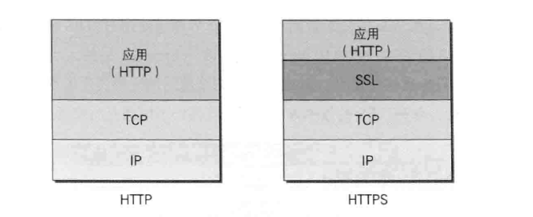
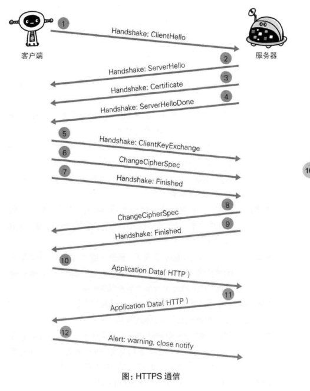
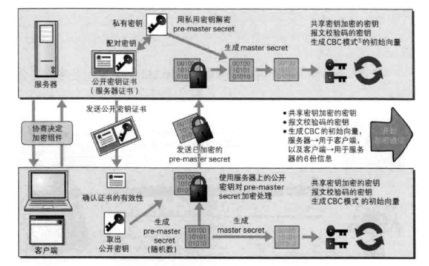

# 第7章: 确保Web安全的HTTPS #

## 7.1 HTTP 的缺点 ##

- 通信使用明文, 内容可能被窃听
- 不验证通信方的身份, 可能遭遇伪装
- 无法证明报文的完整性, 可能遭遇篡改

### 7.1.1 通信使用明文可能会被窃听 ###

#### 加密处理防止被窃听 ####

##### 通信的加密 #####

可以使用 SSL或TLS 组合使用加密HTTP的通信内容. 与 SSL 组合使用的 HTTP 称为 HTTPS.

##### 内容的加密 #####

### 7.1.2 不验证通信方的身份可能遭遇伪装 ###

#### 任何人都可发起请求 ####

- 无法确定是否是伪装的服务器
- 无法确定是否是伪装的客户端
- 无法确定对方是否具备访问权限
- 无法判定请求来自何方, 出自谁手
- 无法阻止 DoS

#### 查明对手的证书 ####

可以使用 SSL 中称为证书的手段来确定对手.

### 7.1.3 无法证明报文完整性, 可能遭遇篡改 ###

#### 接收到的内容可能有误 ####

#### 如何防止篡改 ####

SSL 提供认证和加密处理及摘要功能.

## 7.2 HTTP+加密+认证+完整性保护=HTTPS ##

### 7.2.1 HTTP加上加密处理和认证以及完整性保护后既是HTTPS ###
 
使用 HTTPS 通信时改用 https://.

### 7.2.2 HTTPS 是身披 SSL 外壳的 HTTP ###

HTTPS 只是 HTTP 通信接口部分使用 SSL 和 TLS 协议代替.

### 7.2.3 相互交换密钥的公开密钥加密技术 ###

#### HTTPS 采用混合加密机制 ####

HTTPS 采用共享密钥加密和公开密钥加密两者并用的混合加密机制, 在密钥交换环节使用公开密钥加密方式, 之后的建立通信交换报文阶段使用共享密钥加密方式.

### 7.2.4 证明公开密钥正确性的证书 ###

使用由 CA(数字证书认证机构) 和其相关机关颁发的公开密钥证书.

### 7.2.5 HTTPS 的安全通信机制 ###

#### SSL 和 TLS ####

HTTPS 使用 SSL 和 TLS 协议, TLS 是以 SSL 为原型开发的协议, 有时统称为 SSL. 当前主流版本是 SSL3.0 和 TLS1.0 .
