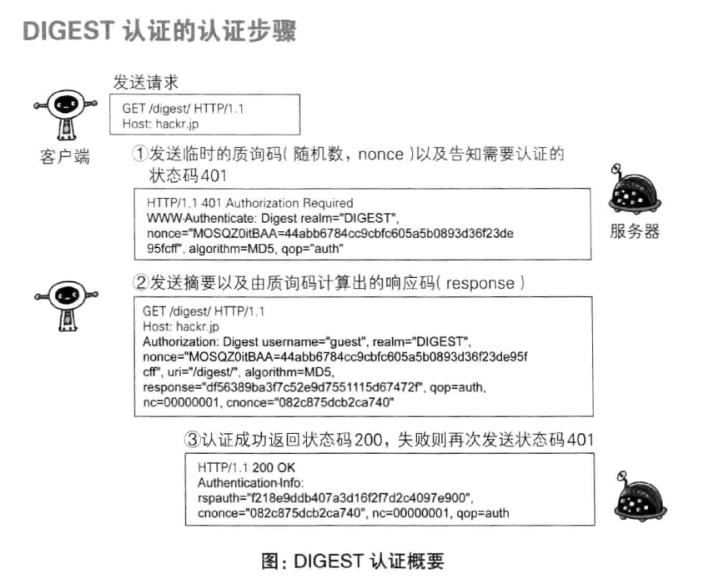

# 第8章: 确认访问用户身份的认证 #

## 8.1 何为认证 ##

核对的信息通常指以下内容:

- 密码
- 动态令牌
- 数字证书
- 生物认证
- IC 卡等

### HTTP 使用的认证方式 ###

HTTP/1.1 使用的认证方式如下:

- BASIC 认证
- DIGEST 认证 (摘要认证)
- SSL 客户端认证
- FormBase 认证 (基于表单认证)

## 8.2 BASIC 认证 ##

从 HTTP/1.0 即定义的认证方式, 较少使用.

## 8.3 DIGEST 认证 ##

从 HTTP/1.1 定义.

## 8.4 SSL 客户端认证 ##

借由 HTTPS 的客户端证书完成认证.

## 8.5 基于表单认证 ##

客户端向服务端发送登录信息(Credential), 按照登录信息的验证结果认证.

### 8.5.1 认证多半为基于表单认证 ###

### 8.5.2 Session管理及Cookie应用 ###

