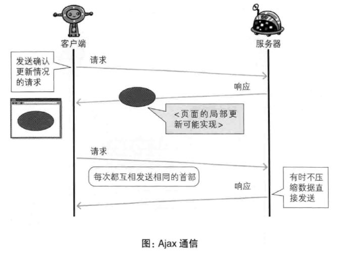
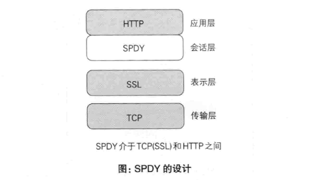
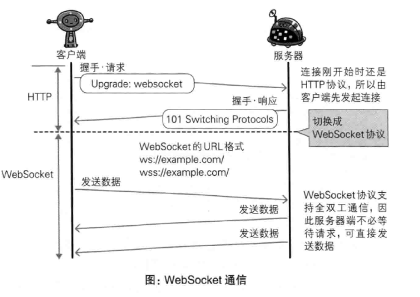

# 第9章: 基于HTTP的功能追加协议 #

## 9.1 基于 HTTP 的协议 ##

## 9.2 消除 HTTP 瓶颈的 SPDY ##

Google 在 2010 年发布, 旨在解决 HTTP 的性能瓶颈, 缩短 Web 页面的加载时间.

### 9.2.1 HTTP 的瓶颈 ###

- 一个连接上只能发送一个请求
- 请求只能从客户端开始
- 请求/响应首部未经压缩发送
- 发送冗长的首部, 特别是每次的首部大部分相同
- 非强制压缩发送, 可选择任意数据压缩格式

#### Ajax的解决方法 ####

Ajax 是一种利用 JavaScript 和 DOM 的操作, 以达到局部 Web 页面替换加载的异步通信手段.



#### Comet 的解决方法 ####

一旦服务器端内容有更新了, Comet 不会让请求等待, 而是直接给客户端返回响应.

#### SPDY 的目标 ####

SPDY是为了在协议级别消除 HTTP 所遭遇的瓶颈.

### 9.2.2 SPDY 的设计与功能 ###

SPDY 是在 TCP/IP 的应用层与传输层之间通过新加会话层的形式运作, 并且规定通信中使用 SSL.



SPDY 的优点如下:

- 多路复用流: 通过单一的 TCP 连接处理多个 HTTP 请求
- 赋予请求优先级
- 压缩 HTTP 首部
- 推送功能
- 服务器提示功能: 服务器可以主动提示客户端请求所需的资源

### 9.2.3 SPDY 消除 Web 瓶颈了吗 ###

SPDY 基本只是将单个域名(IP)的通信复用, 所以当一个 Web 网站上使用多个域名下的资源时改善效果有限. SPDY 的确可以消除 HTTP 的瓶颈.

## 9.3 使用浏览器进行全双工通信的 WebSocket ##

WebSocket 是一套新协议和API, 现在是独立的协议标准, RFC 6455 - The WebSocket Protocol.

### 9.3.1 WebSocket 的设计与功能 ###

WebSocket 是 Web 浏览器与 Web 服务器之间的全双工通信标准.

### 9.3.2 WebSocket 协议 ###

一旦 Web 服务器与客户端之间建立起 WebSocket 协议的通信连接, 之后所有的通信都依靠这个专用协议进行, 通信过程中可互相发送 JSON, XML, HTML 或图片等任意格式的数据. WebSocket 协议主要特点如下:

- 推送功能
- 减少通信量: 连接可以一直保持, 而且 WebSocket 的首部信息较小

为了实现 WebSocket 通信, 在 HTTP 连接建立之后需要完成一次握手:

#### 握手请求 ####

使用 Upgrade 字段:

```
Upgrade: websocket
Connection: Upgrade
Sec-WebSocket-Key: xxxx
Sec-WebSocket-Protocol: chat, superchat        # 子协议, 在连接分开时使用, 定义连接的名称
Sec-WebSocket-Version: 13
```

#### 握手响应 ####

```
HTTP/1.1 101 Switching Protocols
Upgrade: websocket
Connection: Upgrade
Sec-WebSocket-Protocol: chat        # 子协议, 在连接分开时使用, 定义连接的名称
Sec-WebSocket-Accept: yyyyyy        # 由 Sec-WebSocket-Key 字段生成
```



## 9.4 期盼已久的 HTTP/2.0 ##

### HTTP/2.0 的7项技术及讨论 ###

| 技术 | 实现方法 |
|:--|:--|
| 压缩 | SPDY, Friendly |
| 多路复用 | SPDY |
| TLS 义务化 | Speed + Mobility |
| 协商 | Speed + Mobility, Friendly |
| Client Pull, Server Push | Speed + Mobility |
| 流量控制 | SPDY |
| WebSocket | Speed + Mobility |

## 9.5 Web服务器管理文件的 WebDAV ##

WebDAV 是一个可对 Web 服务器上的内容直接进行文件复制, 编辑等操作的分布式文件系统.

### 9.5.1 扩展 HTTP/1.1 的 WebDAV ###

### 9.5.2 WebDAV 内新增的方法及状态码 ###
