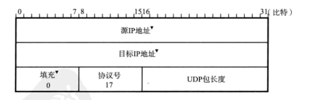

# 第6章: TCP与UDP #

## 6.1 传输层的作用 ##

TCP/IP 中有两个代表性的传输层协议, 分别是 TCP 与 UDP. TCP 提供可靠的通信传输, UDP 则常用于让广播和细节控制交给应用的通信传输.

### 6.1.1 传输层定义 ###

传输层的 TCP 和 UDP 使用端口号来识别应用层的程序.

### 6.1.2 通信处理 ###

传输协议 TCP, UDP 通过接收数据中的目标端口号识别目标处理程序.

### 6.1.3 两种传输层协议 TCP 和 UDP ###

#### TCP ####

TCP 是面向连接的, 可靠的流协议. TCP 实行顺序控制或重发控制, 还具备流量控制, 拥塞控制, 提高网络利用率众多功能.

#### UDP ####

UDP 是不具有可靠性的数据报协议.

### 6.1.4 TCP 与 UDP 区分 ###

## 6.2 端口号 ##

### 6.2.1 端口号定义 ###

传输层使用端口号来识别同一台计算机中进行通信的不同应用程序.

### 6.2.2 根据端口号识别应用 ###

### 6.2.3 通过 IP 地址, 端口号, 协议号进行通信识别 ###

TCP/IP或UDP/IP 通信中采用五个信息来识别一个通信, 它们是(源IP地址, 目标IP地址, 协议号, 源端口号, 目标端口号), 只要其中有一项不同就被认为是不同的通信.

### 6.2.4 端口号如何确定 ###

#### 标准规定的端口号 ####

知名端口号一般由 0 到 1023 的数字分配而成, 普通应用程序应该避免使用知名端口号进行既定目的之外的通信, 以避免产生冲突.

除了知名端口号之外还有一些端口号也被正式注册, 它们分布在 1024 到 49151 之间, 不过这些端口号可用任何通信用途.

#### 时序分配法 ####

除了服务端必须要确定监听端口号, 客户端可以不用自己设置端口号而交给操作系统分配. 动态分配的端口号取值范围在 49152 到 65535 之间.

### 6.2.5 端口号与协议 ###

端口号由使用的传输层协议决定, 不同的传输层协议可以使用相同的端口号. 而对于知名端口号来说, 只要端口一致一般都分配同一个程序进行处理.

## 6.3 UDP ##

### UDP的特点及目的 ###

UDP 不提供复杂的控制协议, 利用 IP 提供面向无连接的通信服务. 常用于:

- 包总量较少的通信 (DNS, SNMP 等)
- 视频, 音频等多媒体通信(实时通信)
- 限定于 LAN 等特定网络的应用通信
- 广播通信(广播, 多播)

## 6.4 TCP ##

TCP 充分实现了数据传输时各种控制功能, 可以进行丢包时的重发机制, 还可以对次序乱掉的分包进行顺序控制.

### 6.4.1 TCP 的特点及目的 ###

TCP 通过校验和, 序列号, 确认应答, 重发控制, 连接管理以及窗口控制等机制实现可靠性传输.

### 6.4.2 通过序列号与确认应答提高可靠性 ###

在 TCP 中, 当发送端的数据到达接收主机时, 接收端主机会返回一个已收到消息的通知, 这个消息叫做确认应答(ACK).

当发送端将数据发送之后会等待对端的确认应答, 如果在一定时间内没有接收到确认应答就认为数据已经丢失, 并进行重发. 未收到确认应答不一定是数据丢失, 也可能是确认应答丢失.

因为目的主机可能收到重复的数据包, 所以 TCP 通过序列号实现对数据包的判断, 用于确认应答处理, 重发控制以及重复控制等. 序列号是按顺序给发送数据的每一个字段都标上号码的编号(起始值不一定为0, 而是在建立连接之后由随机数生成). 接收端查询接收数据 TCP 首部中的序列号和数据的长度, 将自己下一步应该接收的序列号作为确认应答返回.

### 6.4.3 重发超时如何确定 ###

重发超时是指在重发数据之前, 等待确认应答到来的那个时间间隔, 如果超过这个时间仍未收到确认应答即将进行数据重发.

TCP 在每次发包时都会计算往返时间及偏差, 将这个往返时间和偏差相加重发超时时间, 就是比这个总和稍大的值.

在 BSD 的 Unix 以及 Windows 系统中, 超时都是以 0.5 秒为单位进行控制, 由于最初的数据包还不知道往返时间, 所以其重发超时一般设置为 6 秒左右.

数据被重发之后若还是收不到确认应答则再次进行发送, 等待确认应答的时间将会以2倍, 4倍的指数函数延长. 再达到一定的重发次数之后若还是没有确认应答返回, 则会判断网络或对端主机发生了异常并强制关闭连接.

### 6.4.4 连接管理 ###

TCP 在数据通信之前会通过 TCP 首部发送一个 SYN 包作为建立连接的请求等待确认应答, 如果对端发送来确认应答就认为可以进行通信. 在通信结束时会进行断开连接处理(FIN包).

### 6.4.5 TCP 以段为单位发送数据 ###

在建立 TCP 连接的同时也可以确认发送数据包的单位, 成为最大消息长度(MSS). 理想情况是 MSS 正好是 IP 中不会被分片处理的最大数据长度.

TCP 在传送数据时以 MSS 的大小将数据进行分割发送, 在 TCP 建立连接时会在 TCP 首部中写入 MSS 选项, 告诉对端自己的接口能够适应的 MSS 大小, 然后在两者之间选择一个较小的值投入使用.

### 6.4.6 利用窗口控制提高速度 ###

TCP 以1个段为单位, 每发送一个段就进行一次确认应答的处理, 但这样会降低通信的性能.

TCP 引入窗口来控制网络性能的下降, 通过将确认应答不再是以每个分段, 而是以更大的单位进行确认来缩短等待应答的时间. 在这种情况下发送端在发送了一个段之后不再等待确认应答而是继续发送.

滑动窗口就是指无需等待确认应答而可以继续发送数据的最大值, 这个机制使用大量的缓冲区, 通过对多个段同时进行确认应答的功能.

### 6.4.7 窗口控制与重发机制 ###

接收主机如果收到一个自己应该接收的序号以外的数据时, 会针对当前为止收到数据返回确认应答. 在窗口比较大又出现报文段丢失的情况下同一个序号的确认应答将会被重复返回, 发送端主机如果连续3次收到同一个确认应答就会将其对应的数据进行重发. 这称为高速重发机制.

### 6.4.8 流控制 ###

发送端根据自己的实际情况发送数据, 如果接收端未及时返回确认(可能是因为繁忙或是其他原因)就会触发重发机制, 进而导致网络浏览的浪费.

TCP 提供一种称为流量控制的机制让发送端可以根据接收端的实际接收能力控制发送的数据量. 接收端主机向发送端主机通知自己可以接收数据的大小, 然后发送端就会发送不超过这个限度的数据, 该大小限度就称为窗口大小.

发送端主机会时不时的发送一个窗口探测的数据段, 以防止窗口的更新通知丢失而无法继续通信.

### 6.4.9 拥塞控制 ###

因为在窗口控制的情况下主机能够发送大量数据包, 而在通信开始时就发送大量数据可能造成网络拥塞. TCP 为了防止该问题在通信开始时会通过慢启动的算法得到的数值对发送数据量进行控制.

发送端使用一个叫做拥塞窗口的值, 并且取拥塞窗口与接收端通知的窗口大小中较小的值, 发送比这个值更小的数据量.

因为拥塞窗口会不停的增长, 所以引入了慢启动阈值的概念, 只要拥塞窗口的值超出这个阈值则使用下面的公式放大拥塞窗口:

在 TCP 通信的开始时没有设置相应的慢启动阈值, 当在超时重发(或高速重发)时会设置为当前拥塞窗口一半的大小.

### 6.4.10 提高网络利用率的规范 ###

#### Nagle 算法 ####

该算法指发送端即使还有应该发送的数据, 但是如果数据量较小则进行延迟发送的一种处理机制. 即在下列两个条件满足任意一个时才发送:

- 已发送的数据都已经收到确认应答
- 可以发送最大段长度的数据时

该算法可以提高网络利用率, 但是可能会造成某种程度的延迟.

#### 延迟确认应答 ####

如果接收端每次都立刻回复确认, 则可能因为缓冲区满而返回较小的窗口, 从而造成发送端减小窗口而降低网络利用率. 因此可以在收到数据以后延迟一段时间返回确认应答:

- 在没有收到 2x最大段长度的数据为止不做确认应答(根据操作系统不同而不同)
- 其他情况下延迟 0.5 秒返回确认应答(很多操作系统设置为 0.2 秒)

#### 捎带应答 ####

某些应用层协议会在对端收到数据后返回一种回执(如 SMTP, POP, FTP), TCP 的确认应答可以和回执数据一起发送, 称为捎带应答.

在使用捎带应答时必须启用延迟确认应答.

### 6.4.11 使用 TCP 的应用 ###

如果发送数据量较多, 对可靠性要求比较高时可以选择使用 TCP 协议.

## 6.5 其他传输层协议 ##

一般传输层主要使用的协议是 TCP 和 UDP 两种, 但是还有其它几种协议曾被提案并进行了实验.

### 6.5.1 UDP-Lite ###

UDP-Lite 是扩展 UDP 功能的一种传输层协议.

在 UDP 的传输过程中如果出现了校验和错误那么整个包都会被丢弃, 但是有些应用并不希望如此. 虽然可以将 UDP 中的校验和设置为无效, 但是如果发生的错误是 UDP 首部中的端口号或 IP 首部中的 IP 地址被破坏则可能产生严重后果.

UDP-Lite 提供与 UDP 几乎相同的功能, 不过计算校验和的范围可以由应用自行决定.

### 6.5.2 SCTP ###

SCTP 与 TCP 一样, 都是提供数据到达与否相关可靠性检查的传输层协议, 主要特点如下:

- 以消息为单位首发, 这点与 TCP 不同
- 支持多重宿主: 即即使 NIC 发生变化也仍然可以通信(如 IP 地址发生变化)
- 支持多数据流通信
- 可以定义消息的生存期限: 超过生存期限的消息不会被重发

SCTP 主要用于进行通信和应用之间发送众多较小消息的情况.

### 6.5.3 DCCP ###

DCCP 是一个辅助 UDP 的传输层协议, 为 UDP 增加了拥塞控制机制. 主要特点如下:

- 与 UDP 一样, 不提供发送数据的可靠性传输
- 面向连接, 具备建立连接和断开连接的处理
- 能够根据网络拥堵情况进行拥塞控制, 分别是类似TCP拥塞控制和TCP友好升级控制
- 为进行拥塞控制, 接收端会返回确认应答

## 6.6 UDP 首部格式 ##

- 源端口号: 可选项, 没有时设置为 0, 这种情况可能出现在不需要返回的通信中
- 目标端口号
- 包长度: UDP 首部长度和数据的长度之和
- 校验和: 为提供可靠的 UDP 首部和数据而设计, 如果不使用时设置为 0

校验和计算方式如下:

在计算校验和时首先生成如上图的伪首部, 然后加上 UDP 首部(此时将校验和字段填为0)和数据以2字节为单位计算1的补码和, 将所得到的 1 的补码写入校验和字段.

## 6.7 TCP 首部格式 ##

TCP 中没有表示包长度和数据长度的字段, 可由 IP 层获知 TCP 的包长度, 由 TCP 的包长可知数据的长度.

- 源端口号
- 目的端口号
- 序列号: 指发送数据的位置, 每发送一次就累加一次该数据字节数的大小. 序列号不从0或1开始, 而是在建立连接之后由随机数生成, 通过 SYN 传给接收端主机. 在建立连接时的 SYN 包和 FIN 包虽然不携带数据, 但是也会作为一个字节增加对应的序列号
- 确认应答号: 指下一次应该收到的数据的序列号, 表示已收到确认应答号减1的数据
- 数据偏移: 表示 TCP 所传输的数据部分应该从 TCP 包的哪个位置开始计算, 单位为4字节. 也是指 TCP 首部的长度
- 保留
- 控制位: 

| 控制位 | 含义 |
|:--|:--|
| CWR | 和ECE标志都用于 IP 首部的 ECN 字段, ECE标志为1时通知将拥塞窗口缩小 |
| ECE | 表示 ECN-Echo, 为1时表示网络有拥塞, 当首部中的 ECN 为 1 时设置为 1 |
| URG | 为1时表示包中有需要紧急处理的数据 |
| ACK | 为1时确认应答的字段变为有效, 规定除了最初建立连接的 SYN 包之外都必须设置为 1 |
| PSH | 为1时表示需要将收到的数据立刻传给上层协议 |
| RST | 为1时表示 TCP 连接中出现异常需要强制断开连接, 如端口未使用或是重启 |
| SYN | 用于建立连接 |
| FIN | 为 1 时表示今后不会有数据发送, 希望断开连接 |

- 窗口大小: 用于通知从相同 TCP 首部的确认应答号所指的位置开始能够接收的数据大小, 为 0 时表示可以发送窗口探测以了解最新的窗口大小
- 校验和: 无法关闭, 作用与 UDP 类似

TCP 计算校验和时也会使用伪首部, 计算方法和 UDP 相同.

- 紧急指针: 当 URG 控制位为 1 时有效, 指出紧急数据的末尾在报文中的位置
- 选项: 用于提高 TCP 的传输性能, 长度最大为 40 字节. 常见的选项如下:

| 类型 | 长度 | 意义 | RFC | 作用 |
|:--|:--|:--|:--|:--|
| 0 | - | End of Option List | RFC793 |
| 1 | - | No-Operation | RFC793 | |
| 2 | 4 | Maximum Segment Size | RFC793 | 用于建立连接时决定最大段长度 |
| 3 | 3 | WSOPT-Window Scale | RFC1323 | 因为 TCP 首部中窗口字段只有 16 位, 最大为 64K 字节, 该选项可以将最大值扩展到 1G 字节 |
| 4 | 2 | SACK Permitted | RFC2018 | 用于确认应答 | 
| 5 | N | SACK | RFC2018 | 用于确认应答 |
| 8 | 10 | TSOPT-Time Stamp Option | RFC1323 | 使用这个选项来区分新老序列号, 避免高速通信中的新老序列号混淆 |
| 27 | 8 | Quick-Start Response | RFC4782 |
| 28 | 4 | User Timeout Option | RFC5482 |
| 29 | - | TCP Authentication Option | RFC5925 |
| 253 | N | RFC3692-style Experiment 1 | RFC4727 |
| 254 | N | RFC3692-style Experiment 2 | RFC4727 |

