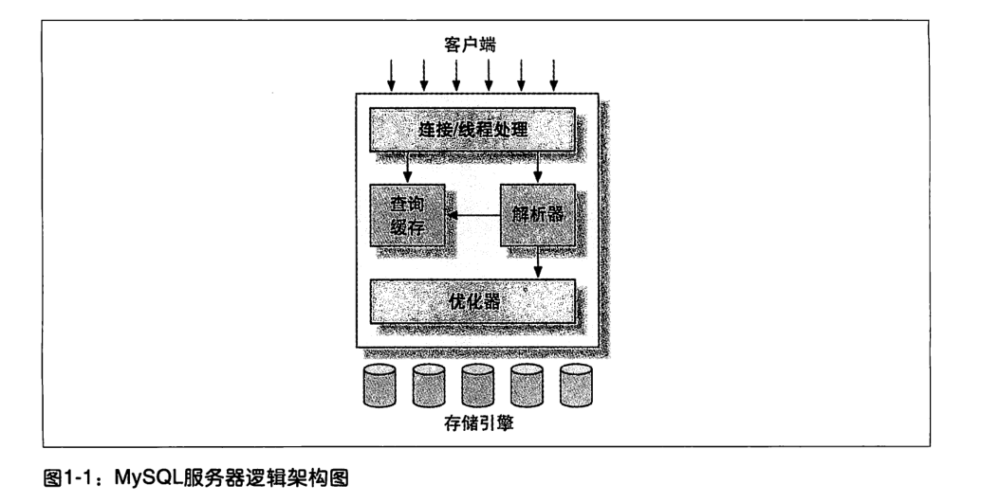

# 第一章: MySQL架构与历史 #

## 1.1 MySQL逻辑架构 ##



### 1.1.1 连接管理与安全性 ###

每个客户端连接都会在服务器进程中拥有一个线程, 这个连接的查询只会在这个单独的线程中执行.

### 1.1.2 优化与执行 ###

MySQL会解析查询, 并创建内部数据结构(解析树), 然后对其进行各种优化, 包括重写查询, 决定表的读取顺序以及选择合适的索引等.

## 1.2 并发控制 ##

MySQL的并发控制主要在两个层面: 服务器层与存储引擎层.

### 1.2.1 读写锁 ###

即实现一个由两种类型的锁组成的锁系统: 共享锁(读锁)和排他锁(写锁).

### 1.2.2 锁粒度 ###

锁策略: 在锁的开销和数据的安全性之间寻求平衡. 一般都是在表上加行级锁.

#### 表锁 ####

MySQL服务器层面可能会施加表锁.

#### 行级锁 ####

行级锁只在存储引擎层实现, InnoDB 实现了行级锁.

## 1.3 事务 ##

事务内的语句要么全部执行成功, 要么全部执行失败. 事务的标准是 ACID.

- 原子性(atomicity): 一个事务被视为一个不可分割的最小工作单元
- 一致性(consistency): 总是从一个一致性的状态转换到另外一个一致性的状态
- 隔离性(isolation): 通常一个事务的修改在提交之前对其他事务是不可见的, 与事务隔离级别相关
- 持久性(durability): 一旦事务提交则所有的修改就永久保存到数据库中

### 1.3.1 隔离级别 ###

SQL 标准中定义了4种隔离级别:

- READ UNCOMMITTED(未提交读): 事务中的修改即使未提交也对其他事务可见, 会产生脏读. 一般不使用
- READ COMMITTED(提交读): 一个事务开始时只能看见已经提交的事务所做的修改. 多数数据库的默认隔离级别
- REPEATABLE READ(可重复读): 解决了脏读的问题. 保证在同一个事务中多次读取同样的记录的结果是一致的. 但是无法解决幻读的问题(指范围读取时可能产生的幻行). InnoDB 通过 MVCC(多版本并发控制)解决该问题.
- SERIALIZABLE(可串行化): 最高隔离级别, 一般不使用.

### 1.3.2 死锁 ###

InnoDB 处理死锁的方法是: 将持有最少行级排他锁的事务进行回滚.

### 1.3.3 事务日志 ###

事务日志采用追加方式, 存储引擎在修改表的数据时只需要修改内存拷贝, 然后把修改记录持久化到事务日志, 内存中修改的数据可以在后台慢慢刷回磁盘(这称为预写式日志).

### 1.3.4 MySQL 中的事务 ###

#### 自动提交(AUTOCOMMIT) ####

MySQL 默认采用自动提交模式, 即如果不显示开启事务则每个查询都当作一个事务. 可以采用如下的代码来修改当前连接的自动提交模式:

```
SHOW VARIABLES LIKE 'AUTOCOMMIT';
SET AUTOCOMMIT = 1;
```

有一些命令会在执行之前强制执行 COMMIT 提交当前活动事务, 如 ALTER TABLE.

MySQL 可以通过如下代码修改隔离级别:

```
SET SESSION TRANSACTION ISOLATION LEVEL READ COMMITTED;
```

#### 在事务中混合使用存储引擎 ####

MySQL 服务器层不管理事务, 由下层的存储引擎实现, 所以混用多种存储引擎是不可靠的.

#### 隐式和显式锁定 ####

InnoDB 采用两阶段锁定协议, 随时都可以执行锁定, 只在 COMMIT 或 ROLLBACK 的时候才会释放.

## 1.4 多版本并发控制 ##

MVCC 是通过保存数据在某个时间点的快照来实现. 典型的有乐观并发控制和悲观并发控制.

InnoDB 是通过在每行记录后面保存两个隐藏的列来实现, 一个保存了行的创建时间, 一个保存过期时间, 这里的时间值实际是指系统版本号. 每开始一个事务系统版本号会递增，事务开始时的系统版本号作为事务的版本号, 用来和查询到的每行记录的版本号进行比较.

下面介绍 MVCC 如何操作:

### SELECT ###

根据以下两个条件检查记录:

1. InnoDB 只查找版本早于当前事务版本的数据行
2. 行的删除版本要么未定义, 要么大于当前事务版本号

### INSERT ###

为新插入的行保存当前系统版本号作为行版本号.

### DELETE ###

为删除的行保存当前系统版本号作为删除标识.

### UPDATE ###

插入一行新记录, 保存当前系统版本号为行版本号, 同时保存当前系统版本号到原来的行作为删除标识.

MVCC 只在 REPEATABLE READ 和 READ COMMITTED 两个隔离级别下工作.

## 1.5 MySQL 的存储引擎 ##

MySQL 将每个数据库保存为数据目录下的一个子目录, 创建表时在该目录下创建一个和表同名的 .frm 文件保存表的定义(大小写平台相关), 表的定义是在 MySQL 服务层处理.

可以通过如下代码查询表的相关信息:

```
SHOW TABLE STATUS LIKE 'user' \G;
```

输出定义如下:

- Name: 表名
- Engine: 存储引擎类型
- Row_format: 行的格式
- Rows: 表中的行数, 对 InnoDB 是估计值
- Avg\_row\_length: 平均每行包含的字节数
- Data_length: 表数据大小(单位字节)
- Max\_data\_length: 表数据最大容量
- Index_length: 索引大小
- Data_free: 对 MyISAM 表示已分配但没有使用的空间
- Auto\_increment: 下一个 AUTO\_INCREMENT 的值
- Create_time: 表创建时间
- Update_time: 表数据最后修改时间
- Check_time: 最后一次检查表的时间
- Collation: 默认字符集和字符列排序规则
- Checksum: 如果启用则保存整个表的实时校验和
- Create_options: 创建表时指定的其他选项
- Comment: 其他的额外信息, 对 InnoDB 表示表空间的剩余空间信息

### 1.5.1 InnoDB存储引擎 ###

默认的事务型引擎.

#### InnoDB 的历史 ####

现在的 InnoDB 版本, 既是 MySQL5.1 中的 InnoDB plugin.

#### InnoDB 概览 ####

InnoDB 的数据存储在表空间中, 表空间是由 InnoDB 管理的一个黑盒子, 由一系列的数据文件组成. InnoDB 可以将每个表的数据和索引存放在单独的文件中.

InnoDB 表是基于聚簇索引建立的, 针对主键查询有很高的性能, 但是二级索引中必须包含主键列.

### 1.5.2 MyISAM 存储引擎 ###

MyISAM 不支持事务和行级锁, 而且崩溃后无法恢复.

#### 存储 ####

MyISAM 会将表存储在两个文件中: 数据文件(.MYD) 和索引文件(.MYI).

#### MyISAM 特性 ####

- 加锁和并发: 表级锁, 而且读取时可以插入(并发插入)
- 修复: 可以手工或自动执行检查e和修复操作
- 索引特性: 支持全文索引, 也支持对 BLOB 或 TEXT 等长字段索引前 500 个字符
- 延迟更新索引键: 如果指定 DELAY\_KEY\_WRITE 可以延迟索引数据写入磁盘, 可能造成索引损坏

#### MyISAM 压缩表 ####

可以进行压缩来减少磁盘占用, 提升查询性能. 压缩表不能进行修改.

#### MyISAM 性能 ####

某些场景下性能很好.

### 1.5.3 MySQL 内建的其他存储引擎 ###

#### Archive 引擎 ####

只支持 INSERT 和 SELECT, 使用 zlib 压缩行, 每次 SELECT 时执行全表扫描. 适合日志和数据采集类应用.

#### Blackhole 引擎 ####

只记录 Blackhole 表的日志, 不保存插入的数据. 不推荐.

#### CSV 引擎 ####

将普通的 CSV 文件作为 MySQL 的表处理, 不支持索引.

#### Federated 引擎 ####

是访问其他 MySQL 服务器的代理, 创建一个到远程 MySQL 服务器的客户端连接. 默认禁用.

#### Memory 引擎 ####

快速访问数据而且不做修改, 重启丢失也没有关系. 所有的数据保存在内存中. 支持 Hash 索引.

在查询过程中的临时表会使用 Memory 表, 如果中间结果太大或含有 BLOB 或 TEXT 字段则使用 MyISAM 表.

#### Merge 引擎 ####

已废弃.

#### NDB 集群引擎 ####

是 SQL h额 NDB 原生协议之间的接口. MySQL 服务器, NDB 集群存储引擎, 以及分布式的, share-nothing 的, 容灾的, 高可用的 NDB 数据库的组合称为 MySQL 集群(MySQL Cluster).

### 1.5.4 第三方存储引擎 ###

#### OLTP 类引擎 ####

- XtraDB存储引擎: Percona 开发, 是 InnoDB 的一个完全替代产品.
- PBXT: 类似 InnoDB
- TokuDB: 使用叫做分形树的索引数据结构, 是一种大数据存储引擎.
- RethinkDB: 最初为 SSD 而设计, 采用只能追加的写时复制B树作为索引的数据结构

#### 面向列的存储引擎 ####

- Infobright: 
- InfiniDB:

#### 社区存储引擎 ####

- Aria: MariaDB 包含, 可以认为是解决了崩溃安全恢复问题的 MyISAM
- Groonga: 全文检索引擎
- OGGraph: 支持图操作
- Q4M: 支持队列操作
- SphinxSE: 为 Sphinx 全文检索提供 SQL 接口
- Spider:
- VPForMySQL:

### 1.5.5 选择合适的引擎 ###

大部分情况下 InnoDB 是正确的选择. 选择时应该优先考虑以下因素:

- 事务: 如果需要则是 InnoDB
- 备份: 如果需要在线热备份则是 InnoDB
- 崩溃恢复: 
- 特有的特性

#### 日志型应用 ####

可以考虑 MyISAM 或 Archive 存储引擎.

#### 只读或大部分情况下只读的表 ####

如果不考虑崩溃恢复则可以采用 MyISAM 引擎.

#### 订单处理 ####

InnoDB 是最佳选择.

### 1.5.6 转换表的引擎 ###

#### ALTER TABLE ####

例如:

```
ALTER TABLE mytable ENGINE = InnoDB;
```

可能需要执行很长时间, MySQL 会将数据从原表复制到一张新的表中.

#### 导出与导入 ####

使用 mysqldump 工具导出到文件, 然后修改文件内容再导入.

#### 创建与查询 ####

例如:

```
CREATE TABLE innodb_table LIKE myisam_table;
ALTER TABLE innodb_table ENGINE = InnoDB;
INSERT INTO innodb_table SELECT * FROM myisam_table;
```

如果数据量大可以进行分批次操作:

```
START TRANSACTION
INSERT INTO innodb_table SELECT * FROM myisam_table
    WHERE id BETWEEN x AND y;
COMMIT;
```

## 1.6 MySQL 时间线 ##

## 1.7 MySQL 的开发模式 ##

